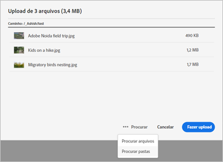
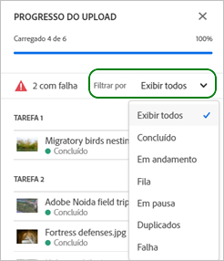
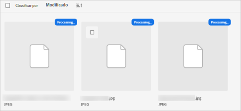
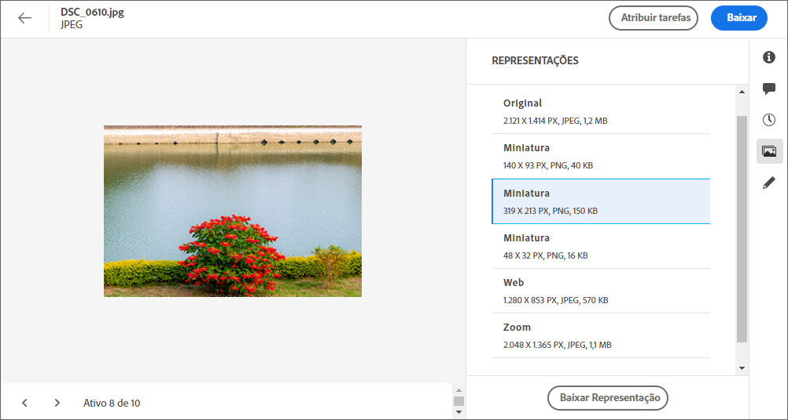
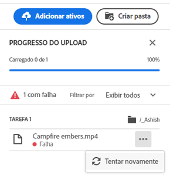
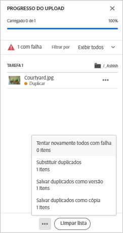

# Fazer upload de ativos {#add-assets}

Para adicionar novos ativos para trabalhar, faça upload de alguns ativos do seu sistema de arquivos local. <!-- TBD: Many of the [common file formats are supported](/help/supported-file-formats.md). -->

Você pode usar os seguintes métodos para carregar um ou mais ativos ou uma pasta contendo ativos:

* Arraste ativos ou pastas na interface do usuário e siga as instruções na tela.
* Clique na opção **[!UICONTROL Add Assets]** na barra de ferramentas e adicione alguns arquivos à caixa de diálogo de upload.

<!-- TBD: Update this GIF
 -->

Você pode usar qualquer um desses métodos para fazer upload de ativos após criar uma pasta. Para criar uma pasta vazia, clique em **[!UICONTROL Create Folder]** na barra de ferramentas. Embora [!DNL Assets Essentials] ofereça uma funcionalidade de pesquisa de texto completo e poderosa, você também pode usar pastas para organizar melhor seus ativos.

Depois de selecionar os arquivos, você obtém uma caixa de diálogo de confirmação para adicionar mais arquivos ou remover arquivos já selecionados. Para adicionar mais arquivos a uma seleção, clique em **[!UICONTROL Browse]** e selecione **[!UICONTROL Browse files]** ou **[!UICONTROL Browse folders]**. Adicione mais arquivos ou pastas da mesma pasta ou de uma diferente.

Depois que todos os arquivos estiverem na fila, clique em **[!UICONTROL Upload]**.

*Figura: Antes de fazer upload dos ativos selecionados, é possível adicionar ou remover ativos da fila.*

>[!CAUTION]
>
>Use ativos que não têm espaço em branco nos nomes de arquivos. As respostas aos comentários não funcionam para esses ativos.

## Exibir o progresso e o status do upload {#upload-progress}

Ao fazer upload de muitos ativos ou pastas aninhadas para [!DNL Assets Essentials], alguns ativos podem falhar ao fazer upload por vários motivos, como problemas duplicados de ativos e de rede.

Para rastrear o progresso do upload, clique na opção **[!UICONTROL Upload Progress]** na barra de ferramentas. Um painel exibe o progresso do upload de todos os ativos.

Para exibir um subconjunto de ativos com base no progresso ou status do upload, use o filtro na barra lateral **[!UICONTROL Upload Progress]**. Os vários filtros são exibir todos os ativos, uploads concluídos, uploads em andamento, ativos em fila a serem carregados, uploads pausados, ativos duplicados e ativos que não foram carregados.

*Figura: Filtre os ativos que você tentou fazer upload com base no status de upload ou no progresso do upload.*

Imediatamente após o upload dos ativos, [!DNL Assets Essentials] processa os ativos para gerar miniaturas e processar metadados. Para muitos ativos, o processamento leva algum tempo. Se não vir uma miniatura e vir uma mensagem de processamento na miniatura do espaço reservado, verifique a pasta novamente após alguns minutos.

## Representações de ativos {#renditions}

[!DNL Assets Essentials] processa os ativos carregados em tempo quase real e, para muitos tipos de arquivos compatíveis, gera representações. Criadas para imagens, as representações são versões redimensionadas da imagem carregada. Você pode baixar não apenas o ativo, mas também as representações para usar uma versão apropriada. Você pode exibir todas as representações de um ativo ao [visualizar um ativo](/help/navigate-view.md#preview-assets).

## Gerenciar uploads com falha {#resolve-upload-fails}

Se o upload de um ativo suportado falhar por algum motivo, clique em **[!UICONTROL Retry]** no painel [!UICONTROL Upload Progress].

*Figura: Tente novamente se um arquivo suportado não for carregado por algum motivo.*

Se você tentar fazer upload de ativos duplicados, os ativos não serão carregados até que você confirme explicitamente o upload. No início, os ativos duplicados são marcados como uploads com falha. Para resolver, basta criar uma versão, excluir e substituir os ativos existentes ou criar uma cópia duplicada renomeando o ativo. Você pode resolver essas falhas um ativo de cada vez ou fazer isso em massa para todas as duplicatas com falha de uma só vez.

*Figura: Para ativos duplicados que não são carregados por padrão, resolva o problema um ativo de cada vez.*

*Figura: Para ativos duplicados que não são carregados por padrão, resolva os problemas para todos os ativos de uma só vez.*

>[!TIP]
>
>Você pode fazer upload de ativos para o repositório DAM diretamente de seus [!DNL Creative Cloud] aplicativos de desktop. Veja como [[!DNL Assets Essentials] integra-se com [!DNL Adobe Asset Link]](/help/integration.md).

## Excluir ativos ou pastas {#delete-assets}

Os usuários podem excluir ativos ou pastas individuais que não são mais necessários. Para excluir um ativo ou uma pasta, siga um destes procedimentos:

* Use a opção disponível na miniatura de um ativo ou de uma pasta.

   

* Selecione um ativo ou uma pasta e clique em **[!UICONTROL Delete]**  na barra de ferramentas.
