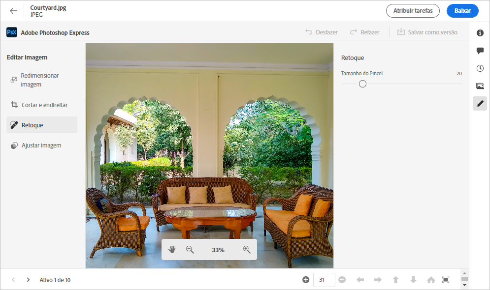
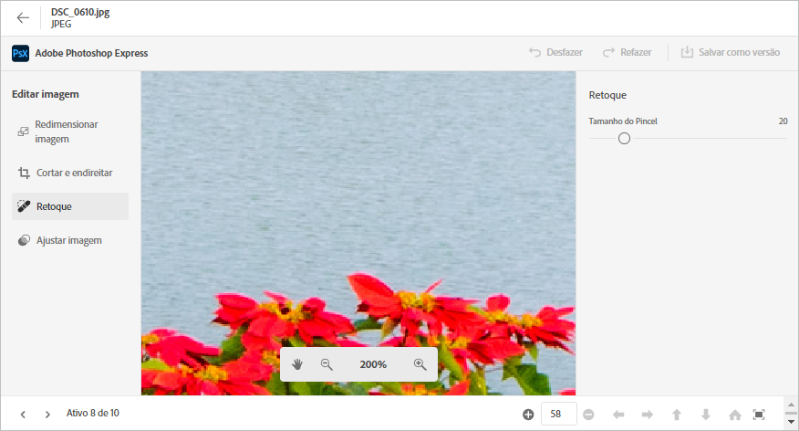
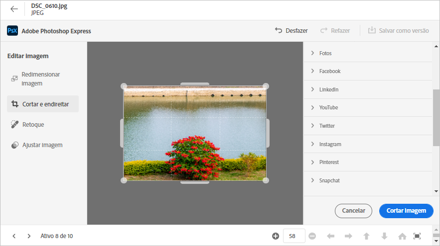
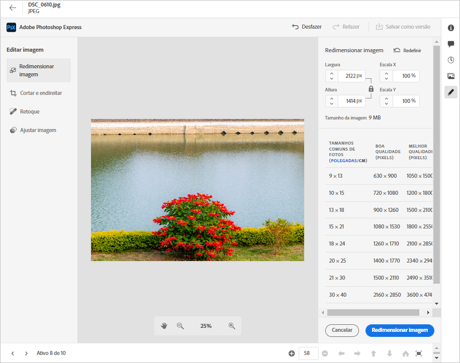
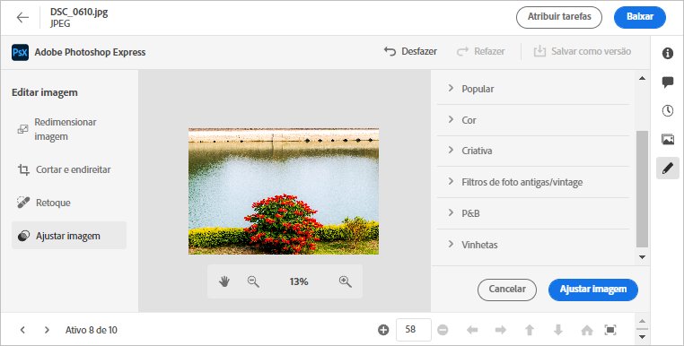

# Editar imagens no [!DNL Assets Essentials] {#edit-images}

O [!DNL Assets Essentials] fornece opções de edição intuitivas viabilizadas pelo [!DNL Adobe Photoshop Express]. As ações de edição disponíveis são: Remover manchas, Cortar e endireitar, Redimensionar imagem e Ajustar imagem.

Após editar uma imagem, você pode salvar a nova imagem como uma nova versão. O controle de versão ajuda você a reverter para o ativo original posteriormente, se necessário. Para editar uma imagem, [abrir sua visualização](/help/navigate-view.md#preview-assets) e clique em **[!UICONTROL Editar imagem]**  do trilho à direita.

*Figura: As opções para editar imagens são viabilizadas pelo [!DNL Adobe Photoshop Express].*

## Reparar imagens com manchas {#spot-heal-images}

Se houver pequenas manchas ou pequenos objetos em uma imagem, você poderá editar e removê-los usando o recurso de reparo de manchas fornecido pelo Adobe Photoshop.

O pincel seleciona a área retocada e faz com que os pixels reparados se misturem perfeitamente no restante da imagem. Use um tamanho de pincel um pouco maior que o ponto que deseja corrigir.

<!-- TBD: See if we should give backlinks to PS docs for these concepts.
For more information about how Spot Healing works in Photoshop, see [retouching and repairing photos](https://helpx.adobe.com/photoshop/using/retouching-repairing-images.html). -->

## Recortar e endireitar imagens {#crop-straighten-images}

Usando a opção cortar e endireitar, você pode fazer cortes básicos, girar a imagem, invertê-la na horizontal ou vertical e recortá-la em dimensões adequadas para sites de redes sociais conhecidos.

Para salvar suas edições, clique em **[!UICONTROL Recortar imagem]**. Após a edição, você pode salvar a nova imagem como uma versão.

Muitas opções padrão permitem que você corte a imagem nas melhores proporções que se ajustam a vários perfis e publicações de redes sociais.

## Redimensionar imagem {#resize-image}

Redimensionar uma imagem para um tamanho específico é um caso de uso comum. O [!DNL Assets Essentials] permite redimensionar rapidamente a imagem para ajustá-la aos tamanhos de foto comuns, fornecendo novas resoluções pré-calculadas para tamanhos de foto específicos. Você pode visualizar os tamanhos comuns de fotos em centímetros ou polegadas para conhecer as dimensões. Por padrão, o método de redimensionamento mantém a proporção. Para substituir manualmente a taxa de proporção, clique em .

Insira as dimensões e clique em **[!UICONTROL Redimensionar imagem]** para redimensionar a imagem. Antes de salvar as alterações como uma versão, você pode desfazer todas as alterações feitas antes de salvar clicando em [!UICONTROL Desfazer] ou você pode alterar a etapa específica do processo de edição clicando em [!UICONTROL Reverter].

## Ajustar imagem {#adjust-image}

O [!DNL Assets Essentials] permite ajustar a cor, o tom, o contraste e muito mais, com apenas alguns cliques. Clique em **[!UICONTROL Ajustar imagem]** na janela de edição. As seguintes opções estão disponíveis na barra lateral direita:

* **Popular**: [!UICONTROL Alto contraste e detalhes], [!UICONTROL Contraste Desaturado], [!UICONTROL Foto de idade], [!UICONTROL P&amp;W Suave]e [!UICONTROL Tom da sépia B&amp;W].
* **Cor**: [!UICONTROL Natural], [!UICONTROL Brilho], [!UICONTROL Alto contraste], [!UICONTROL Alto contraste e detalhes], [!UICONTROL Vívido]e [!UICONTROL Matte].
* **Criativo**: [!UICONTROL Contraste Desaturado], [!UICONTROL Luz fria], [!UICONTROL Turquesa e Vermelho], [!UICONTROL Cintura suave], [!UICONTROL Vintage Instant], [!UICONTROL Contraste Quente], [!UICONTROL Simples e Verde], [!UICONTROL Correspondência de aumento vermelho], [!UICONTROL Sombras quentes]e [!UICONTROL Foto de idade].
* **B&amp;W**: [!UICONTROL &amp;Paisagem B&amp;W], [!UICONTROL B&amp;W Alto Contraste], [!UICONTROL &amp;Inicialização], [!UICONTROL &amp;Baixo Contraste], [!UICONTROL &amp;Plano B&amp;W], [!UICONTROL P&amp;W Suave], [!UICONTROL Infravermelho B&amp;W], [!UICONTROL B&amp;W Tone de selênio], [!UICONTROL Tom da sépia B&amp;W]e [!UICONTROL Tone Dividido em P&amp;W].
* **Vinheta**: [!UICONTROL Nenhum], [!UICONTROL Luz], [!UICONTROL Médio]e [!UICONTROL Pesado].

<!--
TBD: Insert a video of the available social media options.
-->

>[!MORELIKETHIS]
>
>* [Exibir o histórico de versões de um ativo](/help/navigate-view.md)

