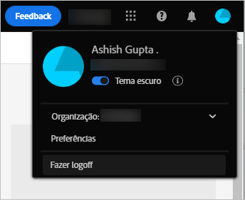
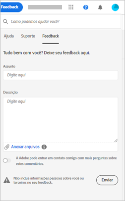

# Introdução ao uso do [!DNL Experience Manager Assets Essentials] {#assets-essentials-get-started}

<!-- TBD: Make links for these steps. -->

O gerenciamento de ativos digitais usando o [!DNL Assets Essentials] requer apenas três etapas simples:

* **Etapa 1**: [Fazer upload](/help/add-delete.md) e [visualizar](/help/navigate-view.md) ativos.
* **Etapa 2**: [Pesquisar](/help/search.md) e [baixar](/help/manage-organize.md#download) ativos.
* **Etapa 3**: [Gerenciar e organizar](/help/manage-organize.md) os ativos.

Para usar o [!DNL Assets Essentials], faça logon em [https://experience.adobe.com/#/assets](https://experience.adobe.com/#/assets). Ao fazer logon, selecione `Company or School Account`. Para receber acesso, entre em contato com o administrador da organização.

Além disso, aproveite as informações de referência que podem ser úteis, como a [explicação sobre a interface](/help/navigate-view.md), a [lista de casos de uso](#use-cases), <!-- TBD: [supported file types](/help/supported-file-formats.md), --> e os [problemas conhecidos](/help/release-notes.md#known-issues).

## Receber acesso ao [!DNL Assets Essentials] {#get-access}

A Adobe fornece a solução e adiciona a pessoa designada de sua organização como administrador. Os administradores podem fornecer acesso a vários usuários da organização usando o [[!DNL Admin Console]](https://helpx.adobe.com/br/enterprise/using/admin-console.html). Para solicitações relacionadas ao seu acesso, entre em contato com o administrador da organização.

Ao fazer logon, depois de fornecer as credenciais, o [!DNL Assets Essentials] solicita que você selecione uma conta. Nesse caso, selecione `Company or School Account` para continuar.

## Configurar o [!DNL Assets Essentials] {#configuration}

Para abrir as preferências, clique no avatar no canto superior direito da interface. Você pode alternar entre os temas claro e escuro nas preferências da solução.

Se fizer parte de organizações diferentes, também poderá alterar a organização e acessar suas contas em várias organizações.

Para alterar as [!UICONTROL Preferências da Experience Cloud], clique em [!UICONTROL Preferências].

## Casos de uso do [!DNL Assets Essentials] {#use-cases}

As várias tarefas de gerenciamento de ativos digitais (DAM) que você pode realizar usando o [!DNL Assets Essentials] estão listadas abaixo.

| Tarefas do usuário | Funcionalidade e informações práticas |
|-----|------|
| Procurar e exibir ativos | <ul> <li>[Navegar pelo repositório](/help/navigate-view.md#view-assets-and-details) </li> <li> [Visualizar um ativo](/help/navigate-view.md#preview-assets) <li> [Exibir representações de um ativo](/help/add-delete.md#renditions) </li> <li>[Exibir versões de um ativo](/help/manage-organize.md#view-versions)</li></ul> |
| Adicionar novos ativos | <ul> <li>[Fazer upload de novos ativos e pastas](/help/add-delete.md#add-assets)</li> <li>[Monitorar o progresso do upload e gerenciar uploads](/help/add-delete.md#upload-progress)</li> <li>[Resolver duplicações](/help/add-delete.md#resolve-upload-fails)</li> </ul> |
| Atualizar ativos ou informações relacionadas | <ul> <li>[Editar imagens](/help/edit-images.md)</li> <li>[Criar versões](/help/manage-organize.md#create-versions) e [exibir versões](/help/manage-organize.md#view-versions)</li> <li>[Editar imagens](/help/edit-images.md)</li> </ul> |
| Editar ativos | <ul> <li>[Edições no navegador usando o Adobe Photoshop Express](/help/edit-images.md)</li> <li>[Recortar para um perfil de redes social](/help/edit-images.md#crop-straighten-images)</li> <li>[Exibir e gerenciar versões](/help/manage-organize.md#view-versions)</li> <li>[Utilização [!DNL Adobe Asset Link]](/help/integration.md#integrations)</ul></ul> |
| Pesquisar ativos no repositório | <ul> <li>[Pesquisar em uma pasta específica](/help/search.md#refine-search-results)</li> <li>[Pesquisas salvas](/help/search.md#saved-search)</li> <li>[Pesquisar ativos visualizados recentemente](/help/search.md)</li> <li>[Pesquisa de texto completo](/help/search.md) |
| Baixar ativos | <ul> <li> [Pré-visualizar ativo](/help/navigate-view.md#preview-assets) </li> <li> [Baixar ativos](/help/manage-organize.md#download) <li> [Baixar representações](/help/add-delete.md#renditions) </li></ul> |
| Operações de metadados | <ul> <li>[Visualizar metadados detalhados](/help/metadata.md) </li> <li> [Atualizar metadados](/help/metadata.md#update-metadata)</li> <li> [Criar novo formulário de metadados](/help/metadata.md#metadata-forms) </li> </ul> |
| Integração com outras soluções | <ul> <li>[Usar o Seletor de ativos no  [!DNL Adobe Journey Optimizer]](/help/integration.md)</li> <li>[[!DNL Adobe Asset Link]  para  [!DNL Creative Cloud]](/help/integration.md)</li> <li>[Integração com o  [!DNL Adobe Workfront]](/help/integration.md)</li> </ul> |

## Próximas etapas {#next-steps}

* [Assista a um vídeo de introdução ao Assets Essentials](https://experienceleague.adobe.com/docs/experience-manager-learn/assets-essentials/getting-started.html?lang=pt-BR)

* Forneça feedback sobre o produto usando a opção de [!UICONTROL Feedback] disponível na interface do Assets Essentials

* Forneça feedback sobre a documentação usando as opções [!UICONTROL Editar esta página]  ou [!UICONTROL Registrar um problema]  disponíveis na barra lateral direita

* Entre em contato com o [Atendimento ao cliente](https://experienceleague.adobe.com/?support-solution=General&amp;lang=pt-BR#support)

<!--TBD: Merge the below rows in the table when the use cases are documented/available.

| How do I delete assets? | <ul> <li>[Delete assets](/help/manage-organize.md)</li> <li>Recover deleted assets</li> <li>Permanently delete assets</li> </ul> |
| How do I share assets or find shared assets? | <ul> <li>Shared by me</li> <li>Shared with me</li> <li>Share for comments and review</li> <li>Unshare assets</li> </ul> |
| How do I collaborate with others and get my assets reviewed | <ul> <li>Share for review</li> <li>Provide comments. Resolve and filter comments</li> <li>Annotations on images</li> <li>Assign tasks to specific users and prioritize</li> </ul> |

-->

<!-- 

##  Provide product feedback {#provide-feedback}

Adobe welcomes feedback about the solution. To provide feedback without even switching your working application, use the [!UICONTROL Feedback] option in the user interface. It also lets you attach files such as screenshots or video recording of an issue.

  

To provide feedback for documentation, click [!UICONTROL Edit this page]  or [!UICONTROL Log an issue]  from the right sidebar. You can do one of the following: 

* Make the content updates and submit a GitHub pull request.
* Create an issue or ticket in GitHub. Retain the automatically populated article name when creating an issue.

-->

>[!MORELIKETHIS]
>
>* [Entender a interface](/help/navigate-view.md).
>* [Notas de versão e problemas conhecidos](/help/release-notes.md).

<!-- TBD: 
>* [Supported file types](/help/supported-file-formats.md).
-->
