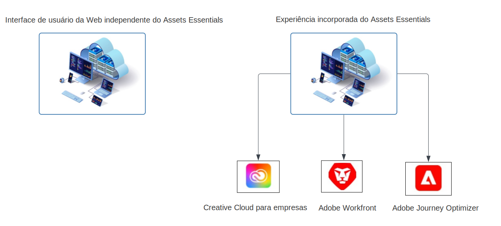

# Visão geral do [!DNL Adobe Experience Manager Assets Essentials] {#assets-essentials}

<!-- TBD: Update this banner to remove Beta label. 

-->

O Adobe oferece soluções robustas de Gerenciamento de ativos digitais (DAM) para você aproveitar ao máximo seus ativos digitais. O Adobe Experience Manager Assets Essentials é a solução de gerenciamento de ativos leve do Adobe para armazenar, gerenciar, detectar e usar ativos digitais.

## O que é o Assets Essentials? {#assets-essemtials-overview}

O Experience Manager Assets Essentials é uma edição leve do Cloud Service de ativos da Adobe Experience Manager. O Assets Essentials oferece gerenciamento e colaboração unificados de ativos com uma interface do usuário moderna e simplificada. A solução fácil de usar permite que mais equipes criativas e de marketing armazenem, descubram e distribuam ativos digitais.

O Assets Essentials permite:

* Gerencie, organize e administre ativos em um local central.

* Colabore no desenvolvimento de conteúdo em equipes.

* Acesse, pesquise e encontre os ativos finais aprovados.

* Compartilhe e baixe ativos para entrega downstream.

## Como acessar o Assets Essentials? {#access-options}

A Assets Essentials oferece uma interface de usuário da Web independente para usuários finais e administradores, dando a eles acesso a todos os recursos da solução. Os usuários de outras soluções do Adobe também podem acessar e trabalhar com ativos da Assets Essentials por meio de uma experiência incorporada, que está disponível no Creative Cloud para aplicativos empresariais, Adobe Journey Optimizer e Adobe Workfront.

## Por que Assets Essentials? {#assets-essentials-features}

O Assets Essentials oferece os principais benefícios, permitindo:

* **Comece rapidamente** com ferramentas de gerenciamento de ativos prontas para uso.

* Estender o acesso aos ativos para mais equipes, a fim de fornecer experiências consistentes para o cliente com **gerenciamento simplificado de ativos**.

* Unificar o ciclo de vida do conteúdo com nativo **integrações em outras soluções Adobe**.

* Aproveite uma **plataforma baseada em nuvem**, seguras e prontas para dimensionar a qualquer hora, em qualquer lugar.

* Comece com os recursos essenciais do DAM e **crescimento** para DAM corporativo.

**Comece rapidamente**

A solução Assets Essentials é fornecida aos clientes por Adobe e está disponível após a conclusão do processo de provisionamento. Os administradores obtêm acesso ao produto no Adobe Admin Console e podem iniciar imediatamente a configuração do sistema e a integração do usuário.

Saiba mais sobre a Assets Essentials [administração e integração de usuários](deploy-administer.md).

**Gerenciamento simplificado de ativos**

A interface de usuário simplificada do Assets Essentials facilita o gerenciamento, a descoberta e a distribuição de seus ativos digitais. Um amplo conjunto de usuários de diferentes funções, incluindo equipes criativas, de marketing e de linha de negócios, pode colaborar em ativos e acessar os ativos corretos e aprovados quando e onde eles precisarem.

Para obter mais informações, consulte [Introdução às suas necessidades de gerenciamento de ativos usando o Assets Essentials](get-started.md).

**Integração com outros aplicativos Adobe**

A Assets Essentials integra-se com as soluções de Adobe compatíveis e fornece uma experiência incorporada nas interfaces desses aplicativos. Ele permite que os usuários acessem facilmente os ativos de que precisam diretamente em seus aplicativos. Todos os usuários podem trabalhar com os mesmos ativos gerenciados centralmente em suas ferramentas e aplicativos familiares.

A experiência incorporada do Assets Essentials está disponível para aplicativos Creative Cloud para empresas, Adobe Journey Optimizer e Adobe Workfront.

Para obter mais informações, consulte [Integrações com outras soluções da Adobe](integration.md).

**Plataforma baseada em nuvem**

Com base na infraestrutura de nuvem Adobe, a Assets Essentials permite que as organizações se concentrem nas suas necessidades comerciais em relação à criação, gerenciamento e distribuição de ativos digitais. Além disso, o Adobe garante que a solução esteja disponível, segura, escalável e sempre atualizada, com inovações de produtos fornecidas aos usuários de maneira contínua por meio de atualizações frequentes.

**Crescer com seus recursos**

Comece a trabalhar com a Assets Essentials rapidamente para se beneficiar dos principais recursos de gerenciamento de ativos digitais em várias equipes.

Quando as necessidades de sua empresa aumentam e você precisa de suporte para requisitos avançados de gerenciamento de ativos digitais, como personalizações, extensibilidade e integrações, automação, Dynamic Media e Brand Portal, o Adobe também oferece [Ativos Adobe Experience Manager as a Cloud Service](https://experienceleague.adobe.com/docs/experience-manager-cloud-service/content/assets/home.html?lang=en).

## Próximas etapas {#next-steps}

* Fornecer feedback do produto usando o [!UICONTROL Feedback] opção disponível na interface do usuário do Assets Essentials

* Forneça feedback de documentação usando [!UICONTROL Editar esta página]  ou [!UICONTROL Registrar um problema]  disponível na barra lateral direita

* Contato [Atendimento ao cliente](https://experienceleague.adobe.com/?support-solution=General#support)

>[!MORELIKETHIS]
>
>* [[!DNL Assets Essentials] página de tutoriais](https://experienceleague.adobe.com/docs/experience-manager-learn/assets-essentials/overview.html?lang=en)

