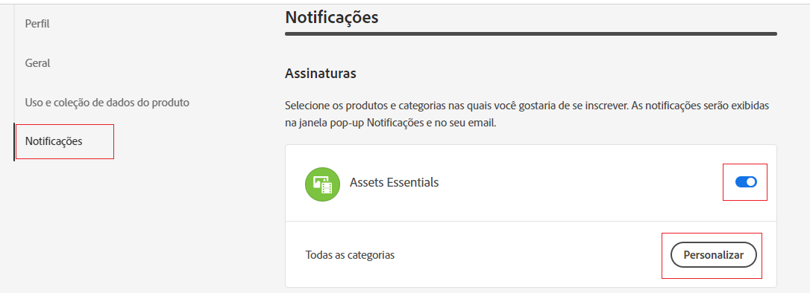
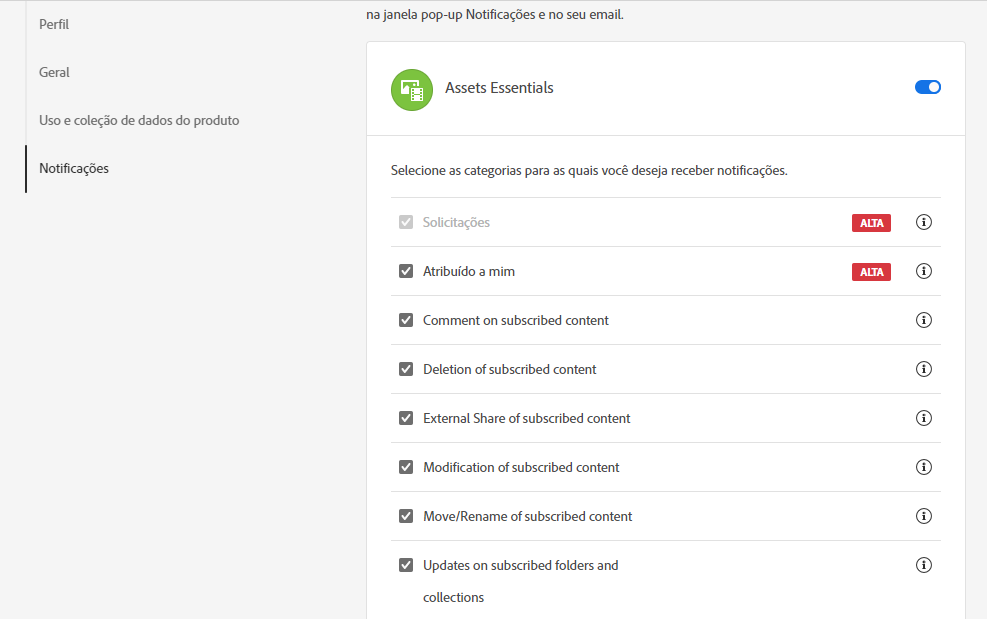
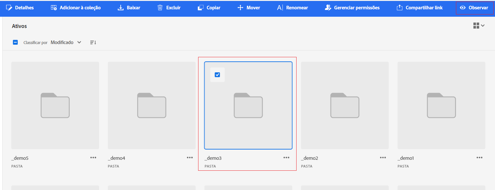

# Gerenciar notificações {#manage-notifications}

As notificações do Assets Essentials permitem monitorar as operações realizadas nos ativos ou pastas disponíveis no repositório. É necessário selecionar e assinar o conteúdo para o qual as notificações são enviadas. Também é possível configurar as categorias para as quais as notificações são enviadas.

## Assinar categorias de notificação {#subscribe-to-notification-categories}

Você pode escolher e assinar a partir de uma lista de categorias para receber notificações. O Assets Essentials envia as notificações para você somente para as categorias selecionadas nas opções disponíveis:

<table>
    <tbody>
     <tr>
      <th><strong>Categoria de notificação</strong></th>
      <th><strong>Descrição</strong></th>
     </tr>
     <tr>
      <td>Solicitações</td>
      <td>Ao atribuir uma tarefa a um usuário, você recebe notificações quando há ações executadas nessa tarefa por esse usuário.</td>
     </tr>
     <tr>
      <td>Atribuído a mim</td>
      <td>Você recebe uma notificação quando há uma tarefa atribuída a você de outro usuário.</td>
     </tr>
     <tr>
      <td>Comentário sobre o conteúdo assinado</td>
      <td>Você recebe uma notificação quando um usuário comenta sobre seu ativo subscrito.</td>
     </tr>
     <tr>
      <td>Exclusão do conteúdo assinado</td>
      <td>Você recebe uma notificação quando um usuário exclui seu ativo ou pasta assinado.</td>
     </tr>
     <tr>
      <td>Compartilhamento externo do conteúdo assinado</td>
      <td>Você recebe uma notificação quando um usuário gera um link público para o ativo ou pasta que você assinou.</td>
     </tr>
     <tr>
      <td>Modificação do conteúdo assinado</td>
      <td>Você recebe uma notificação quando um usuário cria uma nova versão para o ativo inscrito.</td>
     </tr>
     <tr>
      <td>Mover/renomear o conteúdo assinado</td>
      <td>Você recebe uma notificação quando um usuário move ou renomeia seu ativo ou pasta assinado.</td>
     </tr>
     <tr>
      <td>Atualizações em pastas e coleções subscritas</td>
      <td>Você recebe uma notificação quando um usuário adiciona ou remove um ativo de uma pasta subscrita.</td>
     </tr>    
    </tbody>
   </table>

Para assinar as categorias de notificação:

1. Clique em  na extremidade direita da barra de menus na interface do usuário do Assets Essentials.

1. Clique em  para visualizar o [!UICONTROL preferências de Experience Cloud] página.

1. Clique no botão **[!UICONTROL Notificações]** disponível no painel esquerdo.

1. No **[!UICONTROL Notificações]** navegue até a seção [!UICONTROL Assets Essentials] e garanta que a opção de alternância seja alternada para o estado ATIVADO.

   

1. Clique em **[!UICONTROL Personalizar]** para exibir as categorias de notificação.
   

1. Selecione as categorias de notificação para as quais você precisa ser notificado.

## Assista e desmarque pastas ou ativos {#watch-unwatch-assets}

Depois [assinatura das categorias de notificação](#subscribe-to-notification-categories), você deve assinar o conteúdo para começar a receber notificações.

>[!NOTE]
>
>Para **[!UICONTROL Solicitações]** e **[!UICONTROL Atribuído a mim]** categorias de notificação, não é necessário assinar o conteúdo após assinar as categorias de notificação. As notificações são automaticamente enviadas a você para solicitações criadas por você e quando uma tarefa é atribuída a você.

Para se inscrever no conteúdo, selecione a pasta ou ativo que precisa assinar e clique em **[!UICONTROL Observar]**.

O Assets Essentials exibe uma mensagem de sucesso. Você pode clicar em **[!UICONTROL Ir para preferências de notificação]** disponível na mensagem de sucesso para editar seu [assinatura para categorias de notificação](#subscribe-to-notification-categories).

O Assets Essentials agora envia notificações para as categorias assinadas. Você também pode selecionar vários ativos ou pastas e clicar em **[!UICONTROL Observar]** para economizar tempo. No entanto, se você selecionar várias entidades das quais algumas já foram subscritas, a variável **[!UICONTROL Observar]** não é exibida.

Da mesma forma, para cancelar a assinatura, selecione o ativo ou a pasta para o qual você se inscreveu e clique em **[!UICONTROL Desassistir]**.

## Exibir notificações {#view-notifications}

As notificações são exibidas na extremidade direita da barra de menus na interface do usuário do Assets Essentials.

Quando você clica em uma notificação, a Assets Essentials navega até o ativo ou a pasta apropriado que é mencionado na notificação.

