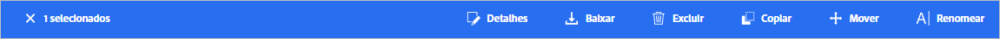
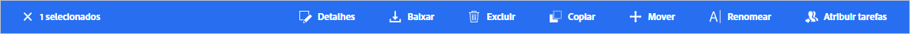
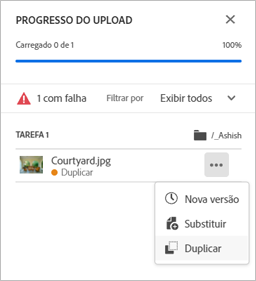
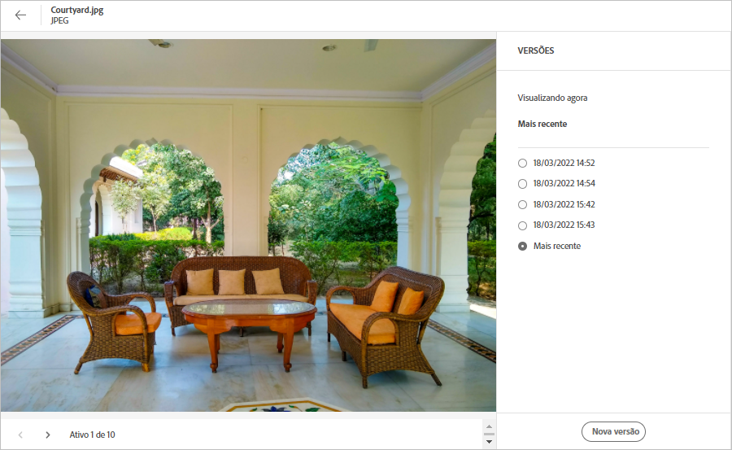
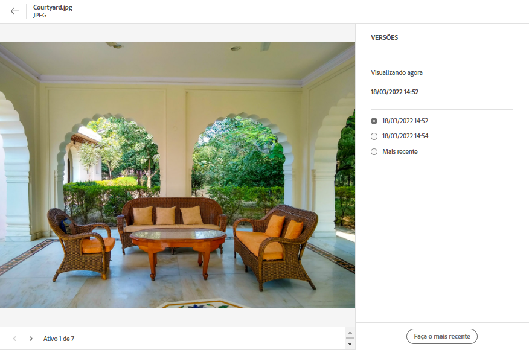

# Gerenciar ativos {#manage-assets}

É possível realizar várias tarefas de gerenciamento de ativos digitais (DAM) facilmente usando a interface amigável do [!DNL Assets Essentials]. Após adicionar os ativos, é possível pesquisar, baixar, mover, copiar, renomear, excluir, atualizar e editar seus ativos.

Use o [!DNL Assets Essentials] para realizar as seguintes tarefas de gerenciamento de ativos. Quando você seleciona um ativo, as seguintes opções são exibidas na barra de ferramentas na parte superior.

*Figura: Opções disponíveis na barra de ferramentas para uma imagem selecionada.*

*  Desmarcar a seleção.
*  Clique para visualizar um ativo e exibir os metadados detalhados. Ao visualizar, você pode exibir as versões e editar uma imagem.
*  Baixar o ativo selecionado para o sistema de arquivos local.
*  Excluir o ativo ou a pasta selecionada.
*  Fazer check-out do ativo selecionado.
*  Copiar o arquivo ou pasta selecionada.
*  Mover o ativo ou pasta selecionada para um local diferente na hierarquia do repositório.
*  Renomear o ativo ou a pasta selecionada. Use um nome exclusivo, caso contrário, a renomeação falhará com um aviso. Você pode tentar novamente com um novo nome.
*  Atribuir tarefas a outros usuários para colaborar em um ativo.

É possível exibir as mesmas opções nas miniaturas de ativos.

O [!DNL Assets Essentials] exibe somente as opções relevantes na barra de ferramentas que dependem do tipo do ativo selecionado.

*Figura: Opções disponíveis na barra de ferramentas para uma pasta selecionada.*

*Figura: Opções disponíveis na barra de ferramentas para um arquivo PDF selecionado.*

## Baixar e distribuir ativos {#download}

É possível selecionar um ou mais ativos ou pastas, ou uma combinação dos dois, e baixar os selecionados para o sistema de arquivos local. É possível editar os ativos e carregá-los novamente ou distribuí-los fora do [!DNL Assets Essentials]. Além disso, é possível [baixar as representações](/help/add-delete.md#renditions) de um ativo.

## Controle de versão de ativos {#versions-of-assets}

<!-- 
TBD: query for engineering: How many versions are maintained. What happens when we reach that limit? Are old versions automatically removed? -->

O [!DNL Assets Essentials] realiza o controle de versão dos ativos quando eles são carregados novamente, após serem atualizados ou editados. Você pode visualizar o histórico de versões e a lista de versões antigas para restaurar uma versão antiga dos ativos como a versão mais recente, que pode então ser revertida para a versão anterior, se necessário. As versões de ativos são criadas nos seguintes cenários:

* Fazer upload de um novo ativo com o mesmo nome de arquivo de um ativo existente e para a mesma pasta de um ativo existente. O [!DNL Assets Essentials] fornece a opção de substituir o ativo anterior ou de salvar o novo ativo como uma versão. Consulte [fazer upload de ativos duplicados](/help/add-delete.md#resolve-upload-fails).

   

   *Figura: Ao fazer upload de um ativo com o mesmo nome de um ativo existente, você pode criar uma versão do ativo.*

* Edite uma imagem e clique em **[!UICONTROL Salvar como versão]**. Consulte [editar imagens](/help/edit-images.md).

   

   *Figura: Salvar a imagem editada como uma versão.*

* Abra as versões de um ativo existente. Clique em **[!UICONTROL Nova versão]** e faça upload de uma versão mais recente do ativo para o repositório.

   

### Exibir versões de um ativo {#view-versions}

Ao fazer upload de uma cópia duplicada ou modificada de um ativo, você pode criar suas versões. O controle de versão permite revisar ativos históricos e reverter para uma versão anterior, caso necessário.

Para exibir as versões, abra a pré-visualização de um ativo e clique em **[!UICONTROL Versões]**  na barra lateral direita. Para visualizar uma versão específica, selecione-a. Para reverter para ela, clique em **[!UICONTROL Tornar a mais recente]**.

Você também pode criar versões na linha do tempo de versões. Selecione a versão mais recente, clique em **[!UICONTROL Nova versão]** e faça upload de uma nova cópia do ativo a partir do sistema de arquivos local.

*Figura: visualizar versões de um ativo, reverter para uma versão anterior ou fazer upload de outra nova versão.*

## Gerenciar o status do ativo {#manage-asset-status}

**Permissões necessárias:** `Can Edit`, `Owner` ou permissões de administrador em um ativo.

O Assets Essentials permite definir o status em ativos disponíveis no repositório. Defina um status de ativo para melhor administrar e gerenciar o consumo downstream de ativos digitais.

Você pode definir o seguinte status em ativos:

* Aprovado

* Rejeitado

* Sem status

### Definir status do ativo {#set-asset-status}

Para definir o status do ativo:

1. Selecione o ativo e clique em **[!UICONTROL Detalhes]** na barra de ferramentas.

1. Na guia **[!UICONTROL Básico]** selecione o status do ativo na lista suspensa de **[!UICONTROL Status]**. Os valores possíveis incluem Aprovado, Rejeitado e Sem status (padrão).

   >[!VIDEO](https://video.tv.adobe.com/v/342495)

<!--

### Set asset expiration date {#set-asset-expiration-date}

To set asset expiration date:

1. Select the asset, and click **[!UICONTROL Details]** in the toolbar.

1. In the **[!UICONTROL Basic]** tab, set the expiration date for the asset using the  **[!UICONTROL Expiration date]** field.

The `Expired` asset card indicator overrides the `Approved` or `Rejected` indicator set for an asset.

-->

Também é possível filtrar ativos com base em um status de ativo. Para mais informações, consulte [Pesquisar ativos no Assets Essentials](search.md).

## Personalizar formulários de metadados para incluir o campo de status do ativo {#customize-asset-status-metadata-form}

**Permissões necessárias:** Administrador

Por padrão, o Assets Essentials fornece vários campos de metadados padrão. As organizações têm necessidades adicionais de metadados e precisam de mais campos para adicionar metadados específicos de negócios. Os formulários de metadados permitem que as empresas adicionem campos de metadados personalizados à página [!UICONTROL Detalhes] de um ativo. Os metadados específicos de negócios melhoram a governança e a descoberta de ativos.

Para mais informações sobre como adicionar campos de metadados adicionais ao formulário de metadados, consulte [Formulários de metadados](metadata.md##metadata-forms).

**Adicionar o campo de metadados Status do ativo ao formulário**

Para adicionar o campo de metadados Status do ativo ao formulário, arraste o componente **[!UICONTROL Status do ativo]** do painel à esquerda para o formulário. A propriedade de mapeamento é preenchida automaticamente. Salve o formulário para confirmar as alterações.

<!--

**Add Expiration Date metadata field to the form**

To add Expiration Date metadata field to the form,  drag **[!UICONTROL Date]** component from the left rail to the form. Specify **Expiration Date** as the label and `pur:expirationDate` as the mapping property. Save the form to confirm the changes.

-->

## Próximas etapas {#next-steps}

* [Assista a um vídeo para gerenciar ativos no Assets Essentials](https://experienceleague.adobe.com/docs/experience-manager-learn/assets-essentials/basics/managing.html)

* Fornecer feedback do produto usando o [!UICONTROL Feedback] opção disponível na interface do usuário do Assets Essentials

* Forneça feedback de documentação usando [!UICONTROL Editar esta página]  ou [!UICONTROL Registrar um problema]  disponível na barra lateral direita

* Contato [Atendimento ao cliente](https://experienceleague.adobe.com/?support-solution=General#support)

