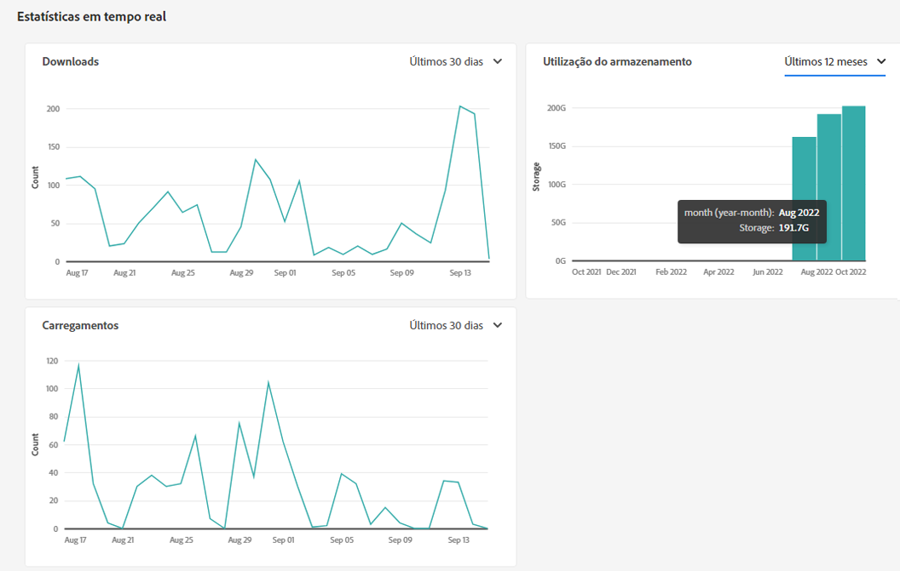
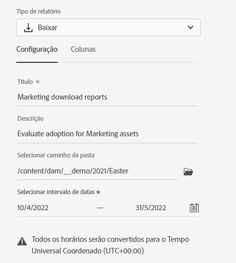
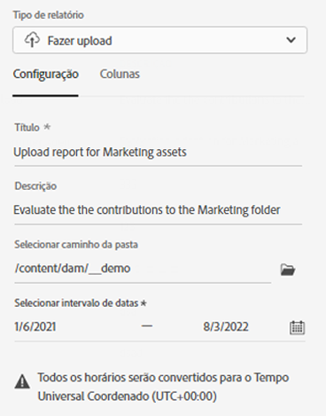
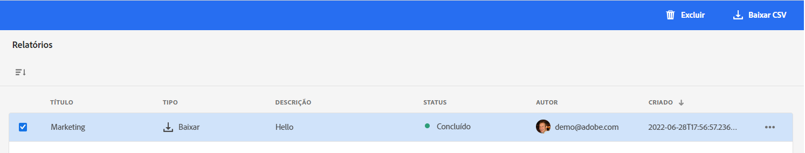

# Gerenciar relatórios {#manage-reports}

Os relatórios de ativos fornecem aos administradores visibilidade sobre as atividades do ambiente do Adobe Experience Manager Assets Essentials. Esses dados fornecem informações úteis sobre como os usuários interagem com o conteúdo e o produto.

## Acessar relatórios {#access-reports}

Todos os usuários atribuídos ao [perfil de produto de administradores do Assets Essentials](deploy-administer.md) podem acessar o painel Estatísticas em tempo real e criar relatórios definidos pelo usuário no Assets Essentials.

## Visualizar estatísticas em tempo real {#view-live-statistics}

O Assets Essentials permite que você visualize dados do seu ambiente em tempo real, por meio do painel Estatísticas em tempo real. Você pode visualizar métricas de evento em tempo real dos últimos 30 dias ou dos últimos 12 meses.

Navegue até **[!UICONTROL Configurações]** > **[!UICONTROL Estatísticas em tempo real]** para visualizar os gráficos gerados automaticamente:

* **Downloads**: o número de ativos baixados do ambiente do Assets Essentials nos últimos 30 dias ou 12 meses representados usando um gráfico de linhas.

* **Carregamentos**: o número de ativos carregados para o ambiente do Assets Essentials nos últimos 30 dias ou 12 meses representados por meio de um gráfico de linhas.

* **Utilização do armazenamento**: o uso do armazenamento, em gigabytes (GB), para o ambiente do Assets Essentials, durante os últimos 30 dias ou 12 meses representados usando um gráfico de barras.

## Criar um relatório de downloads {#create-download-report}

Para criar um relatório de downloads:

1. Navegue até **[!UICONTROL Configurações]** > **[!UICONTROL Relatórios]** e clique em **[!UICONTROL Criar relatório]**.

1. Na guia [!UICONTROL Configuração], especifique o tipo de relatório como **[!UICONTROL Baixar]**.

1. Especifique um título e uma descrição opcional para o relatório.

1. Selecione o caminho da pasta que compreende os ativos para os quais o relatório será criado, usando o campo **[!UICONTROL Selecionar caminho da pasta]**.

1. Selecione o intervalo de datas do relatório.
   >[!NOTE]
   >
   > O Assets Essentials converte todos os fusos horários locais para o Tempo universal coordenado (UTC).

1. Na guia [!UICONTROL Colunas], selecione os nomes das colunas que devem ser exibidas no relatório.

1. Clique em **[!UICONTROL Criar]**.

   

A tabela a seguir explica o uso de todas as colunas que você pode adicionar ao relatório:

<table>
    <tbody>
     <tr>
      <th><strong>Nome da coluna</strong></th>
      <th><strong>Descrição</strong></th>
     </tr>
     <tr>
      <td>Título</td>
      <td>O título do ativo.</td>
     </tr>
     <tr>
      <td>Caminho </td>
      <td>O caminho da pasta onde o ativo está disponível no Assets Essentials.</td>
     </tr>
     <tr>
      <td>Tipo MIME</td>
      <td>O tipo MIME do ativo.</td>
     </tr>
     <tr>
      <td>Tamanho</td>
      <td>O tamanho do ativo em bytes.</td>
     </tr>
     <tr>
      <td>Baixado por</td>
      <td>A ID do email do usuário que baixou o ativo.</td>
     </tr>
     <tr>
      <td>Data de download</td>
      <td>A data em que a ação de download do ativo foi executada.</td>
     </tr>
     <tr>
      <td>Autor</td>
      <td>O autor do ativo.</td>
     </tr>
     <tr>
      <td>Data de criação</td>
      <td>A data em que o ativo foi carregado para o Assets Essentials.</td>
     </tr>
     <tr>
      <td>Data da modificação</td>
      <td>A data em que o ativo foi modificado pela última vez.</td>
     </tr>
     <tr>
      <td>Expirado</td>
      <td>O status de expiração do ativo.</td>
     </tr>
     <tr>
      <td>Baixado por Nome de usuário</td>
      <td>O nome do usuário que baixou o ativo.</td>
     </tr>           
    </tbody>
   </table>

## Criar um relatório de uploads {#create-upload-report}

Para criar um relatório de uploads:

1. Navegue até **[!UICONTROL Configurações]** > **[!UICONTROL Relatórios]** e clique em **[!UICONTROL Criar relatório]**.

1. Na guia [!UICONTROL Configuração], especifique o tipo de relatório como **[!UICONTROL Fazer upload]**.

1. Especifique um título e uma descrição opcional para o relatório.

1. Selecione o caminho da pasta que compreende os ativos para os quais o relatório será criado, usando o campo **[!UICONTROL Selecionar caminho da pasta]**.

1. Selecione o intervalo de datas do relatório.

1. Na guia [!UICONTROL Colunas], selecione os nomes das colunas que devem ser exibidas no relatório.

1. Clique em **[!UICONTROL Criar]**.

   

A tabela a seguir explica o uso de todas as colunas que você pode adicionar ao relatório:

<table>
    <tbody>
     <tr>
      <th><strong>Nome da coluna</strong></th>
      <th><strong>Descrição</strong></th>
     </tr>
     <tr>
      <td>Título</td>
      <td>O título do ativo.</td>
     </tr>
     <tr>
      <td>Caminho </td>
      <td>O caminho da pasta onde o ativo está disponível no Assets Essentials.</td>
     </tr>
     <tr>
      <td>Tipo MIME</td>
      <td>O tipo MIME do ativo.</td>
     </tr>
     <tr>
      <td>Tamanho</td>
      <td>O tamanho do ativo.</td>
     </tr>
     <tr>
      <td>Autor</td>
      <td>O autor do ativo.</td>
     </tr>
     <tr>
      <td>Data de criação</td>
      <td>A data em que o ativo foi carregado para o Assets Essentials.</td>
     </tr>
     <tr>
      <td>Data da modificação</td>
      <td>A data em que o ativo foi modificado pela última vez.</td>
     </tr>
     <tr>
      <td>Expirado</td>
      <td>O status de expiração do ativo.</td>
     </tr>              
    </tbody>
   </table>

## Visualizar relatórios existentes {#view-report-list}

Depois de [criar o relatório](#create-download-report), é possível visualizar a lista de relatórios existentes e baixá-los em formato CSV ou excluí-los.

Para visualizar a lista de relatórios, navegue até **[!UICONTROL Configurações]** > **[!UICONTROL Relatórios]**.

É possível visualizar o título, o tipo, a descrição especificada durante a criação, o status, a ID de email do autor e a data de criação de cada relatório.

O status `Completed ` do relatório significa que ele está pronto para download.

## Baixar um relatório em formato CSV {#download-csv-report}

Para baixar um relatório no formato CSV:

1. Navegue até **[!UICONTROL Configurações]** > **[!UICONTROL Relatórios]**.

1. Selecione um relatório e clique em **[!UICONTROL Baixar CSV]**.

O relatório selecionado é baixado no formato CSV. As colunas exibidas no relatório CSV dependem das colunas selecionadas ao [criar o relatório](#create-download-report).

## Excluir um relatório {#delete-report}

Para excluir um relatório:

1. Navegue até **[!UICONTROL Configurações]** > **[!UICONTROL Relatórios]**.

1. Selecione um relatório e clique em **[!UICONTROL Excluir]**.

1. Clique em **[!UICONTROL Excluir]** novamente para confirmar.
