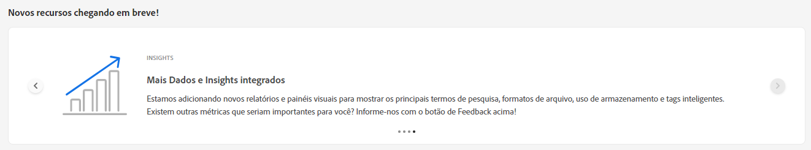
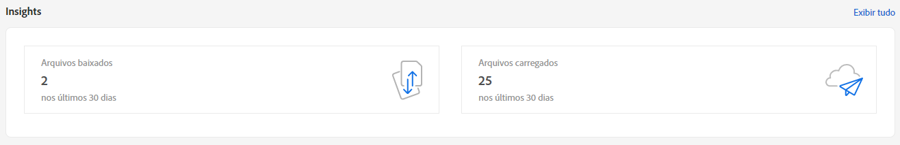
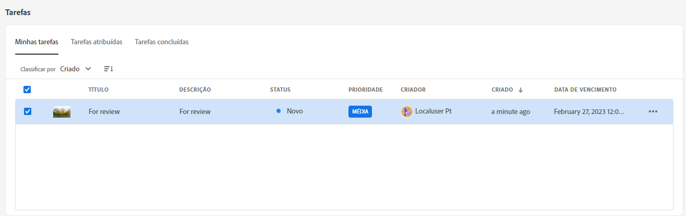
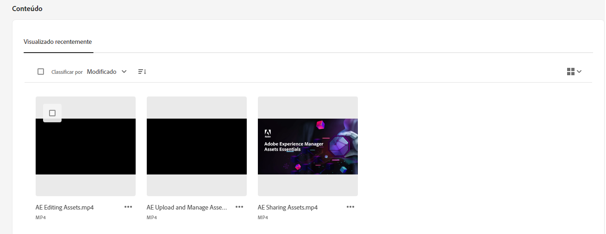
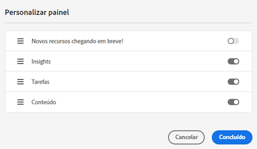

# Meu espaço de trabalho para ativos {#my-workspace}

Os ativos agora incluem um espaço de trabalho personalizável que fornece widgets para acesso conveniente a áreas-chave da interface do usuário do Assets e informações mais relevantes para você. Esta página serve como uma solução única para fornecer uma visão geral dos itens de trabalho e fornecer acesso rápido aos fluxos de trabalho principais. Um acesso mais conveniente a essas opções aumenta a eficiência e a velocidade do conteúdo.

Você pode acessar Meu espaço de trabalho clicando em **[!UICONTROL Meu espaço de trabalho]** nos itens disponíveis no painel de navegação esquerdo. Meu espaço de trabalho inclui uma variedade de widgets que mostram Novos recursos em breve, Insights, Tarefas e widgets de conteúdo. É possível configurar como esses widgets são exibidos no Workspace com base em suas preferências.

>[!NOTE]
>
>O widget de insights só é visível para administradores.

**Novos recursos em breve**

Destaca os recursos futuros do Assets.

**Insights**

Os administradores podem exibir um resumo do número de downloads e uploads executados no ambiente de Ativos nos últimos 30 dias. Você pode clicar em **[!UICONTROL Exibir tudo]** para navegar rapidamente até a página Insights para painéis mais detalhados.

**Tarefas**

Exibe a lista de tarefas atribuídas a você no **[!UICONTROL Minhas Tarefas]** , criada por você na **[!UICONTROL Tarefas atribuídas]** e as tarefas já concluídas por você no **[!UICONTROL Concluído]** guia . Você pode selecionar uma tarefa e clicar em **[!UICONTROL Concluir tarefa]** para aprovar ou rejeitar uma tarefa. Você também pode selecionar uma tarefa e clicar em **[!UICONTROL Abrir Detalhes da Tarefa]** para exibir a tarefa e aprová-la, rejeitá-la, editá-la ou excluí-la.

>[!NOTE]
>
> O **[!UICONTROL Atribuir Tarefas]** opção para atribuir uma tarefa em um ativo a outro usuário está disponível ao selecionar um ativo ou ao abrir a visualização de informações do ativo.

**Conteúdo**

Exibe exibições sorvidas de ativos, incluindo a lista de ativos que você visualizou recentemente. Você pode optar por exibir ativos no widget em uma Exibição de lista, Exibição de grade, Exibição de galeria ou Exibição de cascata e classificar os ativos por nome, tamanho e data modificada. Você também pode selecionar um ativo para exibir os detalhes do ativo ou removê-lo da lista de ativos visualizados recentemente.

## Personalizar meu espaço de trabalho {#configure-widgets}

Todos os widgets são exibidos por padrão, mas você pode ativar ou desativar os widgets exibidos em Meu espaço de trabalho. As preferências são específicas para cada usuário.

1. Clique em **[!UICONTROL Meu espaço de trabalho]** disponível no painel de navegação esquerdo e clique em **[!UICONTROL Personalizar]**.

1. Desative o botão de alternância do widget que você não precisa exibir no Workspace. Você também pode arrastar um widget para um local apropriado para atualizar sua ordem de exibição no Workspace.

1. Clique em **[!UICONTROL Concluído]** para salvar as alterações.

   
