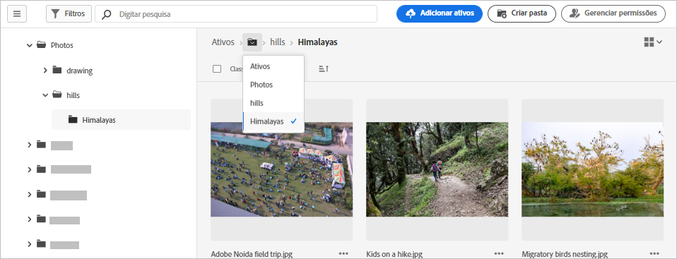
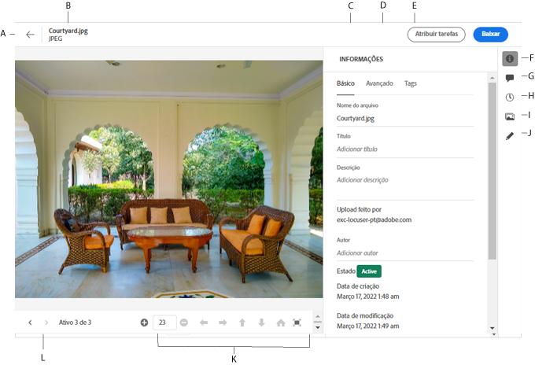

# Navegar para arquivos e pastas e exibir ativos {#view-assets-and-details}

<!-- TBD: Give screenshots of all views with many assets. Zoom out to showcase how the thumbnails/tiles flow on the UI in different views. -->

<!-- TBD: The options in left sidebar may change. Shared with me and Shared by me are missing for now. Update this section as UI is updated. -->

## Compreender a interface do [!DNL Assets Essentials] {#understand-interface-navigation}

O [!DNL Assets Essentials] oferece uma interface intuitiva e fácil de usar. A interface limpa facilita a localização e a memória dos ativos e informações relacionadas.

Ao fazer logon no [!DNL Assets Essentials], você verá a seguinte interface.

<!-- TBD: Update this screenshot. Remove top bar. Remove 2 labels from top bar. -->

Interface do ![[!DNL Assets Essentials] no ](assets/essentials-interface1.png)

*Figura: primeira tela após o logon e a localização dos recursos principais.*
    *A: Barra lateral esquerda para navegar pelo repositório e fornecer acesso a algumas outras opções.*
    *B: Exibir ou recolher a barra lateral esquerda para aumentar a área de visualização de ativos.*
    *C: Filtrar os resultados da pesquisa.*
    *D: Caixa de pesquisa.*
    *E: Opções para classificar ativos.*
    *F: Fornecer feedback sobre o produto.*
    *G: Editar as preferências do usuário ou sair.*
    *H: Alternar entre diferentes visualizações.*

<!-- TBD: Need an embedded video here with narration. It has to be hosted on MPC to be embeddable. -->

## Procurar e exibir ativos e pastas {#browse-repository}

Você pode navegar pelas pastas da interface do usuário principal ou da barra lateral esquerda. Ao navegar, você pode usar a interface para exibir miniaturas de ativos para navegar visualmente pelo repositório ou exibir detalhes do ativo para encontrar rapidamente o ativo que deseja. As opções disponíveis na barra lateral esquerda são:

* **Ativos**: lista de todas as pastas em uma exibição em árvore, à qual você tem acesso.
* **Visualizados recentemente**: lista de ativos que você visualizou recentemente. [!DNL Assets Essentials] exibe somente os ativos que você visualiza. Ele não exibe os ativos que você percorre ao navegar pelos arquivos ou pastas do repositório.
* **Lixeira**:

<!-- TBD: Not sure if we want to publish these right now. CC Libs are beta as per Greg.
* **Libraries**: Access to [!DNL Adobe Creative Cloud Team] (CCT) Libraries view. This view is visible only if the user is entitled to CCT Libraries.
-->

<!-- TBD: My Work Space shows task inbox and it is not visible on AEM Cloud Demos as of now. It is the source of truth server hence not documenting My Work Space option for now.
-->

É possível abrir ou recolher a barra lateral esquerda para aumentar a área de visualização de ativos disponível.

Em [!DNL Assets Essentials], você pode exibir ativos, pastas e resultados de pesquisa em quatro tipos diferentes de layouts.

*  [!UICONTROL Exibição de lista]
*  [!UICONTROL Exibição de grade]
*  [!UICONTROL Exibição da galeria]
*  [!UICONTROL Exibição de cascata]

Para localizar um ativo, você pode classificar os ativos em ordem crescente ou decrescente de `Name`, `Relevancy`, `Size`, `Modified` e `Created`.

Para navegar em uma pasta, clique duas vezes nas miniaturas da pasta ou selecione a pasta na barra lateral esquerda. Para exibir detalhes de uma pasta, selecione-a e clique em Detalhes na barra de ferramentas na parte superior. Para navegar para cima e para baixo na hierarquia, use a barra lateral esquerda ou a navegação estrutural na parte superior.

*Figura: para navegar pela hierarquia, use a navegação estrutural na parte superior ou na barra lateral esquerda.*

## Visualizar ativos {#preview-assets}

Antes de usar, compartilhar ou baixar um ativo, é possível visualizá-lo mais detalhadamente. O recurso de visualização permite exibir não apenas as imagens, mas alguns outros tipos de ativos compatíveis.

Para visualizar um ativo, selecione-o e clique em [!UICONTROL Detalhes]  na barra de ferramentas na parte superior. É possível não só visualizar o ativo, mas visualizar os metadados detalhados dele e realizar outras ações.

*A: Retornar à pasta atual ou ao resultado da pesquisa atual no repositório.*
*B: Nome e formato do arquivo que você está visualizando.*
*C: Metadados básicos.*
*D: Metadados avançados.*
*E: Palavras-chave e tags inteligentes.*
*F: Visualizar o ativo e consultar as informações de metadados.*
*G: Comentar e anotar.*
*H: Exibir e gerenciar versões.*
*I: Exibir representações da imagem.*
*J: Editar a imagem.*
*K: Visualizar mais de perto. Zoom, tela inteira e outras opções.*
*L: Prosseguir para o ativo anterior ou seguinte na pasta atual sem voltar para a pasta.*

Você também pode visualizar vídeos.

Se você visualizar explicitamente um ativo, o [!DNL Assets Essentials] o mostrará como um ativo exibido recentemente.

<!-- TBD: Describe the options.

Explicitly previewed assets are displayed as recently viewed assets. Give screenshot of this.
Other use cases after previewing.
-->

>[!MORELIKETHIS]
>
>* [Exibir versões de um ativo](/help/manage-organize.md#view-versions).

