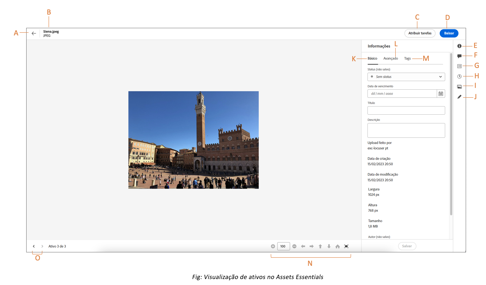

# Navegar para arquivos e pastas e exibir ativos {#view-assets-and-details}

<!-- TBD: Give screenshots of all views with many assets. Zoom out to showcase how the thumbnails/tiles flow on the UI in different views. -->

<!-- TBD: The options in left sidebar may change. Shared with me and Shared by me are missing for now. Update this section as UI is updated. -->

## Compreender a interface do [!DNL Assets Essentials] {#understand-interface-navigation}

O [!DNL Assets Essentials] oferece uma interface intuitiva e fácil de usar. A interface limpa facilita a localização e a memória dos ativos e informações relacionadas.

Ao fazer logon no [!DNL Assets Essentials], você verá a seguinte interface.

![[!DNL Assets Essentials]Interface](assets/essentials-interface.png)

    *A: Barra lateral esquerda para navegar pelo repositório e fornecer acesso a algumas outras opções*
    *B: Exibir ou recolher a barra lateral esquerda para aumentar a área de visualização de ativos*
    *C: Filtrar resultados de pesquisa*
    *D: Selecionar todo o conteúdo da pasta selecionada*
    *E: Opções para classificar ativos*
    *F: Caixa de pesquisa*
    *G: Carregar ou arrastar e soltar arquivos usando `Add Assets` botão*
    *H: Criar uma nova pasta*
    *I: Alternar entre diferentes visualizações*

<!-- TBD: Need an embedded video here with narration. It has to be hosted on MPC to be embeddable. -->

## Procurar e exibir ativos e pastas {#browse-repository}

Você pode navegar pelas pastas da interface do usuário principal ou da barra lateral esquerda. Ao navegar, você pode usar a interface para exibir miniaturas de ativos para navegar visualmente pelo repositório ou exibir detalhes do ativo para encontrar rapidamente o ativo que deseja. As opções disponíveis na barra lateral esquerda são:

* [Meu espaço de trabalho](https://experienceleague.adobe.com/docs/experience-manager-assets-essentials/help/my-workspace.html?lang=en): Os ativos agora incluem um espaço de trabalho personalizável que fornece widgets para acesso conveniente a áreas-chave da interface do usuário do Assets e informações mais relevantes para você. Esta página serve como uma solução única para fornecer uma visão geral dos itens de trabalho e fornecer acesso rápido aos principais fluxos de trabalho. Um acesso mais conveniente a essas opções aumenta a eficiência e a velocidade do conteúdo.
* [Tarefas](https://experienceleague.adobe.com/docs/experience-manager-assets-essentials/help/my-workspace.html?lang=en): Você pode visualizar as tarefas atribuídas a você em **Minhas tarefas** guia . Considerando que as tarefas criadas por você podem ser visualizadas em **Tarefas atribuídas** guia . Além disso, as tarefas concluídas estão localizadas em **Tarefas concluídas** guia .
* [Ativos](https://experienceleague.adobe.com/docs/experience-manager-assets-essentials/help/manage-organize.html?lang=en): lista de todas as pastas em uma exibição em árvore, à qual você tem acesso.
* **Visualizados recentemente**: lista de ativos que você visualizou recentemente. [!DNL Assets Essentials] exibe somente os ativos que você visualiza. Ele não exibe os ativos que você percorre ao navegar pelos arquivos ou pastas do repositório.
* [Coleções](https://experienceleague.adobe.com/docs/experience-manager-assets-essentials/help/manage-collections.html?lang=pt-BR): Uma coleção é um conjunto de ativos, pastas ou outras coleções no Adobe Experience Manager Assets Essentials. Use coleções para compartilhar ativos entre usuários. Diferente de pastas, uma coleção pode incluir ativos de locais diferentes. Você pode compartilhar várias coleções com um usuário. Cada coleção contém referências a ativos. A integridade referencial dos ativos é mantida entre as coleções.

* [Insights](https://experienceleague.adobe.com/docs/experience-manager-assets-essentials/help/manage-reports.html?lang=en#view-live-statistics): Em [!DNL Assets Essentials], você pode visualizar insights em tempo real no seu painel. O Assets Essentials permite que você visualize dados do seu ambiente Assets Essentials em tempo real, por meio do painel Insights. Você pode visualizar métricas de evento em tempo real dos últimos 30 dias ou dos últimos 12 meses.
* **Lixeira**: Listar os ativos excluídos da raiz **[!UICONTROL Ativos]** pasta. Você pode selecionar um ativo na pasta Lixeira e restaurá-lo ao seu local de origem ou excluí-lo permanentemente.
* **Configurações**: Você pode configurar várias opções do Assets Essentials usando **Configurações**, como Formulários de metadados, Relatórios e Gerenciamento de taxonomia.

<!-- TBD: Not sure if we want to publish these right now. CC Libs are beta as per Greg.
* **Libraries**: Access to [!DNL Adobe Creative Cloud Team] (CCT) Libraries view. This view is visible only if the user is entitled to CCT Libraries.
-->

<!-- TBD: My Work Space shows task inbox and it is not visible on AEM Cloud Demos as of now. It is the source of truth server hence not documenting My Work Space option for now.
-->

É possível abrir ou recolher a barra lateral esquerda para aumentar a área de visualização de ativos disponível.

Em [!DNL Assets Essentials], você pode exibir ativos, pastas e resultados de pesquisa em quatro tipos diferentes de layouts.

*  [!UICONTROL Exibição de lista]
*  [!UICONTROL Exibição de grade]
*  [!UICONTROL Exibição da galeria]
*  [!UICONTROL Exibição de cascata]

Para localizar um ativo, você pode classificar os ativos em ordem crescente ou decrescente de `Name`, `Relevancy`, `Size`, `Modified` e `Created`.

Para navegar em uma pasta, clique duas vezes nas miniaturas da pasta ou selecione a pasta na barra lateral esquerda. Para exibir detalhes de uma pasta, selecione-a e clique em Detalhes na barra de ferramentas na parte superior. Para navegar para cima e para baixo na hierarquia, use a barra lateral esquerda ou a navegação estrutural na parte superior.

*Figura: para navegar pela hierarquia, use a navegação estrutural na parte superior ou na barra lateral esquerda.*

## Visualizar ativos {#preview-assets}

Antes de usar, compartilhar ou baixar um ativo, é possível visualizá-lo mais detalhadamente. O recurso de visualização permite exibir não apenas as imagens, mas alguns outros tipos de ativos compatíveis.

Para visualizar um ativo, selecione-o e clique em [!UICONTROL Detalhes]  na barra de ferramentas na parte superior. É possível não só visualizar o ativo, mas visualizar os metadados detalhados dele e realizar outras ações.

*A: Retorne à pasta atual ou ao resultado da pesquisa atual no repositório*
*B: Nome e formato do arquivo que você está visualizando*
*C: Atribuir tarefas*
*D: Baixar ativo*
*E: Visualizar ativo e ver informações de metadados*
*D: Metadados avançados*
*E: Palavras-chave e tags inteligentes*
*F: Comentar e anotar*
*G: Exibir tarefas relacionadas ao Ativo selecionado*
*H: Exibir e gerenciar versões*
*I: Exibir representações da imagem*
*J: Editar imagem*
*K: Metadados básicos*
*L: Metadados avançados*
*M: Palavras-chave e tags inteligentes*
*N: Visualize mais de perto. Zoom, tela cheia e outras opções*
*O: Prossiga para o ativo anterior ou seguinte na pasta atual sem voltar para a pasta*

Você também pode visualizar vídeos.

Se você visualizar explicitamente um ativo, o [!DNL Assets Essentials] o mostrará como um ativo exibido recentemente.

<!-- TBD: Describe the options.

Explicitly previewed assets are displayed as recently viewed assets. Give screenshot of this.
Other use cases after previewing.
-->

## Próximas etapas {#next-steps}

* Forneça feedback sobre o produto usando a opção de [!UICONTROL Feedback] disponível na interface do Assets Essentials

* Forneça feedback sobre a documentação usando as opções [!UICONTROL Editar esta página]  ou [!UICONTROL Registrar um problema]  disponíveis na barra lateral direita

* Entre em contato com o [Atendimento ao cliente](https://experienceleague.adobe.com/?support-solution=General&amp;lang=pt-BR#support)

>[!MORELIKETHIS]
>
>* [Exibir versões de um ativo](/help/manage-organize.md#view-versions).

