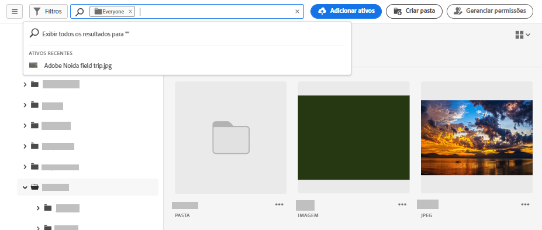
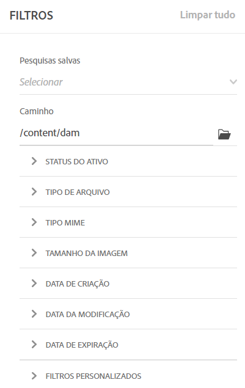
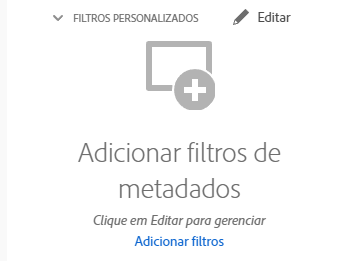
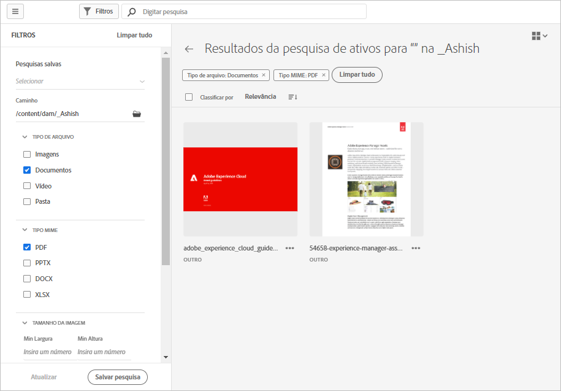

# Pesquisar ativos no [!DNL Assets Essentials] {#search-assets}

O [!DNL Assets Essentials] oferece uma pesquisa eficiente, que funciona por padrão. A pesquisa é abrangente, pois é uma pesquisa de texto completo. Essa eficiente funcionalidade de pesquisa permite descobrir rapidamente o ativo apropriado e ajuda a melhorar a velocidade do conteúdo. O [!DNL Assets Essentials] fornece pesquisa de texto completo e até mesmo pesquisas por meio de metadados, como tags inteligentes, título, data de criação e direito autoral.

Para pesquisar ativos,

* Clique na caixa de pesquisa na parte superior da página. Por padrão, a pesquisa é feita na pasta em que você está navegando no momento. Siga uma das seguintes opções:

   

   * Pesquisar usando uma palavra-chave e, opcionalmente, alterar a pasta. Pressione Return.

   * Comece a trabalhar com um ativo visualizado recentemente procurando diretamente por ele. Clique na caixa de pesquisa e selecione um ativo visualizado recentemente a partir das sugestões.

## Filtrar os resultados da pesquisa {#refine-search-results}

Você pode filtrar os resultados da pesquisa com base nos seguintes parâmetros.

*Figura: filtre ativos pesquisados com base em vários parâmetros.*

* Status do ativo: Filtre os resultados da pesquisa usando um `Approved`, `Rejected`ou `No Status` status do ativo.

* Tipo de arquivo: filtre os resultados da pesquisa pelos tipos de arquivos compatíveis, ou seja, `Images`, `Documents` e `Videos`.
* Tipo MIME: filtrar um ou mais formatos de arquivo compatíveis. <!-- TBD:  [supported file formats](/help/supported-file-formats.md). -->
* Tamanho da imagem: forneça um ou mais valores máximos e mínimos de dimensão para filtrar imagens. O tamanho é fornecido em valores de dimensão de pixel e não é o tamanho do arquivo das imagens.
* Data de criação: a data de criação do ativo fornecida pelos metadados. O formato de data padrão usado é `yyyy-mm-dd`.
* Data de modificação: a data da última modificação dos ativos. O formato de data padrão usado é `yyyy-mm-dd`.

Você pode classificar os ativos pesquisados em ordem crescente ou decrescente de `Name`, `Relevancy`, `Size`, `Modified` e `Created`.

## Gerenciar filtros personalizados {#custom-filters}

**Permissões necessárias:** `Can Edit`, `Owner` ou Administrador.

O Assets Essentials também permite adicionar filtros personalizados à interface. É possível aplicar esses filtros personalizados além dos [filtros padrão](#refine-search-results) para refinar os resultados da pesquisa.

O Assets Essentials fornece os seguintes filtros personalizados:

<table>
    <tbody>
     <tr>
      <th><strong>Nome do filtro personalizado</strong></th>
      <th><strong>Descrição</strong></th>
     </tr>
     <tr>
      <td>Título</td>
      <td>Filtrar ativos usando o título do ativo. Você pode usar um operador curinga (*) para permitir que o Assets Essentials exiba ativos nos resultados que correspondem parcialmente aos critérios de pesquisa. Por exemplo, se você definir <b>ma*</b> como critério de pesquisa, o Assets Essentials exibe ativos com título, como mercado, marketing, homem, manchester e assim por diante nos resultados.</td>
     </tr>
     <tr>
      <td>Nome</td>
      <td>Filtre ativos usando o nome do arquivo de ativo. Você pode usar um operador curinga (*) para permitir que o Assets Essentials exiba ativos nos resultados que correspondem parcialmente aos critérios de pesquisa.</td>
     </tr>
     <tr>
      <td>Tamanho do ativo</td>
      <td>Filtre ativos definindo um intervalo de tamanho, em bytes, nos critérios de pesquisa para um ativo ser exibido nos resultados.</td>
     </tr>
     <tr>
      <td>Tags previstas</td>
      <td>Filtrar ativos usando a tag inteligente de ativos. Você pode usar um operador curinga (*) para permitir que o Assets Essentials exiba ativos nos resultados que correspondem parcialmente aos critérios de pesquisa. Você pode especificar várias tags inteligentes separadas por vírgula nos critérios de pesquisa.</td>
     </tr>    
    </tbody>
   </table>

### Adicionar filtros personalizados {#add-custom-filters}

Para adicionar filtros personalizados:

1. Clique em **[!UICONTROL Filtros]**.

1. Na seção **[!UICONTROL Filtros personalizados]**, clique em **[!UICONTROL Editar]** ou **[!UICONTROL Adicionar filtros]**.

   

1. Na caixa de diálogo **[!UICONTROL Gerenciamento de filtros personalizados]**, selecione os filtros que precisam ser adicionados à lista de filtros existente. Selecionar **[!UICONTROL Filtros personalizados]** para selecionar todos os filtros.

1. Clique em **[!UICONTROL Confirmar]** para adicionar os filtros à interface.

### Remover filtros personalizados {#remove-custom-filters}

Para remover filtros personalizados:

1. Clique em **[!UICONTROL Filtros]**.

1. Na seção **[!UICONTROL Filtros personalizados]**, clique em **[!UICONTROL Editar]**.

1. Na caixa de diálogo **[!UICONTROL Gerenciamento de filtros personalizados]**, desmarque os filtros que precisam ser removidos da lista de filtros existente.

1. Clique em **[!UICONTROL Confirmar]** para remover os filtros da interface.

## Pesquisas salvas {#saved-search}

A funcionalidade de pesquisa é bastante fácil de usar no [!DNL Assets Essentials]. Na caixa de pesquisa, você pode simplesmente digitar uma palavra-chave e pressionar Return para ver os resultados. Além disso, é possível pesquisar novamente por palavras-chave recentes de maneira rápida e com um único clique.

Também é possível filtrar os resultados da pesquisa com base em critérios específicos relacionados aos metadados e tipos de ativos. O [!DNL Assets Essentials] também permite salvar os parâmetros de uma pesquisa para melhorar a experiência de busca de filtros usados com frequência. Em seguida, você pode selecionar a pesquisa salva para pesquisar e aplicar o filtro com apenas um clique.

Para criar uma pesquisa salva, pesquise por algum ativo, aplique um ou mais filtros e clique em [!UICONTROL Salvar pesquisa] no painel [!UICONTROL Filtros].

<!-- TBD: Search behavior. Full-text search. Ranking and rank boosts. Hidden assets.
Report poor UX that users can only save a filtered search and not a simple search.
.
Are other supported files fully indexed and support full-text search? Eg. audio/videos files can at best have metadata indexed.
Anything about ranking of assets displayed in search results?

What about temporarily hiding an asset (suspending search on it) from the search results? If an asset is undergoing review collaboration, should it be used by others? Should it be hidden in search?

When userA is searching and userB add an asset that matches search results, will the asset display in search as soon as userA refreshes the page? Assuming indexing is near real-time. May not be so for bulk uploads.
-->

## Próximas etapas {#next-steps}

* [Assistir a um vídeo para pesquisar ativos no Assets Essentials](https://experienceleague.adobe.com/docs/experience-manager-learn/assets-essentials/basics/using.html)

* Fornecer feedback do produto usando o [!UICONTROL Feedback] opção disponível na interface do usuário do Assets Essentials

* Forneça feedback de documentação usando [!UICONTROL Editar esta página]  ou [!UICONTROL Registrar um problema]  disponível na barra lateral direita

* Contato [Atendimento ao cliente](https://experienceleague.adobe.com/?support-solution=General#support)
