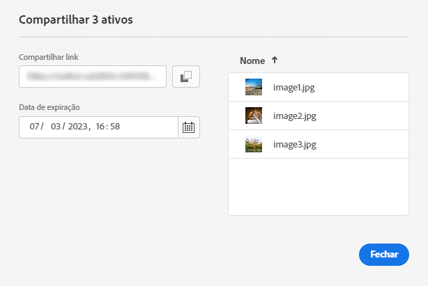
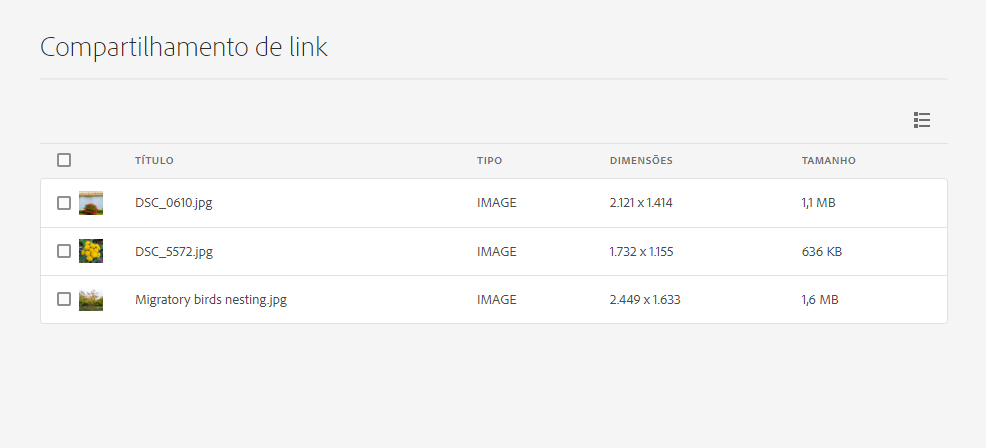

# Compartilhar links para ativos {#share-links-assets}

[!DNL Assets Essentials] permite gerar um link e compartilhar ativos com participantes externos, que não têm acesso ao [!DNL Assets Essentials] aplicativo. Você pode definir:

* Uma data de expiração para o link

* Se os recipients tiverem permissão para baixar os ativos (binários originais) após acessar o link.

Com base nessas configurações, o recipient do link pode optar por visualizar ou baixar os ativos.

## Gerar um link para ativos {#generate-link-for-assets}

Para gerar um link para um ativo ou uma pasta contendo ativos:

1. Selecione o(s) ativo(s) e/ou a(s) pasta(s) contendo os ativos e clique em **[!UICONTROL Share Link]**.

1. Se desejar ajustá-lo, clique no ícone Calendário para definir uma data de expiração para o link usando o **[!UICONTROL Expiration Date]** campo. Também é possível especificar uma data diretamente na variável `yyyy-mm-dd` formato. Por padrão, a data de expiração de um link é definida como 2 semanas a partir da data de compartilhamento.

1. Selecionar **[!UICONTROL Allow download]** para permitir que o recipient do link baixe ativos.

1. Clique em **[!UICONTROL Generate Link]**.

1. Clique em **[!UICONTROL Copy Link]** para copiar o link. Também é possível copiar o link do **[!UICONTROL Share Link]** campo.

   

1. Clique em **[!UICONTROL Close]** e compartilhar o link usando email ou outras ferramentas de colaboração.

## Acessar os ativos compartilhados {#access-shared-assets}

Após compartilhar o link público para os ativos, os recipients podem clicar no link para visualizar ou baixar os ativos compartilhados em um navegador da Web sem precisar fazer logon no [!DNL Assets Essentials].

Clique no link , clique na pasta para navegar até o ativo e, em seguida, clique no ativo para visualizá-lo. Você pode optar por exibir os ativos compartilhados em uma Exibição de lista ou em uma Exibição de cartão.

Você pode passar o mouse sobre o ativo compartilhado ou a pasta de ativos compartilhados para selecionar o ativo ou baixá-lo.

Você também pode selecionar vários ativos e clicar em **[!UICONTROL Download]**. [!DNL Assets Essentials] baixa os ativos selecionados como um arquivo zip. [!DNL Assets Essentials] cria uma subpasta no arquivo zip pai, com o mesmo nome do ativo, para cada ativo que você seleciona para download.

Para baixar todos os ativos de uma só vez, alterne para a **[!UICONTROL List view]**, clique em **[!UICONTROL Select all]** e, em seguida, clique em **[!UICONTROL Download]**.

>[!NOTE]
>
>Se você não ativar a opção de download enquanto [geração do link](#share-links-assets) para um ativo e se o recipient do link selecionar para baixar o ativo, [!DNL Assets Essentials] baixa um arquivo zip vazio.

