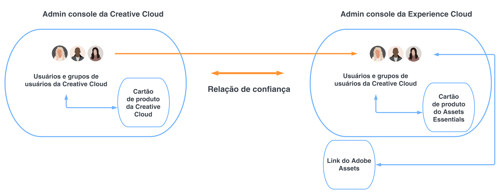

# Assets Essentials para Creative Cloud Pro com soluções de gerenciamento de trabalho {#creative-cloud-enterprise-user-journeys}

## Introdução {#introduction}

A Creative Cloud Pro para corporações com soluções de gerenciamento de trabalho apresenta ferramentas criativas, de conteúdo e de gerenciamento de trabalho para aumentar sua capacidade de produzir conteúdo criativo e atingir metas comerciais rapidamente. A solução inclui os seguintes componentes:

* Creative Cloud Pro

* Adobe Workfront

* Experience Manager Assets Essentials

Este tutorial apresenta uma jornada de administrador que permite a integração do aplicativo do Assets Essentials aos aplicativos de desktop da Creative Cloud e ao aplicativo do Adobe Workfront. Os aplicativos de desktop da Creative Cloud incluem o Adobe Photoshop, Adobe Illustrator, Adobe InDesign e Adobe XD.

## Tipos de implantação {#deployment-types}

Como a solução consiste em aplicativos e serviços da Creative Cloud e da Adobe Experience Cloud, eles podem ser implantados em uma ou duas instâncias do Adobe Admin Console para sua empresa.

No caso de implantação em duas instâncias do Admin Console, é necessária uma etapa de configuração adicional:

* Os serviços e aplicativos da Creative Cloud (Creative Cloud Pro para corporações e módulos opcionais) são gerenciados no [Adobe Admin Console para sua implantação da Creative Cloud](https://helpx.adobe.com/br/enterprise/admin-guide.html).

* O Adobe Workfront e o Adobe Experience Manager Assets Essentials são gerenciados no [Adobe Admin Console para soluções da Experience Cloud](https://experienceleague.adobe.com/docs/core-services/interface/administration/admin-getting-started.html?lang=pt-BR).

Para integrar aplicativos da Creative Cloud e do Assets Essentials, os usuários disponíveis no Admin Console da Creative Cloud devem ser disponibilizados no Admin Console da Experience Cloud. Para disponibilizar os usuários no Admin Console da Experience Cloud, crie um diretório para estabelecer a [confiabilidade do diretório](https://helpx.adobe.com/br/enterprise/using/set-up-identity.html#directory-trusting) entre as duas instâncias do Admin Console.

Conforme mostrado no diagrama, os usuários da Creative Cloud são automaticamente disponibilizados no Admin Console da Experience Cloud com base em uma relação de confiança entre as duas instâncias. Em seguida, é possível adicionar os usuários aos perfis de produto do Assets Essentials. Como resultado, os usuários da Creative Cloud podem acessar o aplicativo Adobe Asset Link, que pode interagir com o repositório do Assets Essentials. Para obter mais informações, consulte [Integrar o Assets Essentials aos aplicativos da Creative Cloud](integrate-with-creative-cloud.md).

## Jornadas de documentação do Experience Manager {#documentation-journeys}

Uma jornada de documentação une vários tópicos e recursos diferentes e talvez complicados, fornecendo uma narrativa que ajuda o leitor, que pode estar iniciando no Assets Essentials, a entender e resolver um problema comercial do início ao fim, considerando que o leitor possui o mínimo de conhecimento prévio sobre o tópico ou sobre o Assets Essentials.

As Jornadas de documentação foram projetadas com princípios de práticas recomendadas, informadas pela última pesquisa da Adobe, experiência comprovada de implementação dos consultores da Adobe e feedback de projetos de clientes.

## Pré-requisitos

* [Acesso ao Adobe Admin Console para soluções da Experience Cloud](https://experienceleague.adobe.com/docs/core-services/interface/administration/admin-getting-started.html?lang=pt-BR)

* [Acesso ao Adobe Admin Console para implantação da Creative Cloud para corporações](https://helpx.adobe.com/br/enterprise/admin-guide.html)

## Administrar o Experience Manager Assets Essentials {#administer-assets-essentials}

O Adobe Experience Manager Assets Essentials é uma edição mais leve e atualizada do Adobe Experience Manager Assets. O Assets Essentials fornece gerenciamento e colaboração unificados de ativos com uma interface simplificada e consistente. A facilidade de uso permite que mais equipes de criação e marketing armazenem, descubram e distribuam ativos digitais.

O Adobe Experience Manager Assets Essentials é provisionado pela Adobe para seus clientes. Como parte do provisionamento, o Assets Essentials é adicionado à organização de um cliente no Adobe Admin Console.

Os administradores usam o Admin Console para gerenciar os direitos de usuários ao produto Assets Essentials:

* Adicionar grupos de usuários

* Adicionar usuários aos grupos

* Adicionar usuários aos perfis de produto do Assets Essentials

Após gerenciar os direitos do usuário no Admin Console, os administradores podem usar o aplicativo do Assets Essentials para:

* Criar uma estrutura de pastas para atender melhor às necessidades da organização

* Gerenciar permissões da estrutura de pastas

* Configurar formulários de metadados

Agora que você configurou e gerenciou o aplicativo do Assets Essentials, [integre os aplicativos da Creative Cloud ao aplicativo do Experience Manager Assets Essentials](integrate-with-creative-cloud.md).

## Integrar aplicativos da Creative Cloud ao Experience Manager Assets Essentials {#administer-creative-cloud-applications}

[O painel no aplicativo do Adobe Asset Link](https://www.adobe.com/br/creativecloud/business/enterprise/adobe-asset-link.html) permite que os profissionais de criação se conectem ao repositório do [!DNL Assets Essentials] de dentro dos aplicativos de desktop compatíveis da [!DNL Adobe Creative Cloud]. O painel está disponível para [!DNL Adobe Photoshop], [!DNL Adobe Illustrator], [!DNL Adobe InDesign] e [!DNL Adobe XD]. Ele simplifica o acesso a ativos, o que, por sua vez, aumenta a velocidade do conteúdo.

Este tutorial o orienta a integrar os aplicativos do [!DNL Adobe Photoshop], [!DNL Adobe Illustrator], [!DNL Adobe InDesign] e [!DNL Adobe XD] ao Experience Manager Assets Essentials.

Metas:

* Criar confiabilidade de diretório entre o Admin Console da Creative Cloud e o Admin Console da Experience Cloud

* Adicionar usuários da Creative Cloud aos perfis de produto do Assets Essentials

* Instalar o Adobe Asset Link

* Usar o Adobe Asset Link

Agora que você integrou os aplicativos da Creative Cloud ao Assets Essentials, [integre o Adobe Workfront ao Experience Manager Assets Essentials](integrate-with-workfront.md).

## Integrar o Adobe Workfront ao Experience Manager Assets Essentials {#administer-adobe-workfront}

O [[!DNL Adobe Workfront]](https://www.workfront.com/) é um aplicativo de gerenciamento de trabalho que ajuda você a gerenciar todo o ciclo de vida do trabalho em um único local. A integração nativa entre o [!DNL Adobe Workfront] e o [!DNL Assets Essentials] permite que as organizações melhorem a velocidade do conteúdo e o prazo para comercialização, conectando intrinsecamente o gerenciamento de trabalho e de ativos. No contexto do gerenciamento de trabalho, os usuários têm acesso aos documentos e imagens necessários na mesma solução.

Este tutorial o orienta a administrar o Adobe Workfront e a integrá-lo ao Experience Manager Assets Essentials.

Metas:

* Adicionar usuários aos perfis de produto do Workfront

* Adicionar usuários aos perfis de produto do Assets Essentials

* Configurar a integração do Experience Manager Assets Essentials

