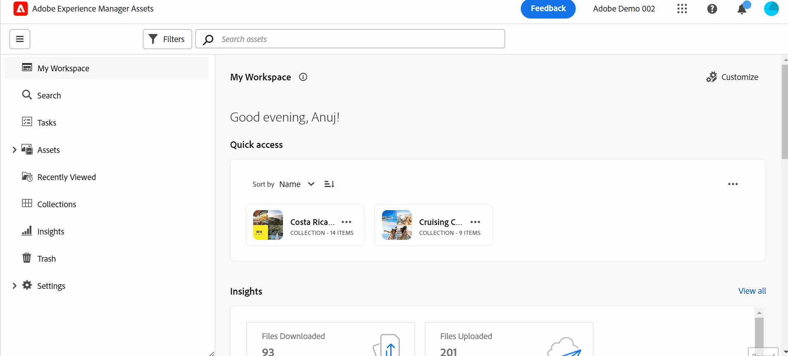

# Introdução à visualização de ativos {#assets-view}

No cenário atual de lançamento digital acelerado, onde a criação e a entrega de conteúdo em tempo real são essenciais, é fundamental ter uma experiência de Gerenciamento de ativos digitais (DAM) projetada para a velocidade de marketing de downstream. O Adobe, aproveitando sua experiência em capacitar profissionais de marketing e criação, introduz uma nova experiência revolucionária para o usuário da Visualização de ativos. Essa abordagem de primeiro fluxo de trabalho revoluciona como as empresas lidam com seus ativos digitais dinâmicos, capacitando os profissionais de marketing para maximizar a eficiência na localização, colaboração, personalização e entrega de ativos. Esses fluxos de trabalho simplificados aceleram a velocidade do conteúdo e impulsionam seus esforços de marketing para novos patamares.

## Como acessar a visualização de Ativos? {#access-assets-view}

É possível acessar a visualização de Ativos das seguintes maneiras:

* **Alternar na exibição do administrador**

   * Efetue logon no [!DNL Experience Manager] usando o Cloud Manager.
   * Navegue até **[!UICONTROL Assets]** > **[!UICONTROL Arquivos]**.
   * Clique no ícone do perfil no canto superior direito.
   * Clique em **[!UICONTROL Alternar exibição]** do **[!UICONTROL Configurações do perfil]** seção.
Repita essas etapas para alternar de volta para a exibição de Administração.

* **Alternador de produto**
   * Efetue logon no [!DNL Experience Manager] e clique em
   * Selecionar **[!UICONTROL Experience Manager Assets]** para acessar a visualização de Ativos.
   * Selecionar **[!UICONTROL Experience Manager]** para acessar a visualização Admin.

* **Links rápidos**
   * Faça logon em experience.adobe.com.
   * Clique em **[!UICONTROL Experience Manager Assets]** para acessar a visualização de Ativos.
   * Clique em **[!UICONTROL Experience Manager Assets]** para acessar a visualização de Ativos.

## Por que exibir o Assets?

A exibição de Ativos fornece os seguintes benefícios principais que não estão disponíveis na exibição de Administrador:

* [Painel Meu espaço de trabalho para fornecer experiências otimizadas](#my-workspace-for-streamlined-experience)
* [Abordagem de pesquisa para aumentar a eficiência](#search-first)
* [Insights para tomar decisões orientadas por dados](#insights-data)
* [Integração do Adobe Photoshop Express para acelerar a colaboração](#accelerate-collaboration)
* [Uploads de pasta para configurar a estrutura hierárquica da organização](#folder-uploads)
* [Inscrever-se no conteúdo do repositório para um gerenciamento eficiente de ativos](#subscribe-content)
* [Excluir ativos de forma reversível para oferecer melhor controle aos administradores](#soft-delete-assets)

### Painel Meu espaço de trabalho para fornecer experiências otimizadas {#my-workspace-for-streamlined-experience}

Dê as boas-vindas a uma solução de gerenciamento de ativos digitais que compreenda as diversas necessidades das diferentes funções organizacionais. A nova e elegante visualização de ativos prioriza a facilidade de uso e a velocidade, atendendo à preferência dos profissionais de marketing por apelo visual e espaços de trabalho desorganizados. Com um painel personalizável específico do usuário do Meu espaço de trabalho, os profissionais de marketing podem encontrar, visualizar, editar, gerenciar e fornecer ativos com eficiência notável. Despeça-se das horas infinitas gastas procurando ativos específicos e receba com prazer uma experiência simplificada que coloque tudo o que você precisa ao seu alcance.

### Insights para tomar decisões orientadas por dados {#insights-data}

Para acompanhar a velocidade do conteúdo, insights acionáveis são essenciais. A nova experiência de Exibição de ativos oferece insights avançados no Meu espaço de trabalho, fornecendo dados valiosos sobre o desempenho dos ativos, o uso do público-alvo e os envolvimentos. Os profissionais de marketing podem tomar decisões orientadas por dados, otimizar estratégias de conteúdo e refinar a entrega downstream para alcançar resultados ideais. Com acesso a insights significativos, as empresas podem se manter à frente da concorrência e impulsionar resultados excepcionais.

### Integração do Adobe Photoshop Express para acelerar a colaboração {#accelerate-collaboration}

A nova experiência oferece um conjunto robusto de recursos de colaboração, incluindo edição em tempo real com recursos incorporados do Adobe Photoshop, controles de versão e ferramentas de anotação. Isso permite uma colaboração contínua entre equipes de design, criação, marca e marketing, permitindo que superem gargalos e agilizem o processo de operações de marketing. Os profissionais de marketing agora têm ferramentas eficientes à disposição para acelerar a entrega de projetos e aumentar sua produtividade geral.

Assista a este vídeo para entender o poder do Assets visualizar a integração com o Adobe Photoshop Express:

>[!VIDEO](https://video.tv.adobe.com/v/3420922)

### Uploads de pasta para configurar a estrutura hierárquica da organização {#folder-uploads}

Configure rapidamente uma estrutura de pastas para sua organização usando a visualização Ativos carregando pastas existentes em seu sistema de arquivos local. Não é necessário criar pastas na pasta raiz e, em seguida, fazer o upload de ativos para essas pastas manualmente para manter a estrutura hierárquica lógica. Todas as pastas e ativos na pasta raiz são carregados automaticamente no Experience Manager Assets.

### Abordagem de pesquisa para aumentar a eficiência {#search-first}

Libere o potencial da biblioteca de ativos digitais da sua organização com o poder da pesquisa com funcionalidade de última geração. Você pode se despedir do incômodo de examinar manualmente inúmeros arquivos e pastas. Qualquer usuário pode localizar instantaneamente a imagem, o vídeo ou o documento perfeito de que você precisa para criar campanhas de marketing impressionantes, apresentações cativantes e conteúdo envolvente. Nosso primeiro mecanismo de pesquisa permite navegar facilmente por tipos de ativos, metadados, tags inteligentes e até mesmo pelo conteúdo em si, sem saber a palavra-chave exata. Adote o futuro do DAM com nosso Search-First e libere todo o potencial de sua biblioteca de ativos digitais.

### Inscrever-se no conteúdo do repositório para um gerenciamento eficiente de ativos {#subscribe-content}

A exibição de Ativos fornece a capacidade de monitorar as operações realizadas nos ativos, pastas ou coleções disponíveis no repositório. Você precisa selecionar e assinar o conteúdo sobre o qual deseja receber notificações. Você também pode configurar os tipos de evento, como exclusão do conteúdo que você assinou, modificações no conteúdo que você assinou etc. As notificações são enviadas a você somente para esses tipos de evento.

### Excluir ativos de forma reversível para oferecer melhor controle aos administradores {#soft-delete-assets}

A pasta Lixeira, disponível na visualização Ativos, lista os ativos excluídos da pasta raiz Ativos. Você pode selecionar um ativo da pasta Lixeira para restaurá-lo no local original ou excluí-lo permanentemente. Você também pode especificar uma palavra-chave ou aplicar filtros padrão ou personalizados para pesquisar ativos apropriados na pasta Lixeira.

Além desses recursos, a exibição Ativos também permite executar os seguintes recursos que não estão disponíveis na exibição Administração:

* Faça upload de uma nova versão de um ativo, com um nome diferente, do sistema de arquivos local para o repositório de ativos. O ativo carregado está disponível como uma nova versão com o mesmo nome do ativo original.

* Renomeie os ativos e a pasta disponíveis no repositório.

## Conclusão {#conclusion}

Chegou a era do digital-first e é hora de transformar nossas ferramentas de marketing para respaldar o cenário empresarial em evolução. A nova Exibição de ativos do Adobe Experience Manager Assets é personalizada para simplificar fluxos de trabalho, promover colaboração e acelerar a entrega de ativos. Ao adotar a velocidade do conteúdo, os profissionais de marketing podem desbloquear todo o potencial de seus ativos digitais e liberar a criatividade como nunca antes. Prepare-se para aproveitar o potencial da nova experiência de Visualização de ativos do Adobe e gerar resultados excepcionais em suas campanhas de marketing. É hora de abraçar o futuro do DAM e impulsionar seus negócios.

