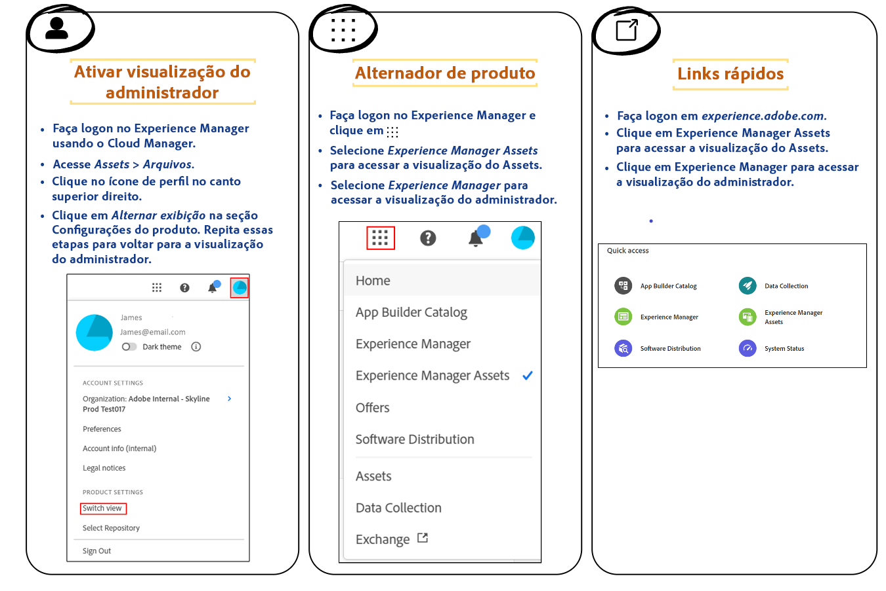

# Introdução à visualização do Assets {#assets-view}

No atual cenário digital de ritmo acelerado, onde a criação e a entrega de conteúdo em tempo real são essenciais, uma experiência de Gerenciamento de ativos digitais (DAM) desenvolvida para oferecer velocidade de marketing downstream é fundamental. A Adobe, utilizando sua experiência em capacitar profissionais de marketing e criação, apresenta uma nova experiência de usuário revolucionária. Essa abordagem de fluxo de trabalho revoluciona a maneira como as empresas lidam com seus ativos digitais dinâmicos, capacitando profissionais de marketing a maximizar a eficiência de localização, colaboração, personalização e entrega de ativos. Esses fluxos de trabalho simplificados aumentam a velocidade do conteúdo e impulsionam suas iniciativas de marketing para novos patamares.

## Como acessar a visualização do Assets? {#access-assets-view}

É possível acessar a visualização do Assets das seguintes maneiras:

<!--

* **Toggle in Admin view**

    * Log into [!DNL Experience Manager] using Cloud Manager.
    * Navigate to **[!UICONTROL Assets]** > **[!UICONTROL Files]**.
    * Click the profile icon on the top right corner.
    * Click **[!UICONTROL Switch View]** from the **[!UICONTROL Profile Settings]** section.
    Repeat these steps to switch back to the Admin view.

* **Product Switcher**
    * Log into [!DNL Experience Manager] and click .
    * Select **[!UICONTROL Experience Manager Assets]** to access the Assets view.
    * Select **[!UICONTROL Experience Manager]** to access the Admin view.

* **Quick Links** 
    * Log into experience.adobe.com.
    * Click **[!UICONTROL Experience Manager Assets]** to access the Assets view.
    * Click **[!UICONTROL Experience Manager Assets]** to access the Assets view.

    -->

## Por que usar a visualização do Assets?

A visualização do Assets fornece os seguintes benefícios fundamentais que não estão disponíveis na visualização de Admin:

* [Painel Meu espaço de trabalho para fornecer experiências otimizadas](#my-workspace-for-streamlined-experience)
* [Abordagem com foco na pesquisa para aumentar a eficiência](#search-first)
* [Insights para tomar decisões orientadas por dados](#insights-data)
* [Integração do Adobe Photoshop Express para acelerar a colaboração](#accelerate-collaboration)
* [Uploads de pasta para configurar a estrutura hierárquica da organização](#folder-uploads)
* [Assinatura do conteúdo do repositório para um gerenciamento de ativos eficiente](#subscribe-content)
* [Exclusão de ativos de forma reversível para oferecer melhor controle a admins](#soft-delete-assets)

### Painel Meu espaço de trabalho para fornecer experiências otimizadas {#my-workspace-for-streamlined-experience}

Dê as boas-vindas a uma solução de gerenciamento de ativos digitais que compreende as diversas necessidades das diferentes funções organizacionais. A nova visualização elegante do Assets prioriza a facilidade de uso e a velocidade, atendendo à preferência dos profissionais de marketing por apelo visual e espaços de trabalho organizados. Com o painel Meu espaço de trabalho que pode ser personalizado de acordo com cada usuário, profissionais de marketing podem encontrar, visualizar, editar, gerenciar e entregar ativos com máxima eficiência. Não é mais necessário gastar horas procurando por ativos específicos, pois essa experiência simplificada coloca tudo o que você precisa ao seu alcance.

### Insights para tomar decisões orientadas por dados {#insights-data}

Para acompanhar a velocidade do conteúdo, os insights acionáveis são essenciais. A nova experiência de visualização do Assets oferece insights avançados no Meu espaço de trabalho, fornecendo dados valiosos sobre desempenho de ativos, uso de público-alvo e engajamentos. Profissionais de marketing podem tomar decisões orientadas por dados, otimizar estratégias de conteúdo e melhorar a entrega downstream para alcançar resultados ideais. Com acesso a insights significativos, as empresas podem se manter à frente da concorrência e gerar resultados excepcionais.

### Integração do Adobe Photoshop Express para acelerar a colaboração {#accelerate-collaboration}

A nova experiência oferece um conjunto robusto de recursos de colaboração, incluindo edição em tempo real com recursos incorporados do Adobe Photoshop, controles de versão e ferramentas de anotação. Isso oferece uma colaboração perfeita entre equipes de design, criação, identidade visual e marketing, permitindo que superem obstáculos e agilizem o processo das operações de marketing. Profissionais de marketing agora têm ferramentas eficientes à disposição para acelerar a entrega de projetos e aumentar sua produtividade geral.

Assista a este vídeo para entender o potencial da integração da visualização do Assets com o Adobe Photoshop Express:

>[!VIDEO](https://video.tv.adobe.com/v/3420922)

As próximas versões também incluirão a [integração do Adobe Firefly por meio do Adobe Express](https://firefly.adobe.com/?gclid=EAIaIQobChMIlZeKuNfj_wIVeyCtBh3e5g2cEAAYASAAEgL56_D_BwE&amp;sdid=JM4FW6VL&amp;mv=search&amp;mv2=paidsearch&amp;ef_id=EAIaIQobChMIlZeKuNfj_wIVeyCtBh3e5g2cEAAYASAAEgL56_D_BwE:G:s&amp;s_kwcid=AL!3085!3!652077237594!e!!g!!adobe%20firefly!19870733758!148140507838).

### Uploads de pasta para configurar a estrutura hierárquica da organização {#folder-uploads}

Configure rapidamente uma estrutura de pastas para sua organização por meio da visualização do Assets carregando pastas existentes em seu sistema de arquivos local. Não é necessário criar pastas na pasta raiz e fazer upload de ativos para essas pastas manualmente para manter a lógica da estrutura hierárquica. Todas as pastas e ativos na pasta raiz são carregados automaticamente no Experience Manager Assets.

### Abordagem com foco na pesquisa para aumentar a eficiência {#search-first}

Explore o potencial da biblioteca de ativos digitais da sua organização com uma funcionalidade de pesquisa de última geração. Não é mais necessário vasculhar inúmeros arquivos e pastas manualmente. Qualquer usuário pode localizar instantaneamente a imagem, vídeo ou documento perfeito para criar campanhas de marketing impressionantes, apresentações cativantes e conteúdo envolvente. Nosso mecanismo com foco na pesquisa permite navegar facilmente pelos tipos de ativos, metadados, tags inteligentes e até pelo próprio conteúdo, mesmo sem saber a palavra-chave exata. Aproveite o futuro do DAM com nosso recurso de pesquisa e explore todo o potencial da sua biblioteca de ativos digitais.

### Assinatura do conteúdo do repositório para um gerenciamento de ativos eficiente {#subscribe-content}

A visualização do Assets fornece a capacidade de monitorar as operações executadas nos ativos, pastas ou coleções disponíveis no repositório. Você precisa selecionar e assinar o conteúdo sobre o qual deseja receber notificações. Você também pode configurar os tipos de evento, como exclusão do conteúdo assinado, modificações no conteúdo assinado etc. As notificações são enviadas a você somente para esses tipos de evento.

### Exclusão de ativos de forma reversível para oferecer melhor controle a admins {#soft-delete-assets}

A pasta Lixeira, disponível na visualização do Assets, lista os ativos excluídos da pasta raiz Ativos. Você pode selecionar um ativo na pasta Lixeira e restaurá-lo ao seu local de origem ou excluí-lo permanentemente. Você também pode especificar uma palavra-chave ou aplicar filtros padrão ou personalizados para pesquisar ativos apropriados na pasta Lixeira.

Além desses recursos, a visualização do Assets também permite executar os seguintes recursos que não estão disponíveis na visualização de Admin:

* Faça upload de uma nova versão de um ativo, com um nome diferente, do sistema de arquivos local para o repositório de ativos. O ativo carregado é disponibilizado como uma nova versão com o mesmo nome do ativo original.

* Renomeie os ativos e a pasta disponíveis no repositório.

## Conclusão {#conclusion}

A era do “digital-first” chegou e é hora de transformar nossas ferramentas de marketing para acompanhar a evolução do cenário comercial. A nova visualização do Adobe Experience Manager Assets é personalizada para simplificar fluxos de trabalho, promover a colaboração e acelerar a entrega de ativos. Por acompanhar a velocidade do conteúdo, profissionais de marketing podem explorar todo o potencial de seus ativos digitais e liberar sua criatividade como nunca antes. Prepare-se para aproveitar o potencial da nova experiência de visualização do Adobe Assets e gerar resultados excepcionais em suas campanhas de marketing. É hora de abraçar o futuro do DAM e impulsionar seus negócios.

