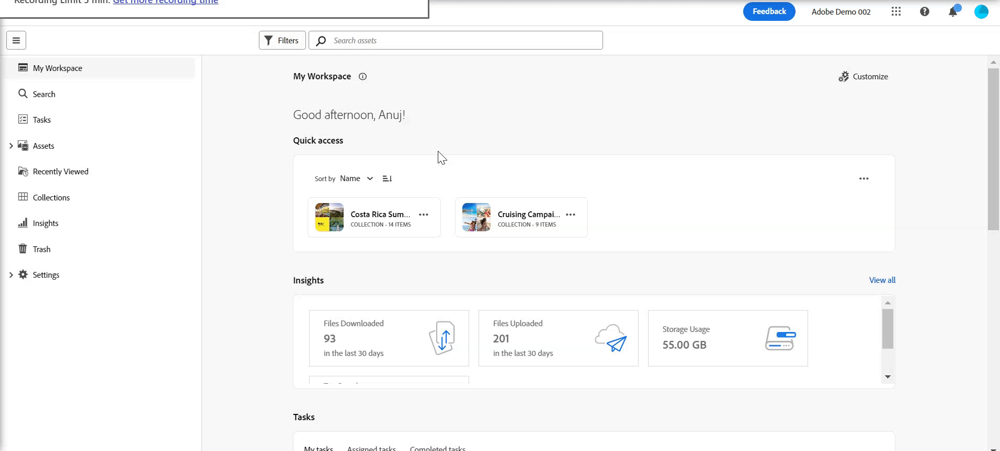

# Introdução à visualização de ativos {#assets-view}

No cenário atual de lançamento digital acelerado, onde a criação e a entrega de conteúdo em tempo real são essenciais, é fundamental ter uma experiência de Gerenciamento de ativos digitais (DAM) projetada para a velocidade de marketing de downstream. O Adobe, aproveitando sua experiência em capacitar profissionais de marketing e criação, introduz uma nova experiência revolucionária para o usuário da Visualização de ativos. Essa abordagem de primeiro fluxo de trabalho revoluciona como as empresas lidam com seus ativos digitais dinâmicos, capacitando os profissionais de marketing para maximizar a eficiência na localização, colaboração, personalização e entrega de ativos. Esses fluxos de trabalho simplificados aceleram a velocidade do conteúdo e impulsionam seus esforços de marketing para novos patamares.

## Como acessar a visualização de Ativos? {#access-assets-view}

É possível acessar a visualização de Ativos das seguintes maneiras:

* **Alternar na exibição do administrador**

   * Efetue logon no [!DNL Experience Manager] usando o Cloud Manager.
   * Navegue até **[!UICONTROL Assets]** > **[!UICONTROL Arquivos]**.
   * Clique no ícone do perfil no canto superior direito.
   * Clique em **[!UICONTROL Alternar exibição]** do **[!UICONTROL Configurações do perfil]** seção.
Repita essas etapas para alternar de volta para a exibição de Administração.

* **Alternador de produto**
   * Efetue logon no [!DNL Experience Manager] e clique em
   * Selecionar **[!UICONTROL Experience Manager Assets]** para acessar a visualização de Ativos.
   * Selecionar **[!UICONTROL Experience Manager]** para acessar a visualização Admin.

* **Links rápidos**
   * Faça logon em experience.adobe.com.
   * Clique em **[!UICONTROL Experience Manager Assets]** para acessar a visualização de Ativos.
   * Clique em **[!UICONTROL Experience Manager Assets]** para acessar a visualização de Ativos.

## Painel Meu espaço de trabalho para fornecer experiências otimizadas

Dê as boas-vindas a uma solução de gerenciamento de ativos digitais que compreenda as diversas necessidades das diferentes funções organizacionais. A nova e elegante visualização de ativos prioriza a facilidade de uso e a velocidade, atendendo à preferência dos profissionais de marketing por apelo visual e espaços de trabalho desorganizados. Com um painel personalizável específico do usuário do Meu espaço de trabalho, os profissionais de marketing podem encontrar, visualizar, editar, gerenciar e fornecer ativos com eficiência notável. Despeça-se das horas infinitas gastas procurando ativos específicos e receba com prazer uma experiência simplificada que coloque tudo o que você precisa ao seu alcance.

