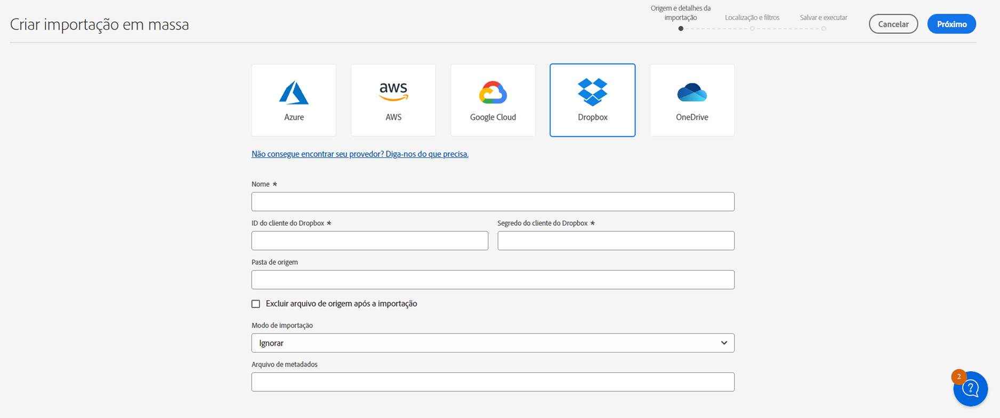
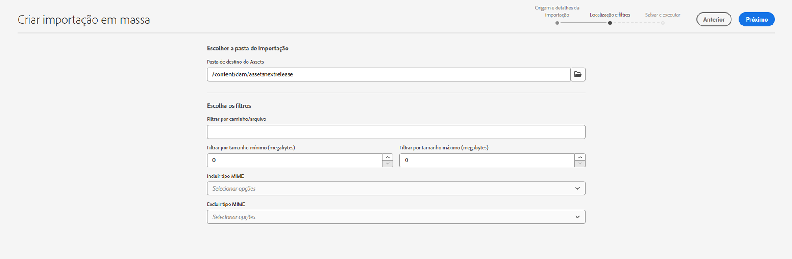
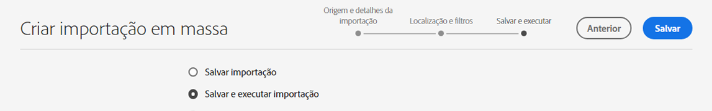
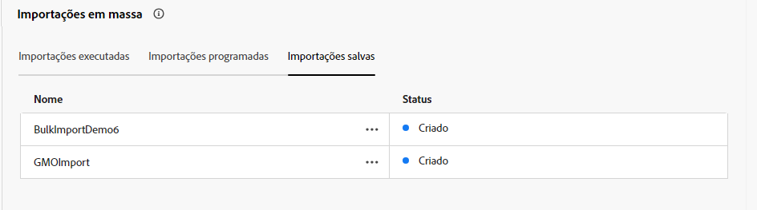
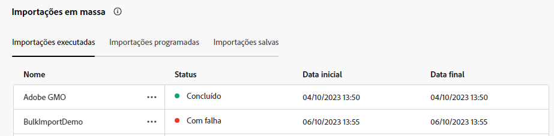
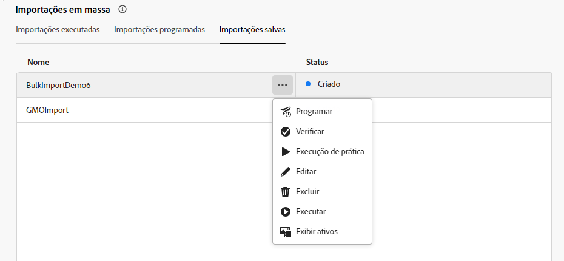
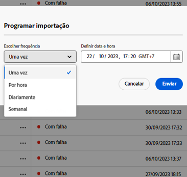
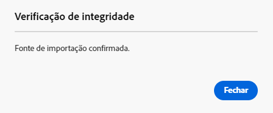
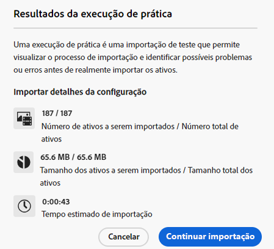
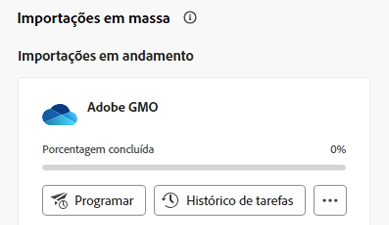

# Importar ativos em massa usando o Assets Essentials  {#bulk-import-essentials}

>[!CONTEXTUALHELP]
>id="assets_bulk_import"
>title="Importação em massa de ativos"
>abstract="Administradores podem importar um grande número de ativos de uma fonte de dados para o Experience Manager Assets usando o Assets Essentials. Não é mais necessário mais fazer upload de ativos ou pastas individuais para o Experience Manager Assets. Os provedores de armazenamento na nuvem compatíveis com a importação em massa são Azure, AWS, Google Cloud e Dropbox."
>additional-url="https://images-tv.adobe.com/mpcv3/4477/98bce651-721c-442e-98b8-c43e7708e44c_1698834577.854x480at800_h264.mp4" text="Assistir ao vídeo"

A importação em massa do AEM Assets Essentials permite que admins importem um grande número de ativos de uma fonte de dados para o AEM Assets. Não é mais necessário fazer upload de ativos ou pastas individuais para o AEM Assets.

>[!NOTE]
>
>O importador em massa do Assets Essentials usa o mesmo back-end do importador em massa do Assets as a Cloud Service. No entanto, o Assets Essentials oferece mais fontes de dados para importar e uma experiência de usuário mais simplificada.

É possível importar ativos das seguintes fontes de dados:

* Azure
* AWS
* Google Cloud
* Dropbox
* OneDrive

## Pré-requisitos {#prerequisites}

| Fonte de Dados | Pré-requisitos |
|-----|------|
| Azure | <ul> <li>Conta de armazenamento do Azure </li> <li> Container do Blob Azure <li> Chave de Acesso do Azure ou Token SAS com base no modo de autenticação </li></ul> |
| AWS | <ul> <li>Região do AWS </li> <li> Classificação AWS <li> Chave de acesso do AWS </li><li> Segredo de acesso do AWS </li></ul> |
| Google Cloud | <ul> <li>Compartimento de GCP </li> <li> Email da conta de serviço GCP <li> Chave privada da conta de serviço GCP</li></ul> |
| Dropbox | <ul> <li>ID do cliente do Dropbox </li> <li> Segredo do cliente do Dropbox</li></ul> |
| OneDrive | <ul> <li>ID de locatário do OneDrive  </li> <li> ID de cliente do OneDrive</li><li> Segredo de cliente do OneDrive</li></ul> |

Além desses pré-requisitos da fonte de dados, você deve saber o nome da pasta de origem disponível na fonte de dados que contém todos os ativos que precisam ser importados para o AEM Assets.

## Configurar o aplicativo para desenvolvedores do Dropbox {#dropbox-developer-application}

Antes de importar ativos da sua conta do Dropbox para o AEM Assets, crie e configure o aplicativo para desenvolvedores do Dropbox.

Execute as seguintes etapas:

1. Faça logon na sua [conta do Dropbox](https://www.dropbox.com/developers) e clique em **[!UICONTROL Criar aplicativos]**.

1. Na seção **[!UICONTROL Escolher uma API]**, selecione o único botão de opção disponível.

1. Na seção **[!UICONTROL Escolha o tipo de acesso necessário]**, selecione uma das seguintes opções:

   * Selecione **[!UICONTROL Pasta do aplicativo]** se precisar acessar uma única pasta criada no seu aplicativo na conta do Dropbox.

   * Selecione **[!UICONTROL Dropbox completo]** se precisar de acesso a todos os arquivos e pastas da sua conta do Dropbox.

1. Especifique um nome para o aplicativo e clique em **[!UICONTROL Criar aplicativo]**.

1. Na guia **[!UICONTROL Configurações]** do aplicativo, adicione o seguinte à seção **[!UICONTROL URIs de redirecionamento]**:

   * https://exc-unifiedcontent.experience.adobe.net

   * https://exc-unifiedcontent.experience-stage.adobe.net (válido apenas para ambientes de preparo)

1. Copie os valores para os campos **[!UICONTROL Chave do aplicativo]** e **[!UICONTROL Segredo do aplicativo]**. Os valores são necessários ao configurar a ferramenta de importação em massa no AEM Assets.

1. Na guia **[!UICONTROL Permissões]**, adicione as seguintes permissões na seção **[!UICONTROL Escopos individuais]**.

   * account_info.read

   * files.metadata.read

   * files.content.read

   * files.content.write

1. Clique em **[!UICONTROL Enviar]** para salvar as alterações.

## Configurar o aplicativo para desenvolvedores do OneDrive {#onedrive-developer-application}

Antes de importar ativos da sua conta do OneDrive para o AEM Assets, crie e configure o aplicativo para desenvolvedores do OneDrive.

Execute as seguintes etapas:

1. Faça logon na [conta do OneDrive](https://portal.azure.com/#view/Microsoft_AAD_RegisteredApps/ApplicationsListBlade) e clique em **[!UICONTROL Novo registro]**.

1. Especifique um nome para o aplicativo e selecione **[!UICONTROL Apenas contas que estão neste diretório organizacional (somente Adobe - locatário único)]** em **[!UICONTROL Tipos de conta compatíveis]** e clique em **[!UICONTROL Registrar]**. O aplicativo foi criado com sucesso.

1. Copie os valores para os campos ID do cliente e ID do locatário do aplicativo. Os valores são necessários ao configurar a ferramenta de importação em massa no AEM Assets.

1. Execute as seguintes etapas para adicionar um certificado:
   1. Na página de visão geral do aplicativo, clique em **[!UICONTROL Adicionar um certificado ou segredo]** e selecione **[!UICONTROL Novo segredo de cliente]**.
   1. Especifique a descrição e a expiração do segredo de cliente e clique em **[!UICONTROL Adicionar]**.
   1. Depois de criar o segredo de cliente, copie o campo **[!UICONTROL Valor]** (não copie o campo ID do segredo). Isso é necessário ao configurar a importação em massa no AEM Assets.

1. Execute as etapas a seguir para adicionar URIs de redirecionamento:
   1. Na página de visão geral do aplicativo, clique em **[!UICONTROL Adicionar um URI de redirecionamento]** >; **[!UICONTROL Adicionar uma plataforma]** >; **[!UICONTROL Web]**.
   1. Adicione o seguinte à seção **[!UICONTROL URIs de redirecionamento]**:

      * https://exc-unifiedcontent.experience.adobe.net

      * https://exc-unifiedcontent.experience-stage.adobe.net (válido apenas para ambientes de preparo)

      Adicione o primeiro URI e clique em **[!UICONTROL Configurar]** para adicioná-lo. É possível adicionar mais clicando na opção **[!UICONTROL Adicionar URI]** disponível na seção **[!UICONTROL Web]** da página **[!UICONTROL Autenticação]**.

1. Execute as seguintes etapas para adicionar permissões de API no aplicativo:
   1. Clique em **[!UICONTROL Permissões de API]** no painel esquerdo e selecione **[!UICONTROL Adicionar uma permissão]**.
   1. Clique em **[!UICONTROL Gráfico da Microsoft]** > **[!UICONTROL Permissões delegadas]**. A seção **[!UICONTROL Selecionar permissão]** exibe as permissões disponíveis.
   1. Selecione a permissão `offline_access` em `OpenId permissions` e a permissão `Files.ReadWrite.All` em `Files`.
   1. Clique em **[!UICONTROL Adicionar permissões]** para salvar as atualizações.

## Criação de uma configuração de importação em massa {#create-bulk-import-configuration}

Siga as seguintes etapas para criar uma configuração de importação em massa:

1. Navegue até **[!UICONTROL Configurações]** > **[!UICONTROL Importação em massa]** e clique em **[!UICONTROL Criar importação]**.
1. Selecione a fonte de dados. As opções disponíveis incluem Azure, AWS, Google Cloud e Dropbox.
1. Especifique um nome para a configuração de importação em massa no campo **[!UICONTROL Nome]**.
1. Especifique as credenciais específicas da fonte de dados, conforme mencionado em [Pré-requisitos](#prerequisites).
1. Forneça o nome da pasta raiz que contém ativos na fonte de dados no campo **[!UICONTROL Pasta de origem]**.

   >[!NOTE]
   >
   >Se estiver usando o Dropbox como fonte de dados, especifique o caminho da pasta de origem com base nas seguintes regras:
   >* Se você selecionar **Dropbox completo** ao criar o aplicativo do Dropbox e a pasta que contiver os ativos existir em `https://www.dropbox.com/home/bulkimport-assets`, especifique `bulkimport-assets` no campo **[!UICONTROL Pasta de origem]**.
   >* Se você selecionar **Pasta do aplicativo** ao criar o aplicativo do Dropbox e a pasta que contiver os ativos existir em `https://www.dropbox.com/home/Apps/BulkImportAppFolderScope/bulkimport-assets`, especifique `bulkimport-assets` no campo **[!UICONTROL Pasta de origem]**, onde `BulkImportAppFolderScope` refere-se ao nome do aplicativo. Neste caso, o `Apps` é adicionado automaticamente após `home`.

1. (Opcional) Selecione a opção **[!UICONTROL Excluir arquivo de origem após a importação]** para excluir os arquivos originais do armazenamento de dados de origem após os arquivos serem importados para o Experience Manager Assets.
1. Selecione o **[!UICONTROL Modo de importação]**. Selecione **[!UICONTROL Ignorar]**, **[!UICONTROL Substituir]** ou **[!UICONTROL Criar versão]**. O modo Ignorar é o padrão e nesse modo, o assimilador ignora a importação de um ativo, caso já exista.
   

1. (Opcional) Especifique o arquivo de metadados a ser importado, fornecido no formato CSV, no campo Arquivo de metadados e clique em **[!UICONTROL Próximo]** para navegar até **[!UICONTROL Localização e filtros]**.
1. Defina um local no DAM onde os ativos devem ser importados usando o campo **[!UICONTROL Pasta de destino do Assets]**. Por exemplo, `/content/dam/imported_assets`.
1. (Opcional) Na seção **[!UICONTROL Escolher filtros]**, forneça o tamanho mínimo de arquivo dos ativos em MB para incluí-los no processo de assimilação no campo **[!UICONTROL Filtrar por tamanho mínimo]**.
1. (Opcional) Forneça o tamanho máximo de arquivo dos ativos em MB para incluí-los no processo de assimilação no campo **[!UICONTROL Filtrar por tamanho máximo]**.
1. (Opcional) Selecione os tipos MIME a serem incluídos no processo de assimilação usando o campo **[!UICONTROL Incluir tipo MIME]**. É possível selecionar vários tipos MIME nesse campo. Se não definir um valor, todos os tipos MIME serão incluídos no processo de assimilação.

1. (Opcional) Selecione os tipos MIME a serem excluídos no processo de assimilação usando o campo **[!UICONTROL Excluir tipo MIME]**. É possível selecionar vários tipos MIME nesse campo. Se não definir um valor, todos os tipos MIME serão incluídos no processo de assimilação.

   

1. Clique em **[!UICONTROL Avançar]**. Selecione **[!UICONTROL Salvar e executar importação]** para salvar a configuração e executar a importação em massa. Selecione **[!UICONTROL Salvar importação]** para salvar a configuração a fim de executá-la posteriormente.

   

1. Clique em **[!UICONTROL Salvar]** para executar a opção selecionada.

### Tratamento de nomes de arquivo durante a importação em massa {#filename-handling-bulkimport-assets-view}

Ao importar ativos ou pastas em massa, o [!DNL Experience Manager Assets] importa toda a estrutura existente na fonte de importação. O [!DNL Experience Manager] segue as regras incorporadas para caracteres especiais em nomes de ativos e pastas, portanto, esses nomes de arquivo precisam de limpeza. Tanto o nome da pasta quanto o nome do ativo definidos pelo usuário permanece inalterado e é armazenado em `jcr:title`.

Durante a importação em massa, o [!DNL Experience Manager] procura pelas pastas existentes para evitar a reimportação de ativos e pastas e também verifica as regras de limpeza aplicadas na pasta principal onde a importação ocorre. Se as regras de limpeza forem aplicadas na pasta principal, as mesmas regras serão aplicadas à fonte de importação. Para novas importações, as seguintes regras de limpeza são aplicadas para gerenciar os nomes de arquivo de ativos e pastas.

Para obter mais informações sobre nomes não permitidos, tratamento de nomes de ativos e de nomes de pastas durante a importação em massa, consulte [Tratamento de nomes de arquivo durante a importação em massa](https://experienceleague.adobe.com/docs/experience-manager-cloud-service/content/assets/manage/add-assets.html?lang=pt-BR#filename-handling-bulkimport).

## Exibir configurações de importação em massa já existentes {#view-import-configuration}

Se optar por salvar a configuração após criá-la, a configuração será exibida na guia **[!UICONTROL Importações salvas]**.

Se você optar por salvar e executar a importação, a configuração de importação será exibida na guia **[!UICONTROL Importações executadas]**.

Se você agendar uma importação, ela será exibida na guia **[!UICONTROL Importações programadas]**.

## Edição de configurações de importação em massa {#edit-import-configuration}

Para editar os detalhes da configuração, clique em ... correspondente ao nome da configuração e escolha **[!UICONTROL Editar]**. Não é possível editar o título da configuração e a fonte de dados de importação. Você pode editar as configurações nas guias Importações executadas, programadas ou salvas.

## Agendar importações únicas ou recorrentes {#schedule-imports}

Para agendar uma importação em massa única ou recorrente, execute as seguintes etapas:

1. clique em ... correspondente ao nome da configuração disponível na guia **[!UICONTROL Importações Executadas]** ou **[!UICONTROL Importações salvas]** e escolha **[!UICONTROL Programar]**. Também é possível reagendar uma importação navegando até a guia **[!UICONTROL Importações programadas]** e clicando em **[!UICONTROL Programar]**.

1. Defina uma assimilação única ou agende uma programação por hora, dia ou semana. Clique em **[!UICONTROL Enviar]**.

   

## Execução de uma verificação de integridade de importação {#import-health-check}

Para validar a conexão com a fonte de dados, clique em ... correspondente ao nome da configuração e selecione **[!UICONTROL Verificar]**. Se a conexão for bem-sucedida, o Experience Manager Assets exibirá a seguinte mensagem:

## Faça uma execução de prática antes de executar uma importação {#dry-run-bulk-import}

Clique em ... correspondente ao nome da configuração e escolha **[!UICONTROL Execução de prática]** para solicitar uma execução de teste para a tarefa de importação em massa. O Experience Manager Assets exibe os seguintes detalhes sobre a tarefa de importação em massa:

## Execução de uma importação em massa {#run-bulk-import}

Se a importação foi salva ao criar a configuração, é possível navegar até a guia Importações salvas, clicar em ... correspondente à configuração e selecionar **[!UICONTROL Executar]**.

Da mesma forma, caso precise executar uma importação já executada, navegue até a guia Importações executadas, clique em ... correspondente ao nome da configuração e selecione **[!UICONTROL Executar]**.

## Interrupção ou agendamento de uma importação em andamento {#schedule-stop-ongoing-report}

É possível agendar ou interromper uma importação em massa em andamento usando a caixa de diálogo Status da importação em massa que é exibida na página inicial da Importação em massa durante a importação.

Também é possível visualizar os ativos que foram importados na pasta de destino clicando em **[!UICONTROL Exibir ativos]**.

## Exclusão de uma configuração de importação em massa {#delete-bulk-import-configuration}

Clique em ... correspondente ao nome da configuração existente nas guias **[!UICONTROL Importações Executadas]**, **[!UICONTROL Importações Programadas]** ou **[!UICONTROL Importações Salvas]** e selecione **[!UICONTROL Excluir]** para excluir a configuração.

## Navegação até os ativos após a execução de uma importação em massa {#view-assets-after-bulk-import}

Para exibir o local de destino do Assets onde os ativos são importados após a execução das tarefas de importação em massa, clique em ... correspondente ao nome da configuração e selecione **[!UICONTROL Exibir ativos]**.
