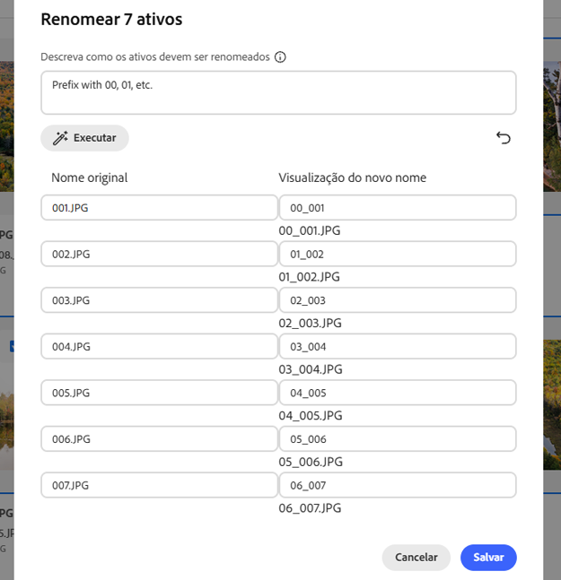

# Renomear ativo ou pasta em [!DNL Assets Essentials] {#rename-single-asset-or-folder}

Renomear pode ajudar a organizar, categorizar e identificar melhor os arquivos sem alterar seu conteúdo ou local. [!DNL Assets Essentials] permite renomear o ativo ou pasta selecionada.

Execute as etapas abaixo para renomear um ativo ou uma pasta:

1. Localize o ativo ou pasta que deseja renomear.

1. Use uma das seguintes maneiras para renomear um ativo ou uma pasta:

   * Selecione o ativo ou pasta e clique em  **[!UICONTROL Renomear]** no menu superior.
   * Clique em mais opções `...` no ativo ou pasta e selecione **[!UICONTROL Renomear]**.
   * Clique no título de um ativo ou pasta para renomeá-lo. Insira o novo texto na caixa de texto **Renomear ativo** e clique em **Salvar**. Esse recurso está disponível nas exibições em grade, galeria, cascata e lista.

## Renomear ativos alimentados por IA em massa {#rename-bulk-assets-using-ai}

[!DNL Assets Essentials] permite renomear vários ativos de uma só vez usando IA. A funcionalidade de Renomeação em massa de IA só pode ser aplicada a arquivos, não a pastas. Você pode selecionar vários arquivos de uma vez e renomeá-los todos juntos.

Siga as etapas abaixo para renomear vários arquivos de uma só vez usando prompts gerados por IA:

1. Selecione vários ativos e clique em **[!UICONTROL Renomear em massa]** no menu superior.

1. Adicione o prompt que descreve como você deseja renomear os ativos selecionados. Consulte [alguns exemplos ilustrando a Renomeação em Massa de IA](#examples-ai-bulk-rename).

1. Clique em **[!UICONTROL Executar]** para permitir que a IA renomeie os ativos como mencionado no prompt.

1. [Opcional] Clique no  para reverter ou cancelar a última ação executada.

1. Verifique as alterações na coluna [!UICONTROL Nova visualização de nome] e clique em **[!UICONTROL Salvar]**.

   

## Alguns exemplos ilustrando a Renomeação em massa de IA {#examples-ai-bulk-rename}

A seguir, apresentamos alguns exemplos de como usar a IA para renomear ativos em massa com base em um prompt de IA:

* Adicione os prefixos 00, 01 e assim por diante, e acrescente a data de hoje como sufixo.
* Altere todos os arquivos para `my-file` e anexe um número incremental.
* Remova o prefixo e o sufixo, mantendo apenas a parte do meio do nome.
* Adicione os prefixos 001, 002, etc., aos arquivos e traduza para o inglês.

>[!VIDEO](https://video.tv.adobe.com/v/3440975)

>[!NOTE]
>
> * Não é possível converter emojis em texto.
> * Use um nome exclusivo para evitar mensagens de aviso ao renomear ativos. Mas você pode tentar novamente com um novo nome.
> * Você também pode converter caracteres Unicode ou não alfanuméricos em texto.

## Próximas etapas {#next-steps}

* [Assista a um vídeo sobre como gerenciar formulários de metadados no Assets Essentials](https://experienceleague.adobe.com/docs/experience-manager-learn/assets-essentials/configuring/metadata-forms.html)

* Forneça feedback sobre o produto usando a opção de [!UICONTROL Feedback] disponível na interface do Assets Essentials

* Forneça feedback sobre a documentação usando as opções [!UICONTROL Editar esta página]  ou [!UICONTROL Registrar um problema]  disponíveis na barra lateral direita

* Entre em contato com o [Atendimento ao cliente](https://experienceleague.adobe.com/pt-br?support-solution=General#support)

