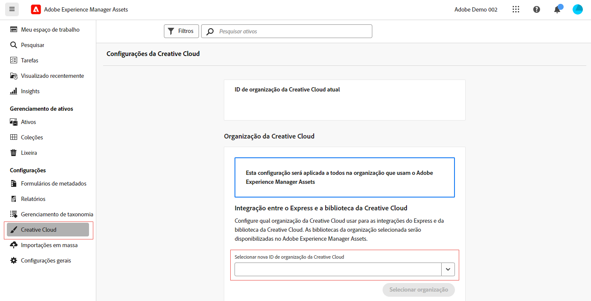

# Direitos entre organizações para integrações da Creative Cloud  {#cross-org-entitlements}

O Experience Manager Assets pode se conectar a um direito da Creative Cloud provisionado para uma organização IMS diferente para usar facilmente as integrações mais recentes da Creative Cloud no AEM Assets, incluindo o Express e as bibliotecas da Creative Cloud.

Se seus produtos da Creative Cloud e o AEM Assets forem provisionados para organizações IMS separadas, você poderá se conectar a uma organização diferente da Creative Cloud para executar fluxos de trabalho integrados entre as duas soluções.

## Pré-requisitos {#prerequisites}

* Direitos de administração do Experience Manager Assets

* Direito ativo à Creative Cloud para a mesma ID de usuário usada na Creative Cloud e no Experience Manager. Os direitos a IDs pessoais e federadas que utilizam o mesmo endereço de email são tratados como IDs de usuário diferentes.

## Conectar-se a uma nova organização da Creative Cloud {#connect-to-creative-cloud-org}

Para se conectar a uma nova organização da Creative Cloud, execute as seguintes etapas:

1. Navegue até **[!UICONTROL Configurações]** >; **[!UICONTROL Creative Cloud]**.

1. Selecione a nova organização da Creative Cloud usando a lista suspensa **[!UICONTROL Selecionar nova ID de organização da Creative Cloud]**. A lista exibe todas as organizações às quais você tem acesso. Selecione a organização com direitos da Creative Cloud ativos.

1. Clique em **[!UICONTROL Alternar organizações]** para alterar para a nova organização.

   

## Limitações {#limitations}

* Você pode conectar o AEM Assets a uma organização da Creative Cloud de cada vez. Não é possível conectar-se a várias organizações da Creative Cloud ao mesmo tempo.

* A organização da Creative Cloud à qual você se conecta no AEM Assets se aplica a todos os usuários em sua organização.
