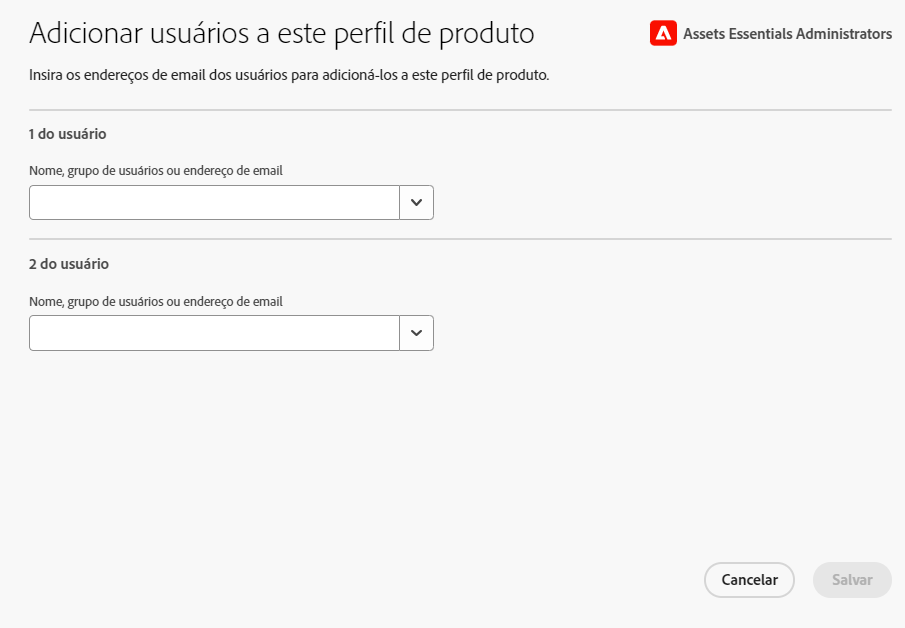

# Administrar o [!DNL Assets Essentials] e adicionar usuários {#administer}

O [!DNL Adobe Experience Manager Assets Essentials] é provisionado pela Adobe para seus clientes. Como parte do provisionamento, o [!DNL Assets Essentials] é adicionado à organização de um cliente no [!DNL Adobe Admin Console]. Os administradores usam o [!DNL Admin Console] para gerenciar direitos de usuário para a solução do [!DNL Assets Essentials] e atribuir administradores de aplicativos para configurar permissões e formulários de metadados no [!DNL Assets Essentials].

O diagrama de fluxo de dados a seguir ilustra a sequência de tarefas que um administrador deve executar para configurar e gerenciar o Assets Essentials:

## Acessar o Admin Console {#access-admin-console}

Depois que a solução Assets Essentials é provisionada, o administrador recebe um email da Adobe. O email contém uma mensagem de boas-vindas e um link para começar a trabalhar. Além disso, a Adobe inicia o processo de implantação do Assets Essentials automaticamente. Esse processo leva uma hora para ser concluído.

No link do email, acesse e faça logon no [Admin Console](https://adminconsole.adobe.com). Se você tiver acesso de administrador a mais de uma conta de organização, selecione a organização apropriada ou alterne para ela usando o [seletor de organização](https://helpx.adobe.com/br/enterprise/using/admin-console.html). Quando o processo de implantação automática é concluído, o cartão de produto do [!DNL AEM Assets Essentials] fica visível no [!DNL Admin Console].

Execute as seguintes tarefas de direito do usuário usando o Admin Console:

* [Criar administrador de aplicativos do Assets Essentials](#create-assets-essentials-administrator)

* [Adicionar grupos de usuários](#add-user-groups)

* [Adicionar grupos de usuários aos perfis de produtos](#add-users-to-product-profiles)

### Criar administrador de aplicativos do Assets Essentials {#create-assets-essentials-administrator}

O administrador do Admin Console deve adicionar o perfil de produto do administrador do Assets Essentials a um usuário e não a um grupo de usuários. O administrador do aplicativo do Assets Essentials poderá então gerenciar tarefas como criar uma estrutura de pastas, fazer upload de arquivos, configurar permissões, configurar formulários de metadados e criar coleções públicas. Para obter informações sobre como atribuir um perfil de administrador de aplicativo do Assets Essentials a um usuário, consulte [Adicionar perfis de produto a grupos de usuários](#add-product-profiles-to-user-groups).

### Adicionar grupos de usuários {#add-user-groups}

Crie grupos de usuários e atribua os usuários a eles. Esses grupos de usuários estarão disponíveis no aplicativo do Assets Essentials para que se possa definir as permissões de pastas.

Para obter informações sobre como gerenciar grupos de usuários, consulte `Create user groups` e `Edit user groups`, disponíveis em [Gerenciar grupos de usuários](https://helpx.adobe.com/br/enterprise/using/user-groups.html).

>[!NOTE]
>
>Se o Admin Console estiver configurado para usar um sistema externo para gerenciar atribuições de usuários/grupos, como conectores do Azure ou do Google, ferramenta de sincronização de usuários ou API REST do User Management, seus grupos e atribuições de usuários serão configurados automaticamente. Para obter mais informações, consulte [Usuários do Adobe Admin Console](https://helpx.adobe.com/br/enterprise/using/users.html).

Para obter informações sobre como gerenciar a adição de usuários a grupos de usuários, consulte `Add users to groups`, disponível em [Gerenciar grupos de usuários](https://helpx.adobe.com/br/enterprise/using/user-groups.html#add-users-to-groups).

### Adicionar perfis de produto a grupos de usuários {#add-product-profiles-to-user-groups}

Adicione perfis de produtos a grupos de usuários para que eles tenham acesso ao aplicativo do Assets Essentials.

Para adicionar perfis de produto a grupos de usuários:

1. Acesse o [Admin Console](https://adminconsole.adobe.com) da sua organização, clique em **[!UICONTROL Produtos]** na barra superior, selecione **[!UICONTROL AEM Assets Essentials]** e, em seguida, clique na instância do [!DNL Assets Essentials]. O nome da instância pode ser diferente do que o da captura de tela abaixo.
   >[!NOTE]
   >
   >A instância do [!DNL Cloud Manager] é apenas para fins administrativos especiais, como verificar o status do serviço e obter acesso aos logs de serviço, e não pode ser usada para adicionar usuários ao produto. 

   

   O [!DNL Assets Essentials] tem três perfis de produto que representam o acesso para administradores, usuários comuns e consumidores.

   * Administradores do **[!DNL Assets Essentials]**: têm acesso administrativo ao aplicativo. Além de todos os recursos do usuário final, os administradores de aplicativos neste grupo podem gerenciar permissões para qualquer pasta e grupo/usuário em todo o repositório de aplicativos.

   * Usuários do **[!DNL Assets Essentials]**: têm acesso à interface completa. Esses usuários podem fazer upload, organizar, marcar e encontrar ativos digitais.

   * Os usuários consumidores do **[!DNL Assets Essentials]**&#x200B;podem executar operações de localização, visualização e download no Assets Essentials. Eles também podem localizar e selecionar ativos no Adobe Journey Optimizer, além de localizar e selecionar ativos para usar no Workfront.
Para obter mais informações, consulte [Integrações com outras soluções](integration.md).

   

1. Para adicionar um grupo de usuários ao produto, clique em um dos três perfis de produtos do Assets Essentials, selecione **[!UICONTROL Adicionar usuário]**, forneça os detalhes do grupo de usuários e clique em **[!UICONTROL Salvar]**.

   

   Ao adicionar um usuário, ele recebe um convite por email para começar. Você pode desativar os convites por email nas configurações do perfil de produto no [!DNL Admin Console].

   >[!NOTE]
   >
   >É necessário adicionar um usuário ao perfil de produto do administrador do Assets Essentials no Admin Console para que ele execute tarefas administrativas no aplicativo do Assets Essentials. Essas tarefas incluem: [criar estrutura de pastas](#create-folder-structure), [gerenciar permissões de pastas](#manage-permissions-for-folders) e [configurar formulários de metadados](#metadata-forms).

## Acessar o aplicativo Assets Essentials {#access-assets-essentials-application}

Depois de definir os direitos de usuário no Admin Console, você pode acessar o aplicativo Assets Essentials para executar as seguintes tarefas:

* [Criar estrutura de pastas](#create-folder-structure)

* [Fazer upload de ativos](#upload-assets)

* [Gerenciar permissões para pastas](#manage-permissions-for-folders)

* [Configurar formulários de metadados](#metadata-forms)

* [Criar coleções públicas](#create-public-collections)

### Criar estrutura de pastas {#create-folder-structure}

Você pode usar os seguintes métodos para criar uma estrutura de pastas no repositório do Assets Essentials:

* Clique na opção **[!UICONTROL Criar pasta]**, disponível na barra de ferramentas, para criar uma pasta vazia.

* Clique na opção **[!UICONTROL Adicionar ativos]**, disponível na barra de ferramentas, para [fazer upload de uma estrutura de pastas disponível em seu computador local](add-delete.md).

Crie uma estrutura de pastas que funcione bem com os objetivos de negócio da organização. Se estiver carregando uma estrutura de pastas existente no repositório do Assets Essentials, você deverá revisar a estrutura. Para obter mais informações, consulte [Práticas recomendadas de estrutura de pastas para o gerenciamento eficaz de permissões](permission-management-best-practices.md##folder-structure-assets-essentials).

Há vários tipos possíveis de estruturas de pastas que podem ser usados na sua organização. Veja a seguir alguns exemplos de estruturas de pastas típicas:

>[!NOTE]
>
>Para gerenciar essas tarefas, especialmente o gerenciamento de permissões, o usuário deve ter direitos de administração no aplicativo; ele precisa ser adicionado ao [perfil de produto do Administrador do Assets Essentials](#add-users-to-product-profiles).

### Fazer upload de ativos {#upload-assets}

Para adicionar novos ativos para trabalhar, faça upload de alguns ativos do seu sistema de arquivos local. Você pode arrastar ativos ou pastas para a interface e seguir as instruções na tela ou clicar em **[!UICONTROL Adicionar ativos]** na barra de ferramentas e adicionar alguns arquivos à caixa de diálogo de upload. O [!DNL Assets Essentials] oferece uma eficiente funcionalidade de pesquisa de texto completo, mas você também pode usar pastas para organizar melhor seus ativos. Para obter mais informações, consulte [Fazer upload de ativos](add-delete.md).

### Gerenciar permissões para pastas {#manage-permissions-for-folders}

O Assets Essentials permite que os administradores gerenciem os níveis de acesso para pastas disponíveis no repositório. Como administrador, você pode criar grupos de usuários e atribuir permissões a esses grupos para gerenciar níveis de acesso. Você também pode delegar os privilégios de gerenciamento de permissões a grupos de usuários no nível da pasta.

>[!VIDEO](https://video.tv.adobe.com/v/341104)

Para obter mais informações, consulte [Gerenciar permissões para pastas](manage-permissions.md).

### Configurar Forms de metadados (opcional) {#metadata-forms}

Por padrão, o Assets Essentials fornece vários campos de metadados padrão. As organizações têm necessidades adicionais de metadados e precisam de mais campos para adicionar metadados específicos de negócios. Os formulários de metadados permitem que as empresas adicionem campos de metadados personalizados à página [!UICONTROL Detalhes] de um ativo. Os metadados específicos de negócios melhoram a governança e a descoberta de ativos. É possível criar formulários do zero ou redefinir a finalidade de um formulário existente.

É possível configurar formulários de metadados para diferentes tipos de ativos (diferentes tipos de MIME). Use o mesmo nome de formulário como o tipo de MIME do arquivo. O Essentials corresponde automaticamente os ativos carregados do tipo MIME ao nome do formulário e atualiza os metadados dos ativos carregados com base nos campos de formulário.

Por exemplo, se um formulário de metadados chamado `PDF` ou `pdf` existir, os documentos PDF carregados conterão campos de metadados conforme definidos no formulário.

Para obter mais informações, consulte [Formulários de metadados](metadata.md#metadata-forms).

>[!VIDEO](https://video.tv.adobe.com/v/341275)

Para obter mais informações sobre formulários de metadados, consulte [Formulários de metadados no Assets Essentials](metadata.md#metadata-forms).

### Criar coleções públicas (opcional) {#create-public-collections}

Uma coleção é um conjunto de ativos no Experience Manager Assets Essentials. Use coleções para compartilhar ativos entre usuários.

Diferente de pastas, uma coleção pode incluir ativos de locais diferentes. Você pode compartilhar várias coleções com um usuário. Cada coleção contém referências a ativos. A integridade referencial dos ativos é mantida entre as coleções. Para obter mais informações, consulte [Gerenciar coleções](manage-collections.md).

## Próximas etapas {#next-steps}

<!-- THIS URL IS A 404 ERROR; NO REDIRECT WAS PUT IN PLACE * [Watch a video to deploy Assets Essentials](https://experienceleague.adobe.com/docs/experience-manager-learn/assets-essentials/provisioning.html?lang=en) -->

* Forneça feedback sobre o produto usando a opção de [!UICONTROL Feedback] disponível na interface do Assets Essentials

* Forneça feedback sobre a documentação usando as opções [!UICONTROL Editar esta página]  ou [!UICONTROL Registrar um problema]  disponíveis na barra lateral direita

* Entrar em contato com o [Atendimento ao cliente](https://experienceleague.adobe.com/pt-br?support-solution=General&lang=pt-BR#support)

>[!MORELIKETHIS]
>
>* Ajuda com o [[!DNL Admin Console] &#x200B;](https://helpx.adobe.com/br/enterprise/using/admin-console.html)
>* Ajuda com o [[!DNL Cloud Manager] &#x200B;](https://experienceleague.adobe.com/docs/experience-manager-cloud-manager/using/introduction-to-cloud-manager.html?lang=pt-BR)
>* [Documentação do Adobe Journey Optimizer](https://experienceleague.adobe.com/docs/journey-optimizer/using/ajo-home.html?lang=pt-BR)
>* [Notas de versão](release-notes.md)
>* [Introdução ao uso do [!DNL Assets Essentials]](get-started.md)
