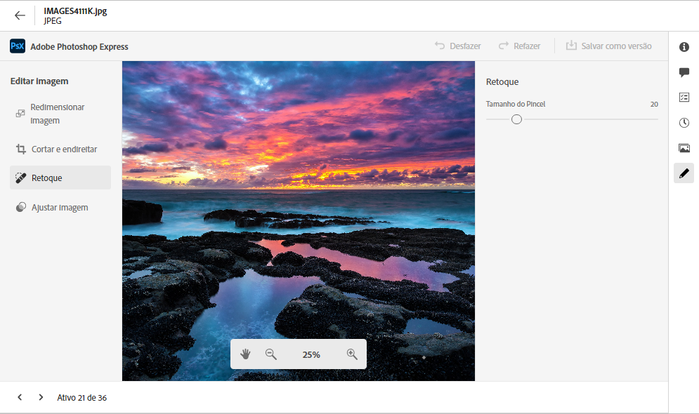
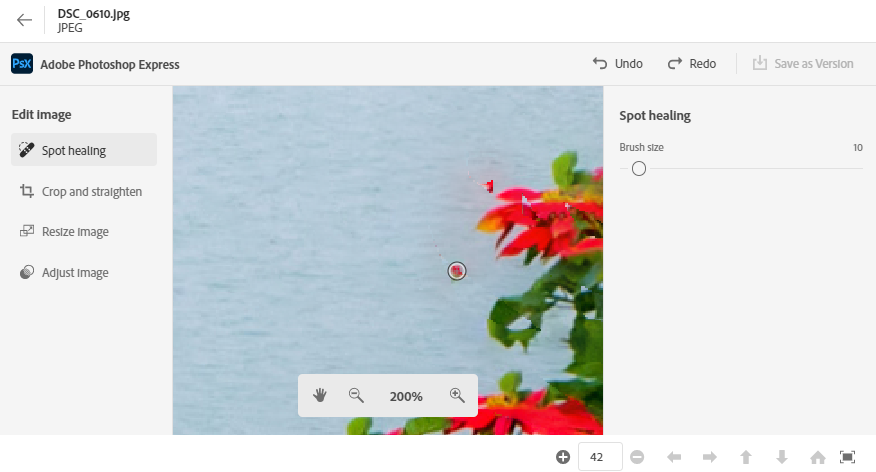
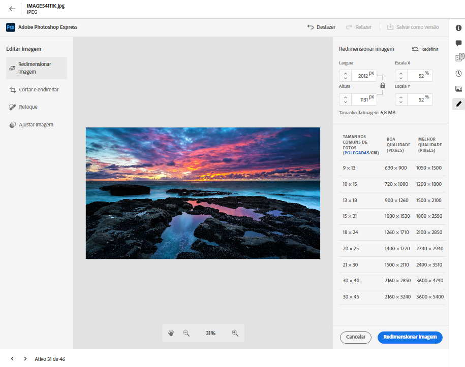
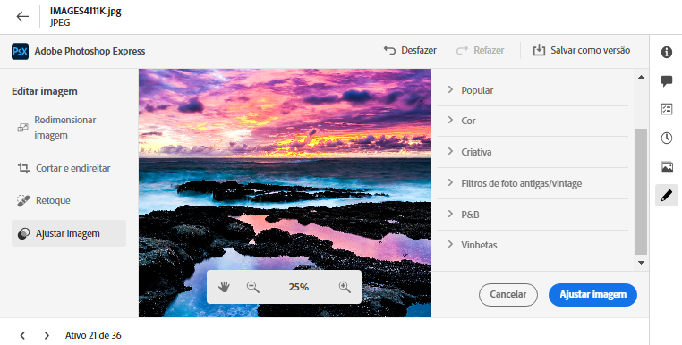

# Editar imagens no [!DNL Assets Essentials] {#edit-images-in-assets-essentials}

A interface do Assets Essentials permite a edição básica de imagens, como redimensionar, remover o fundo, cortar e converter entre formatos JPEG e PNG. Além disso, a edição avançada é possível por meio da integração com o Adobe Express. Após editar uma imagem, é possível salvá-la como uma nova versão. O controle de versão permite reverter para o ativo original posteriormente, se necessário. Para editar uma imagem, [abra sua visualização](https://experienceleague.adobe.com/pt-br/docs/experience-manager-assets-essentials/help/navigate-view#preview-assets) e clique em **Editar imagem**.

>[!NOTE]
>
>É possível editar imagens de arquivos PNG e JPEG usando o Adobe Express.

<!--The editing actions that are available are Spot healing, Crop and straighten, Resize image, and Adjust image.-->

## Editar imagens {#edit-images}

Acesse a interface do Assets Essentials usando o link [Interface do Assets Essentials](https://experience.adobe.com/#/assets) e selecionando o repositório correto. Para receber acesso, entre em contato com a administração da organização.
Para obter informações de referência adicionais, consulte [Introdução ao Adobe Experience Manager Assets Essentials](https://experienceleague.adobe.com/pt-br/docs/experience-manager-assets-essentials/help/get-started), [noções básicas da interface do usuário](https://experienceleague.adobe.com/pt-br/docs/experience-manager-assets-essentials/help/navigate-view), [casos de uso do Assets Essentials](https://experienceleague.adobe.com/pt-br/docs/experience-manager-assets-essentials/help/get-started#use-cases) e [problemas conhecidos](https://experienceleague.adobe.com/pt-br/docs/experience-manager-assets-essentials/help/release-notes).

### Edição de imagens usando o Adobe Express {#edit-images-using-adobe-express}

>[!CONTEXTUALHELP]
>id="assets_express_integration"
>title="Integração do Adobe Express"
>abstract="Ferramentas de edição de imagens fáceis e intuitivas, viabilizadas pelo Adobe Express, disponíveis diretamente no AEM Assets para aumentar a reutilização de conteúdo e acelerar sua velocidade."

Após acessar a interface do Essentials, clique em **Ativos**, selecione uma imagem e clique em **Editar** no painel superior. A nova tela exibe as opções de edição disponíveis, incluindo redimensionar, remover o fundo, cortar e converter entre formatos JPEG e PNG.

#### Redimensionar imagem {#resize-image-using-express}

Redimensionar uma imagem para um tamanho específico é um caso de uso comum. O Assets Essentials permite redimensionar rapidamente a imagem para ajustá-la aos tamanhos de foto comuns, fornecendo novas resoluções pré-calculadas para tamanhos de foto específicos. Para redimensionar a imagem usando o Assets Essentials, siga as etapas abaixo:

1. Clique em **Redimensionar imagem** no painel esquerdo.
2. Selecione a plataforma de rede social apropriada na lista suspensa Redimensionar e escolha o tamanho da imagem nas opções exibidas.
3. Dimensione a imagem, se necessário, usando o campo **Dimensionamento de imagem**.
4. Clique em **Aplicar** para aplicar as alterações.
   

   A imagem editada estará disponível para download. É possível salvar o ativo editado como uma nova versão do mesmo ativo ou como um novo ativo.
   

#### Remover fundo {#remove-background-using-express}

Para remover o fundo de uma imagem, siga as etapas mencionadas abaixo:

1. Clique em **Remover fundo** no painel esquerdo. O Experience Manager Assets exibirá a imagem sem o fundo.
2. Clique em **[!UICONTROL Aplicar]** para aplicar as alterações.
   

   A imagem editada estará disponível para download. É possível salvar o ativo editado como uma nova versão do mesmo ativo ou como um novo ativo.

#### Cortar imagem {#crop-image-using-express}

É possível adequar a imagem a um tamanho ideal com facilidade usando as ações rápidas incorporadas do [!DNL Adobe Express].

1. Clique em **[!UICONTROL Cortar imagem]** no painel esquerdo.
2. Arraste as alças nos cantos da imagem para criar o corte desejado.
3. Clique em **[!UICONTROL Aplicar]**.
   
A imagem cortada estará disponível para download. É possível salvar o ativo editado como uma nova versão do mesmo ativo ou como um novo ativo.

#### Converter entre tipos de arquivo de imagem {#convert-image-types-using-express}

É possível converter rapidamente uma imagem entre os formatos JPEG e PNG usando o Adobe Express. Execute as seguintes etapas:

1. Clique em **JPEG para PNG** ou **PNG para JPEG** no painel esquerdo.
   
2. Clique em **[!UICONTROL Baixar]**.

#### Limitações {#limitations-adobe-express}

* Resolução da imagem compatível: mínimo de 50 pixels e máximo de 6.000 pixels por dimensão.
* Tamanho máximo do arquivo aceito: 17 MB.

### Editar imagens usando o editor integrado do Adobe Express {#edit-images-in-adobe-express-embedded-editor}

Usuários com direito ao Adobe Express podem usar o editor incorporado à interface do Assets Essentials para editar e criar novos conteúdos facilmente com a IA generativa do Adobe Firefly. Isso melhora a reutilização do conteúdo e acelera a sua velocidade. Você também pode usar elementos predefinidos para que seu ativo tenha uma aparência incrível ou para executar ações de edição rápidas na imagem com apenas alguns cliques.

Para editar imagens usando o editor incorporado do Adobe Express, siga as etapas abaixo:

1. Acesse a interface do AEM Assets Essentials usando o link [Interface do AEM Assets Essentials](https://experience.adobe.com/#/assets) e selecione o repositório correto.
1. Clique em **Ativos**, escolha uma pasta e selecione uma imagem.
1. Clique em **Abrir no Adobe Express**. A imagem abre em uma tela do Express.
1. Faça as edições necessárias na imagem.
1. Se o projeto exigir que você adicione mais páginas, clique em **Adicionar**, selecione os ativos, insira uma pasta, selecione uma imagem para trazer para a página da tela e faça as edições necessárias na imagem.
1. Para salvar as imagens, clique em **Salvar**. A caixa de diálogo Salvar é exibida.

   >[!NOTE]
   >
   > **1. Para página única**
   >
   > **Salvar como versão:** esse recurso permite salvar apenas um único ativo. Selecione essa opção para exportar a imagem como uma nova versão (mantendo o formato original) e salvá-la na mesma pasta.
   > **Salvar como novo ativo:** selecione essa opção para exportar o ativo em um formato diferente do original e salvá-lo em qualquer pasta como um novo ativo.
   >  
   > **2. Para várias páginas**
   >
   > **Salvar como versão:** esse recurso permite salvar apenas um único ativo. Se deseja salvar uma única página a partir de várias páginas, selecione essa opção para salvar o ativo no formato e no local originais.\
   > **Salvar como novo ativo:** com essa opção, é possível exportar vários ativos ou um único ativo para qualquer pasta e os salvar como novos ativos com o formato de arquivo original ou em outro formato.

1. Na caixa de diálogo Salvar:
   1. Insira um nome para o arquivo no campo **Salvar como**.
   1. Selecione uma pasta de destino.
   1. Opcional: forneça detalhes como o nome do projeto ou da campanha, palavras-chave, canais, intervalo de tempo e região.
1. Clique em **Salvar como versão** ou **Salvar como novo ativo** para salvar o(s) ativo(s).

#### Limitações da edição de imagens no editor do Express {#limitations-of-editing-images-in-the-express-editor}

* Tipos de arquivo compatíveis: JPEG ou PNG.
* Tamanho máximo de arquivo aceito: 40 MB.
* Intervalo de largura e altura compatível: entre 50 e 8000 pixels.
* Recarregue a página para ver o último ativo salvo na pasta de origem.

### Criar novos ativos usando o Adobe Express {#create-new-assets-using-embedded-editor}

O Assets Essentials permite criar um novo modelo do zero usando o editor integrado do Adobe Express. Para criar um novo ativo usando o Adobe Express, execute as etapas a seguir:

1. Navegue até **Meu espaço de trabalho** e clique em **Criar** no banner do Adobe Express na parte superior. A tela em branco do Adobe Express aparece na interface do Assets Essentials.
1. Crie o conteúdo usando [modelos](https://helpx.adobe.com/br/express/using/work-with-templates.html). Caso contrário, navegue até Seus itens para modificar o conteúdo existente.
1. Após concluir a edição, clique em **Salvar**.
1. Especifique o caminho de destino do ativo criado e clique em **Salvar como novo ativo**.

#### Limitações {#limitations}

* É possível modificar apenas as imagens com tipos de formato `JPEG` e `PNG`.
* O tamanho do ativo deve ser inferior a 40 MB.
* É possível salvar uma imagem nos formatos `PDF`, `JPEG` ou `PNG`.

<!--
## Edit images using [!DNL Adobe Photoshop Express] {#edit-using-photoshop-express}

<!--
After editing an image, you can save the new image as a new version. Versioning helps you to revert to the original asset later, if needed. To edit an image, [open its preview](/help/using/navigate-view.md#preview-assets) and click **[!UICONTROL Edit Image]**  from the rail on the right.

*Figure: The options to edit images are powered by [!DNL Adobe Photoshop Express].*
-->
<!--
### Spot heal images {#spot-heal-images-using-photoshop-express}

If there are minor spots or small objects on an image, you can edit and remove the spots using the spot healing feature provided by Adobe Photoshop.

The brush samples the retouched area and makes the repaired pixels blend seamlessly into the rest of the image. Use a brush size that is only slightly larger than the spot you want to fix.

<!-- 
TBD: See if we should give backlinks to PS docs for these concepts.
For more information about how Spot Healing works in Photoshop, see [retouching and repairing photos](https://helpx.adobe.com/photoshop/using/retouching-repairing-images.html). 
-->
<!--
### Crop and straighten images {#crop-straighten-images-using-photoshop-express}

Using the crop and straighten option that you can do basic cropping, rotate image, flip it horizontally or vertically, and crop it to dimensions suitable for popular social media websites.

To save your edits, click **[!UICONTROL Crop Image]**. After editing, you can save the new image as a version.

Many default options let you crop your image to the best proportions that fit various social media profiles and posts.

### Resize image {#resize-image-using-photoshop-express}

You can view the common photo sizes in centimeters or inches to know the dimensions. By default, the resizing method retains the aspect ratio. To manually override the aspect ratio, click .

Enter the dimensions and click **[!UICONTROL Resize Image]** to resize the image. Before you save the changes as a version, you can either undo all the changes done before saving by clicking [!UICONTROL Undo] or you can change the specific step in the editing process by clicking [!UICONTROL Revert].

### Adjust image {#adjust-image-using-photoshop-express}

[!DNL Assets Essentials] lets you adjust the color, tone, contrast, and more, with just a few clicks. Click **[!UICONTROL Adjust image]** in the edit window. The following options are available in the right sidebar:

* **Popular**: [!UICONTROL High Contrast & Detail], [!UICONTROL Desaturated Contrast], [!UICONTROL Aged Photo], [!UICONTROL B&W Soft], and [!UICONTROL B&W Sepia Tone].
* **Color**: [!UICONTROL Natural], [!UICONTROL Bright], [!UICONTROL High Contrast], [!UICONTROL High Contrast & Detail], [!UICONTROL Vivid], and [!UICONTROL Matte].
* **Creative**: [!UICONTROL Desaturated Contrast], [!UICONTROL Cool Light], [!UICONTROL Turquoise & Red], [!UICONTROL Soft Mist], [!UICONTROL Vintage Instant], [!UICONTROL Warm Contrast], [!UICONTROL Flat & Green], [!UICONTROL Red Lift Matte], [!UICONTROL Warm Shadows], and [!UICONTROL Aged Photo].
* **B&W**: [!UICONTROL B&W Landscape], [!UICONTROL B&W High Contrast], [!UICONTROL B&W Punch], [!UICONTROL B&W Low Contrast], [!UICONTROL B&W Flat], [!UICONTROL B&W Soft], [!UICONTROL B&W Infrared], [!UICONTROL B&W Selenium Tone], [!UICONTROL B&W Sepia Tone], and [!UICONTROL B&W Split Tone].
* **Vignetting**: [!UICONTROL None], [!UICONTROL Light], [!UICONTROL Medium], and [!UICONTROL Heavy].

<!--
TBD: Insert a video of the available social media options.
-->

### Próximas etapas {#next-steps}

* Forneça feedback sobre o produto usando a opção de [!UICONTROL Feedback] disponível na interface do Assets Essentials

* Forneça feedback sobre a documentação usando as opções [!UICONTROL Editar esta página]  ou [!UICONTROL Registrar um problema]  disponíveis na barra lateral direita

* Entre em contato com o [Atendimento ao cliente](https://experienceleague.adobe.com/?support-solution=General&amp;lang=pt-BR#support)

>[!MORELIKETHIS]
>
>* [Exibir o histórico de versões de um ativo](/help/using/navigate-view.md)
