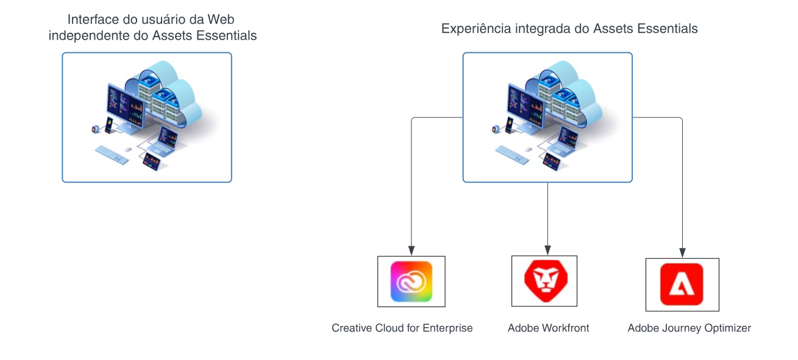

# Visão geral do [!DNL Adobe Experience Manager Assets Essentials] {#assets-essentials}

<!-- TBD: Update this banner to remove Beta label. 

-->

A Adobe oferece uma solução robusta de Gerenciamento de ativos digitais (DAM) para você aproveitar ao máximo seus ativos digitais. O Adobe Experience Manager Assets Essentials é uma solução leve de gerenciamento de ativos da Adobe para armazenar, gerenciar, detectar e usar ativos digitais.

## O que é o Assets Essentials? {#assets-essemtials-overview}

O Experience Manager Assets Essentials é uma versão mais leve e atualizada do Adobe Experience Manager Assets Cloud Service. O Assets Essentials fornece colaboração e gerenciamento de ativos unificados com uma interface simplificada e moderna. Essa solução fácil de usar permite que mais equipes de criação e marketing armazenem, descubram e distribuam ativos digitais.

O Assets Essentials permite:

* Gerenciar, organizar e administrar ativos em um local central.

* Colaborar com o desenvolvimento de conteúdo em equipes.

* Acessar, pesquisar e encontrar os ativos finais aprovados.

* Compartilhar e baixar ativos para entrega downstream.

## Como acessar o Assets Essentials? {#access-options}

O Assets Essentials oferece uma interface da Web independente para usuários finais e administradores, oferecendo a eles acesso a todos os recursos da solução. Os usuários de outras soluções da Adobe também podem acessar e trabalhar com ativos do Assets Essentials por meio de uma experiência incorporada, que está disponível nos aplicativos Creative Cloud para corporações, Adobe Journey Optimizer e Adobe Workfront.

## Razões para usar o Assets Essentials {#assets-essentials-features}

O Assets Essentials oferece importantes benefícios, e permite:

* **Começar rapidamente** com ferramentas de gerenciamento de ativos prontas para uso.

* Estender o acesso aos ativos para mais equipes, a fim de fornecer experiências consistentes para o cliente com um **gerenciamento de ativos simplificado**.

* Unificar o ciclo de vida do conteúdo por meio de **integrações nativas com outras soluções da Adobe**.

* Utilize uma **plataforma baseada em nuvem**, segura e pronta para escalar a qualquer hora, em qualquer lugar.

* Comece com os recursos essenciais do DAM e **avance** até o DAM corporativo.

**Começar rapidamente**

A solução do Assets Essentials é fornecida aos clientes pela Adobe e está disponível após a conclusão do processo de provisionamento. Os administradores obtêm acesso ao produto no Adobe Admin Console e podem iniciar imediatamente a configuração do sistema e a integração do usuário.

Saiba mais sobre a [administração e integração de usuários](deploy-administer.md) no Assets Essentials.

**Gerenciamento simplificado de ativos**

A interface simplificada do Assets Essentials facilita o gerenciamento, a descoberta e a distribuição de ativos digitais. Um extenso conjunto de usuários de diferentes funções, incluindo equipes criativas, de marketing e de linha de negócios, pode colaborar em ativos e acessar os ativos corretos e aprovados quando e onde for preciso.

Para obter mais informações, consulte [Começar a gerenciar ativos usando o Assets Essentials](get-started.md).

**Integração com outros aplicativos da Adobe**

O Assets Essentials integra-se com as soluções compatíveis da Adobe e fornece uma experiência incorporada nas interfaces desses aplicativos. Ele permite que os usuários acessem facilmente os ativos de que precisam diretamente em seus aplicativos. Todos os usuários podem trabalhar com os mesmos ativos gerenciados centralmente em suas ferramentas e aplicativos familiares.

A experiência incorporada do Assets Essentials está disponível para os aplicativos Creative Cloud para corporações, Adobe Journey Optimizer e Adobe Workfront.

Para obter mais informações, consulte [Integrações com outras soluções da Adobe](integration.md).

**Plataforma baseada em nuvem**

Com base na infraestrutura em nuvem da Adobe, o Assets Essentials permite que as organizações se concentrem nas suas necessidades comerciais relacionadas à criação, gerenciamento e distribuição de ativos digitais. Além disso, a Adobe garante a disponibilidade, segurança e escalabilidade da solução, mantendo-a sempre atualizada com inovações de produtos que são fornecidas aos usuários de maneira contínua por meio de atualizações frequentes.

**Recursos que acompanham seu crescimento**

Comece a trabalhar com o Assets Essentials rapidamente para se beneficiar dos principais recursos de gerenciamento de ativos digitais em várias equipes.

Quando as necessidades de sua empresa aumentam e você precisa de suporte para requisitos avançados de gerenciamento de ativos digitais, como personalizações, extensibilidade, integrações, automação, o Dynamic Media e o Brand Portal, a Adobe também oferece o [Adobe Experience Manager Assets as a Cloud Service](https://experienceleague.adobe.com/docs/experience-manager-cloud-service/content/assets/home.html?lang=pt-BR).

## Próximas etapas {#next-steps}

* Forneça feedback sobre o produto usando a opção de [!UICONTROL Feedback] disponível na interface do Assets Essentials

* Forneça feedback sobre a documentação usando as opções [!UICONTROL Editar esta página]  ou [!UICONTROL Registrar um problema]  disponíveis na barra lateral direita

* Entre em contato com o [Atendimento ao cliente](https://experienceleague.adobe.com/?support-solution=General&amp;lang=pt-BR#support)

>[!MORELIKETHIS]
>
>* [[!DNL Assets Essentials] página de tutoriais](https://experienceleague.adobe.com/docs/experience-manager-learn/assets-essentials/overview.html?lang=pt-BR)
