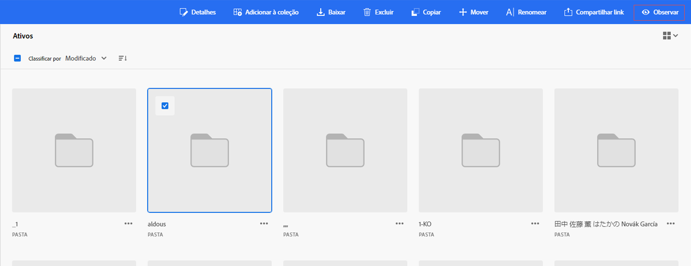

# Monitorar ativos, pastas e coleções {#watch-assets-folders}

As notificações do Assets Essentials permitem monitorar as operações realizadas nos ativos, pastas ou coleções disponíveis no repositório. Você precisa selecionar e assinar o conteúdo sobre o qual deseja receber notificações. Você também pode configurar as categorias para as quais receberá notificações.

## Assinar categorias de notificação {#subscribe-to-notification-categories}

Você pode assinar e escolher dentre uma lista de categorias para as quais receberá notificações. O Assets Essentials envia notificações somente sobre as categorias selecionadas dentre as opções disponíveis:

<table>
    <tbody>
     <tr>
      <th><strong>Categoria de notificação</strong></th>
      <th><strong>Descrição</strong></th>
     </tr>
     <tr>
      <td>Solicitações</td>
      <td>Ao atribuir uma tarefa a um usuário, você recebe notificações quando esse usuário executa ações nessa tarefa.</td>
     </tr>
     <tr>
      <td>Atribuído a mim</td>
      <td>Você recebe uma notificação quando há uma tarefa atribuída a você por outro usuário.</td>
     </tr>
     <tr>
      <td>Comentário sobre o conteúdo assinado</td>
      <td>Você recebe uma notificação quando um usuário comenta no ativo que você assinou.</td>
     </tr>
     <tr>
      <td>Exclusão do conteúdo assinado</td>
      <td>Você recebe uma notificação quando um usuário exclui o ativo, pasta ou coleção que você assinou.</td>
     </tr>
     <tr>
      <td>Compartilhamento externo do conteúdo assinado</td>
      <td>Você recebe uma notificação quando um usuário gera um link público para o ativo, pasta ou coleção que você assinou.</td>
     </tr>
     <tr>
      <td>Modificação do conteúdo assinado</td>
      <td>Você recebe uma notificação quando um usuário cria uma nova versão do ativo que você assinou.</td>
     </tr>
     <tr>
      <td>Mover/renomear o conteúdo assinado</td>
      <td>Você recebe uma notificação quando um usuário move ou renomeia o ativo ou pasta que você assinou.</td>
     </tr>
     <tr>
      <td>Atualizações em pastas e coleções assinadas</td>
      <td>Você recebe uma notificação quando um usuário adiciona ou remove um ativo de uma pasta ou coleção que você assinou.</td>
     </tr>    
    </tbody>
   </table>

Para assinar as categorias de notificação:

1. Clique no  na extremidade direita da barra de menus da interface do Assets Essentials.

1. Clique no  para visualizar a página [!UICONTROL Preferências da Experience Cloud].

1. Clique na opção **[!UICONTROL Notificações]** disponível no painel esquerdo.

1. Na seção **[!UICONTROL Notificações]**, navegue até [!UICONTROL Assets Essentials] e verifique se a opção está definida como ATIVADO.

   

1. Clique em **[!UICONTROL Personalizar]** para visualizar as categorias de notificação.
   

1. Selecione as categorias de notificação sobre as quais você precisa ser notificado.

## Observar e deixar de observar pastas, ativos ou coleções {#watch-unwatch-assets}

Depois de [assinar as categorias de notificação](#subscribe-to-notification-categories), você deve assinar o conteúdo para começar a receber notificações.

>[!NOTE]
>
>* Para as categorias de notificação **[!UICONTROL Solicitações]** e **[!UICONTROL Atribuído a mim]**, não é necessário assinar o conteúdo após ter assinado as categorias de notificação. Você recebe notificações automaticamente sobre solicitações que criou e quando uma tarefa é atribuída a você.
>* O Assets Essentials envia notificações somente quando outros usuários executam ações no conteúdo assinado. Você não recebe notificações para ações que você executou no conteúdo assinado.

Para assinar o conteúdo, selecione a pasta, ativo ou coleção que você precisa assinar e clique em **[!UICONTROL Observar]**.

O Assets Essentials exibe uma mensagem de sucesso. Você pode clicar em **[!UICONTROL Ir para as preferências de notificação]** disponível na mensagem de sucesso para editar a [assinatura de categorias de notificação](#subscribe-to-notification-categories).

O Assets Essentials agora envia notificações sobre as categorias que você assina. Você também pode selecionar vários ativos, pastas ou coleções e clicar em **[!UICONTROL Observar]** para economizar tempo. No entanto, se você selecionar várias entidades, dentre as quais algumas você já assinou algumas, a opção **[!UICONTROL Observar]** não é exibida.

De maneira similar, para cancelar a assinatura, selecione o ativo, pasta ou coleção que você assinou e clique em **[!UICONTROL Deixar de observar]**.

## Visualizar notificações {#view-notifications}

As notificações são exibidas na extremidade direita da barra de menus da interface do Assets Essentials.

Ao clicar em uma notificação, o Assets Essentials navega até o ativo ou a pasta apropriada que é mencionada na notificação.
