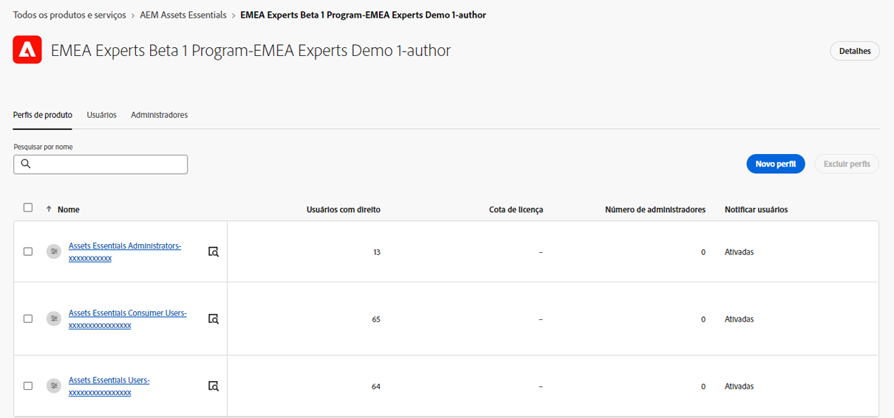

# Gerenciar permissões para pastas {#manage-permissions}

>[!CONTEXTUALHELP]
>id="assets_permissions_folders"
>title="Gerenciar permissões"
>abstract="O [!DNL Assets Essentials] permite que os administradores gerenciem os níveis de acesso para pastas disponíveis no repositório. Como administrador, você pode criar grupos de usuários e atribuir permissões a esses grupos para gerenciar níveis de acesso. Você também pode delegar os privilégios de gerenciamento de permissões a grupos de usuários no nível da pasta."

O Assets Essentials permite que os administradores gerenciem os níveis de acesso para pastas disponíveis no repositório. Como administrador, você pode criar grupos de usuários e atribuir permissões a esses grupos para gerenciar níveis de acesso. Você também pode delegar os privilégios de gerenciamento de permissões a grupos de usuários no nível da pasta.

O diagrama de fluxo de dados a seguir ilustra a sequência de tarefas executada para configurar e gerenciar permissões em pastas disponíveis no repositório do Assets Essentials:

## Antes de gerenciar permissões para pastas {#before-managing-permissions}

Antes de começar a gerenciar permissões para pastas no repositório do Assets Essentials, você deve realizar determinadas tarefas, como adicionar administradores que podem criar uma estrutura de pastas lógica, criar grupos de usuários e gerenciar permissões de pastas para vários grupos de usuários.

### Adicionar administradores {#add-admin-users}

Adicione administradores no aplicativo Assets Essentials para que eles possam gerenciar as permissões de pastas para outros grupos de usuários.

Para adicionar administradores:

1. Acesse o [Admin Console](https://adminconsole.adobe.com) da sua organização, clique em **[!UICONTROL Produtos]** na barra superior, clique em **[!UICONTROL AEM Assets Essentials]** e, em seguida, clique no ambiente [!DNL Assets Essentials]. O [!DNL Assets Essentials] tem três perfis de produto que representam o acesso para administradores, usuários comuns e consumidores.

   

1. Para adicionar um usuário a um grupo, clique no grupo de administradores do Assets Essentials, selecione **[!UICONTROL Adicionar usuário]**, forneça os detalhes do usuário e clique em **[!UICONTROL Salvar]**.

   

   Ao adicionar um usuário, ele recebe um convite por email para começar. Você pode desativar os convites por email nas configurações do perfil de produto no [!DNL Admin Console].

1. Para remover um usuário de um grupo, clique no grupo, selecione um usuário existente e selecione **[!UICONTROL Remover usuário]**.

### Adicionar grupos de usuários {#add-user-groups}

Crie grupos de usuários e atribua permissões a esses grupos para gerenciar os níveis de acesso às pastas no repositório do Assets Essentials. Em seguida, você pode atribuir seus usuários aos grupos de usuários.

Você pode adicionar usuários a grupos de usuários (1) e adicionar [usuários a Perfis de produto do Assets Essentials (2)](#add-admin-users). No entanto, não é possível adicionar grupos de usuários diretamente aos Perfis de produto do Assets Essentials (3).

Para obter informações sobre como gerenciar grupos de usuários, consulte `Create user groups` e `Edit user groups`, disponíveis em [Gerenciar grupos de usuários](https://helpx.adobe.com/br/enterprise/using/user-groups.html).

>[!NOTE]
>
>Se o Admin Console estiver configurado para usar um sistema externo para gerenciar atribuições de usuários/grupos, como conectores do Azure ou do Google, ferramenta de sincronização de usuários ou API REST do User Management, seus grupos e atribuições de usuários serão configurados automaticamente. Para obter mais informações, consulte [Usuários do Adobe Admin Console](https://helpx.adobe.com/br/enterprise/using/users.html).

### Adicionar usuários aos grupos {#add-users-to-uesr-groups}

Depois de criar grupos de usuários, você pode começar a adicionar usuários aos grupos de usuários.

Para obter informações sobre como gerenciar a adição de usuários a grupos de usuários, consulte `Add users to groups`, disponível em [Gerenciar grupos de usuários](https://helpx.adobe.com/br/enterprise/using/user-groups.html#add-users-to-groups).

### Criar estrutura de pastas {#create-folder-structure}

Você pode usar os seguintes métodos para criar uma estrutura de pastas no repositório do Assets Essentials:

* Clique na opção **[!UICONTROL Criar pasta]**, disponível na barra de ferramentas, para criar uma pasta vazia.

* Clique na opção **[!UICONTROL Adicionar ativos]**, disponível na barra de ferramentas, para [fazer upload de uma estrutura de pastas disponível em seu computador local](add-delete.md).

Crie uma estrutura de pastas que funcione bem com os objetivos de negócio da organização. Se estiver carregando uma estrutura de pastas existente no repositório do Assets Essentials, você deverá revisar a estrutura. Para obter mais informações, consulte [Práticas recomendadas para o gerenciamento eficaz de permissões](permission-management-best-practices.md).

## Gerenciar permissões em pastas {#manage-permissions-on-folders}

Você pode atribuir as seguintes permissões aos grupos de usuários ou usuários. A Adobe não recomenda atribuir permissões a usuários.

| Nome da permissão | Descrição |
|-----|------|
| Pode visualizar | <ul><li>Acesso de leitura para visualizar e navegar pelas pastas </li><li>Visualizar ativos</li><li>Baixar ativos</li><li>Copiar ativos</li><li>Compartilhar links para ativos</li><ul> |
| Pode editar | <ul><li>Todos os privilégios disponíveis para as permissões Pode visualizar </li><li>Criar pastas</li><li>Remover pastas</li><li>Renomear pastas</li><li>Criar ativos</li><li>Atualizar ativos</li><li>Remover ativos</li><li>Mover ativos</li><li>Renomear ativos</li><ul> |
| Proprietário | <ul><li>Todos os privilégios disponíveis para as permissões Pode editar</li><li>Gerenciar permissões em uma pasta e suas subpastas</li>Essa permissão possibilita que os administradores deleguem privilégios de administrador a outras pessoas para uma pasta e suas subpastas.<ul> |
| Negar acesso | Remove as permissões Pode visualizar, Pode editar e Proprietário de uma pasta e suas subpastas. |

**Permissões padrão**

Todos os usuários autenticados e que podem fazer logon no aplicativo Assets Essentials têm permissões `Can Edit` para o repositório do Assets Essentials, inicialmente. O administrador pode ajustar as permissões padrão ao [editar permissões para todo o repositório do Assets Essentials](#edit-permissions-entire-repository).

**Sequência para atribuir permissões de pasta a grupos de usuários**

Crie regras para atribuir permissões de pasta a grupos de usuários. A sequência usada para atribuir permissões a uma pasta é importante e decide o acesso disponível aos grupos de usuários e, eventualmente, aos usuários.

Por exemplo, se você atribuir as permissões `Can View` de uma pasta para um supergrupo e, em seguida, atribuir permissões `Can Edit` para seu subgrupo, somente os membros do subgrupo terão permissões de edição para a pasta. Os usuários do supergrupo têm acesso de visualização à pasta.

Se precisar fornecer permissões de edição à pasta `Marketing` somente para o departamento de marketing de sua organização, e permissões de visualização para outras pessoas, atribua permissões `Can View` para o supergrupo `All Authenticated Users` e permissões `Can Edit` para o subgrupo `Marketing`.

**Herança da permissões**

O Assets Essentials usa a herança de permissões, que permite herdar as permissões definidas para a pasta pai na pasta filho. Por exemplo, se a pasta pai tiver permissões `Can View` para o grupo `All Authenticated Users` e a pasta filho tiver permissões `Can Edit` para o grupo de usuários `Marketing`, isso permite que todos os usuários autenticados tenham permissões de exibição para a pasta filho e que o grupo de usuários `Marketing` tenha permissões de edição para a pasta filho. O grupo de usuários `Marketing` tem permissões de edição para níveis posteriores de pastas na pasta filho (Marketing).

>[!NOTE]
>
> Configurar permissões de `Deny Access` para um grupo em uma pasta de nível superior e, em seguida, restaurar o acesso (`Can view`, `Can edit` ou `Owner`) para esse grupo ou seu membro, não é suportado. Use `Deny Access` com moderação.

### Adicionar permissões para grupos de usuários {#add-permissions}

Para atribuir permissões de grupo em pastas:

1. Selecione a pasta e clique em **[!UICONTROL Gerenciar permissões]**.

1. Na caixa de diálogo **[!UICONTROL Gerenciar permissões]**, especifique o nome do grupo ou um usuário no campo **[!UICONTROL Grupos e Usuários]**.

1. Selecione o [nível de acesso](#manage-permissions-on-folders) na lista suspensa **[!UICONTROL Acesso]**.

1. Clique em **[!UICONTROL Adicionar]** para fazer uma alteração imediata nas permissões para o usuário ou grupo de usuários.

1. Repita as etapas 1 a 3 para adicionar mais regras à caixa de diálogo **[!UICONTROL Gerenciar permissões]**.

   

   >[!NOTE]
   >
   > A ordem usada para atribuir permissões a uma pasta é importante e decide o acesso disponível aos grupos de usuários e, eventualmente, aos usuários adicionados aos grupos.

   Se você estiver gerenciando permissões para várias pastas, também poderá selecionar qualquer outra pasta no painel esquerdo e começar a gerenciar permissões para essa pasta.

1. Clique em **[!UICONTROL Fechar]**.

>[!CAUTION]
>
> É recomendável gerenciar permissões para grupos de usuários, não para usuários individuais. Só é possível definir a permissão `Deny access` para grupos de usuários, não para usuários individuais.

### Editar permissões atribuídas a grupos de usuários {#edit-permissions}

Para editar permissões atribuídas a grupos de usuários em pastas:

1. Selecione a pasta e clique em **[!UICONTROL Gerenciar permissões]**.

1. Na caixa de diálogo **[!UICONTROL Gerenciar permissões]**, edite o [nível de acesso](#manage-permissions-on-folders) na lista suspensa **[!UICONTROL Acesso]**.

1. [Adicione mais grupos de usuários ou usuários](#add-permissions) às regras de permissão existentes, se necessário.

1. Clique em X para remover as permissões atribuídas a um grupo de usuários.

### Editar permissões para todo o repositório do Assets Essentials {#edit-permissions-entire-repository}

Um administrador de aplicativos pode editar permissões para todo o repositório do Assets Essentials, desde uma permissão `Can Edit` padrão até qualquer outro nível de acesso.

Para editar as permissões de todo o repositório do Assets Essentials:

1. Selecione qualquer pasta e clique em **[!UICONTROL Gerenciar permissões]**.

1. Na caixa de diálogo **[!UICONTROL Gerenciar permissões]**, clique em **[!UICONTROL Todos os ativos]** no painel esquerdo.

1. [Edite as permissões](#edit-permissions) e feche a caixa de diálogo.

>[!NOTE]
>
>Um administrador não pode selecionar o nível de permissão `Deny Access` para todo o repositório do Assets Essentials para garantir que os usuários tenham pelo menos acesso de leitura ao aplicativo. Da mesma forma, `All Authenticated Users` tem pelo menos permissões de leitura no repositório, mesmo que o administrador remova explicitamente as permissões `Can Edit` na caixa de diálogo [!UICONTROL Gerenciar permissões].

## Exemplos para o gerenciamento eficaz de permissões {#example-permission-management}

**Caso de uso**

* O grupo Todos usuários autenticados tem acesso de visualização ao repositório.
* Grupos de usuários específicos da equipe têm permissões de edição para suas próprias pastas específicas da função.
* A pasta legal não está disponível para visualização para qualquer usuário autenticado, exceto para a equipe jurídica.

Crie os seguintes grupos de usuários no Admin Console:

* Equipe de marketing

* Equipe de aprovadores da marca

* Equipe de gerentes de projeto

* Equipe do projeto X

* Equipe legal

O diagrama a seguir ilustra a hierarquia de pastas e as permissões atribuídas a cada grupo de usuários:

A seguir estão os níveis de acesso para todos os grupos de usuários na hierarquia de pastas:

* /Todos os ativos: o administrador modifica as permissões no nível raiz, desde a permissão padrão `Can Edit` até `Can View`. Todos os usuários podem visualizar pastas e ativos, mas não podem editá-los.

* /marketing: todos os usuários podem visualizar as pastas e suas subpastas com base na herança da permissões. No entanto, o grupo de usuários da Equipe de marketing tem permissões de edição para a pasta.

* /marca: todos os usuários podem visualizar as pastas e suas subpastas com base na herança de permissões. No entanto, o grupo de usuários da Equipe de aprovadores da marca tem permissões de edição para a pasta.

* /projetos: todos os usuários podem visualizar as pastas e suas subpastas com base na herança de permissões. O grupo de usuários da Equipe de gerentes de projeto tem:

   * Editar permissões

   * Permissões do proprietário: gerenciar permissões em uma pasta e suas subpastas.

* /projetos/projeto-x: todos os usuários podem visualizar as pastas e suas subpastas. O grupo de usuários Equipe de gerentes de projeto tem permissões de edição e pode gerenciar permissões em uma pasta e suas subpastas (permissões de proprietário). O grupo de usuários Equipe do projeto X tem permissões de edição.

* /legal: nenhum dos usuários pode acessar a pasta com base nas permissões `Deny Access` para o grupo `All Authenticated Users`. O grupo de usuários Equipe Jurídica tem permissões de edição.

## Próximas etapas {#next-steps}

* [Assista a um vídeo sobre gerenciamento de permissões no Assets Essentials](https://experienceleague.adobe.com/docs/experience-manager-learn/assets-essentials/configuring/permissions-management.html?lang=pt-BR)

* Forneça feedback sobre a documentação usando as opções [!UICONTROL Editar esta página]  ou [!UICONTROL Registrar um problema]  disponíveis na barra lateral direita

* Entre em contato com o [Atendimento ao cliente](https://experienceleague.adobe.com/?support-solution=General&amp;lang=pt-BR#support)
