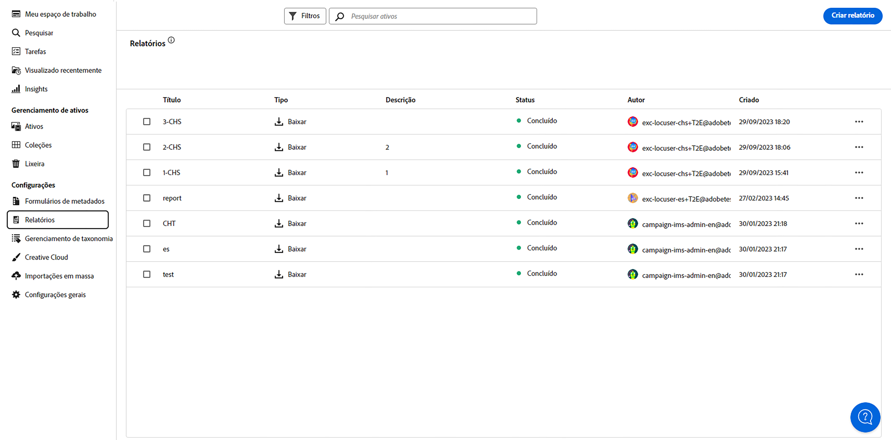
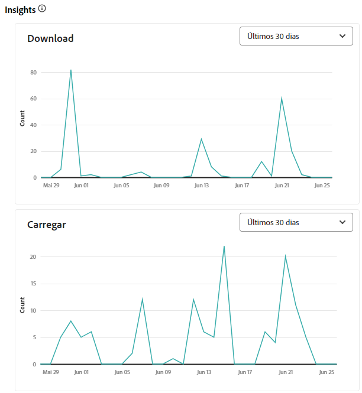
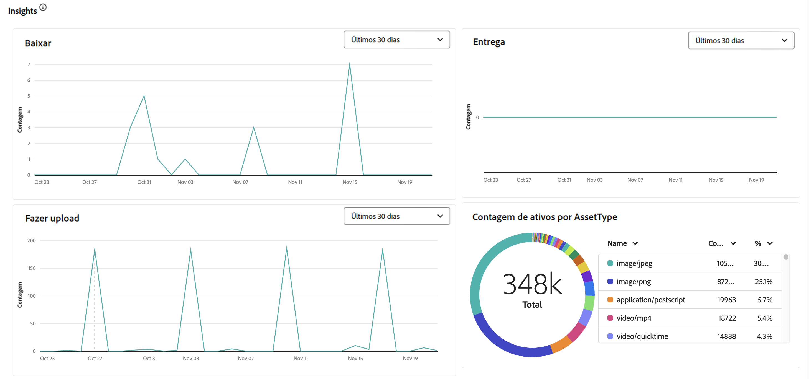
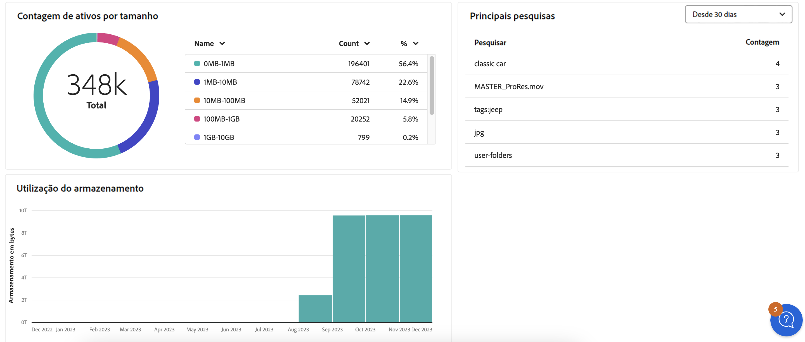

# Gerenciar relatórios {#manage-reports}

Os relatórios de ativos fornecem aos administradores visibilidade sobre as atividades do ambiente do Adobe Experience Manager Assets Essentials. Esses dados fornecem informações úteis sobre como os usuários interagem com o conteúdo e o produto. Todos os(as) usuários(as) podem acessar o painel Insights e aqueles que estiverem atribuídos(as) ao perfil de produto Administrador podem criar relatórios definidos pelo(a) usuário(a).

## Acessar relatórios {#access-reports}

Todos os usuários atribuídos ao [Perfil de produto de administradores do Assets Essentials](deploy-administer.md) podem acessar o painel Insights e criar relatórios definidos pelo usuário no Assets Essentials.

Para acessar os relatórios, navegue até **[!UICONTROL Relatórios]** em **[!UICONTROL Configurações]**.

<!--
In the **[!UICONTROL Reports]** screen, various components are shown in the tabular format which includes the following:

* **Title**: Title of the report
* **Type**: Determines whether the report is uploaded or downloaded to the repository
* **Description**: Provide details of the report that was given during uploading/downloading the report
* **Status**: Determines whether the report is completed, under progress, or deleted.
* **Author**: Provides email of the author who has uploaded/downloaded the report.
* **Created**: Gives information of the date when the report was generated.
-->

## Criar um relatório {#create-report}

O ambiente do AEM Assets Essentials oferece recursos abrangentes de geração de relatórios por meio do painel Relatórios. Esse recurso permite que os usuários gerem e baixem relatórios CSV detalhando uploads e downloads de ativos em intervalos de tempo especificados, que variam desde uma única vez a intervalos diários, semanais, mensais ou anuais.

**Para criar um relatório:**

1. Navegue até **Relatórios** e clique em **Criar relatório** (na parte superior direita). A caixa de diálogo **criar relatório** exibe os seguintes campos:
   

   **Na guia Configuração:**

   1. **Tipo de relatório:** selecione entre upload e download.
   1. **Título:** adicione um título ao relatório.
   1. **Descrição:** adicione uma descrição opcional ao relatório.
   1. **Selecionar caminho de pasta:** selecione um caminho de pasta para gerar o relatório de ativos enviados e baixados nessa pasta específica. Por exemplo, se você precisar que o relatório de ativos seja enviado para uma pasta, especifique o caminho para essa pasta.
   1. **Selecionar intervalo de datas:** selecione o intervalo de datas para exibir a atividade de upload ou download na pasta.
    

   >[!NOTE]
   >
   > O Assets Essentials converte todos os fusos horários locais para o Tempo Universal Coordenado (UTC).

   **Na guia Colunas:** selecione os nomes das colunas a serem exibidas no relatório. A tabela a seguir explica o uso de todas as colunas:

   <table>
    <tbody>
     <tr>
      <th><strong>Nome da coluna</strong></th>
      <th><strong>Descrição</strong></th>
      <th><strong>Tipo de relatório</strong></th>
     </tr>
     <tr>
      <td>Título</td>
      <td>O título do ativo.</td>
      <td>Upload e download</td>
     </tr>
     <tr>
      <td>Caminho</td>
      <td>O caminho da pasta onde o ativo está disponível no Assets Essentials.</td>
      <td>Upload e download</td>
     </tr>
     <tr>
      <td>Tipo MIME</td>
      <td>O tipo MIME do ativo.</td>
      <td>Upload e download</td>
     </tr>
     <tr>
      <td>Tamanho</td>
      <td>O tamanho do ativo em bytes.</td>
      <td>Upload e download</td>
     </tr>
     <tr>
      <td>Baixado por</td>
      <td>A ID do email do usuário que baixou o ativo.</td>
      <td>Download</td>
     </tr>
     <tr>
      <td>Data de download</td>
      <td>A data em que a ação de download do ativo foi executada.</td>
      <td>Download</td>
     </tr>
     <tr>
      <td>Autor</td>
      <td>O autor do ativo.</td>
      <td>Upload e download</td>
     </tr>
     <tr>
      <td>Data de criação</td>
      <td>A data em que o ativo foi carregado para o Assets Essentials.</td>
      <td>Upload e download</td>
     </tr>
     <tr>
      <td>Data da modificação</td>
      <td>A data em que o ativo foi modificado pela última vez.</td>
      <td>Upload e download</td>
     </tr>
     <tr>
      <td>Expirado</td>
      <td>O status de expiração do ativo.</td>
      <td>Upload e download</td>
     </tr>
     <tr>
      <td>Baixado por Nome de usuário</td>
      <td>O nome do usuário que baixou o ativo.</td>
      <td>Download</td>
     </tr>           
    </tbody>
   </table>

## Exibir e baixar relatórios já existentes {#View-and-download-existing-report}

Os relatórios já existentes são exibidos na guia **Relatórios executados**. Clique em **Relatórios** e selecione **Relatórios executados** para exibir todos os relatórios criados com o status **concluído**, indicando que eles estão prontos para o download. Para baixar o relatório no formato CSV ou excluí-lo, selecione a linha do relatório. Em seguida, selecione **Baixar CSV** ou **Excluir**.

## Agendar um relatório {#schedule-report}

Na interface do AEM Essentials, a opção **Agendar relatório** configura uma geração automática de relatórios em intervalos futuros especificados, como diário, semanal, mensal ou anual. Esse recurso ajuda a simplificar as necessidades de relatórios recorrentes e garante atualizações de dados oportunas. Enquanto a opção **Criar relatório** gera relatórios de datas passadas, Relatórios concluídos estão listados em **Relatórios executados** e os próximos relatórios serão encontrados em **Relatórios agendados**.

Para agendar um relatório, siga as etapas abaixo:

1. Clique em Relatórios no painel esquerdo e, em seguida, clique em Criar relatório (no canto superior direito).
1. A caixa de diálogo do relatório exibe as informações abaixo:
   1. **Tipo de relatório:** selecione entre upload e download.
   1. **Título:** adicione um título ao relatório.
   1. **Descrição**: adicione uma descrição opcional ao relatório.
   1. **Selecionar caminho de pasta:** selecione um caminho de pasta para gerar um relatório de ativos que serão enviados ou baixados dessa pasta específica no futuro.
   1. Botão **Agendar relatório:** ative-o para agendar o relatório para um momento posterior ou para que ocorra de forma recorrente.
      

   1. **Escolha a frequência:** especifique o intervalo para gerar o relatório (por exemplo, diário, semanal, mensal, anual ou sem repetição) e defina a data e a hora para executar o relatório junto com a data final para recorrência. Para um relatório sem repetição, selecione o intervalo de datas do relatório de acordo com o tipo de atividade selecionado no ambiente do AEM. Por exemplo, se você precisar de um relatório de ativos baixados do dia 10 ao dia 29 (datas futuras) de um mês específico, selecione essas datas no campo **Selecionar intervalo de datas**.

   >[!NOTE]
   >
   > O Assets Essentials converte todos os fusos horários locais para o Tempo Universal Coordenado (UTC).

## Exibir relatórios agendados {#view-scheduled-reports}

Os relatórios agendados são exibidos na guia **Relatórios agendados** de maneira organizada e sistemática. Todos os relatórios concluídos de cada relatório agendado são armazenados em uma única pasta de relatórios. Clique em  para exibir os relatórios concluídos. Por exemplo, se você agendou um relatório diário, todos os relatórios concluídos serão agrupados em uma pasta. Essa organização simplifica a navegação e a capacidade de descoberta dos relatórios. Para exibir os relatórios agendados, clique em **Relatórios** e em **Relatórios agendados**. Todos os relatórios agendados são exibidos com o status em andamento ou concluído. Os relatórios concluídos estão prontos para download.

## Editar e cancelar relatórios agendados {#edit-cancel-scheduled-reports}

1. Navegue até a guia **Relatórios agendados**.
1. Selecione a linha do relatório.
1. Clique em **Editar**.
1. Clique em **Cancelar agendamento** e em **Confirmar** para cancelar o relatório agendado. Para relatórios cancelados, o próximo tempo de execução fica vazio e o status é exibido como cancelado.
   

### Retomar cronograma {#resume-schedule}

Para retomar o agendamento cancelado, selecione a linha do relatório e clique em **Retomar agendamento**. Quando retomado, os próximos registros de tempo de execução são exibidos novamente e o status é exibido como em andamento.

>[!NOTE]
>
> Se você retomar um relatório cancelado antes da data final programada, os relatórios da data de cancelamento até a data de retomada serão gerados automaticamente.

## Exibir o Insights {#view-live-statistics}

>[!CONTEXTUALHELP]
>id="assets_reports"
>title="Relatórios"
>abstract="O painel Insights permite visualizar as métricas de eventos em tempo real do seu ambiente do Experience Manager Assets nos últimos 30 dias ou nos últimos 12 meses. A lista de eventos inclui o número de downloads, uploads, principais pesquisas e assim por diante."

O Assets Essentials permite que você visualize dados do seu ambiente Assets Essentials em tempo real, por meio do painel Insights. Você pode visualizar métricas de evento em tempo real dos últimos 30 dias ou dos últimos 12 meses.

<!---->

Clique na opção **[!UICONTROL Insights]**, disponível no painel de navegação esquerdo, para exibir os seguintes gráficos gerados automaticamente:

* **Downloads**: o número de ativos baixados do ambiente do Assets Essentials nos últimos 30 dias ou 12 meses representados por meio de um gráfico de linhas.
  

* **Uploads**: o número de ativos enviados para o ambiente do Assets Essentials nos últimos 30 dias ou 12 meses representados por meio de um gráfico de linhas.
  

<!--* **Asset Count by Size**: The division of count of assets based on their range of various sizes from 0 MB to 100 GB.-->

* **Uso do armazenamento**: o uso de armazenamento (em bytes) no ambiente do Assets Essentials, representado por um gráfico de barras.
  
  <!--* **Delivery**: The graph depicts the count of assets as the delivery dates.-->

<!--* **Asset Count by Asset Type**: Represents count of various MIME types of the available assets. For example, application/zip, image/png, video/mp4, application/postscripte.-->

* **Principais pesquisas**: visualize os principais termos pesquisados junto com o número de vezes que eles foram pesquisados em seu ambiente do Assets Essentials nos últimos 30 dias ou 12 meses representados em formato tabular.
  

  <!--
   
   
   -->

* **Contagem de ativos por tamanho:** segmenta a contagem total de ativos no ambiente do Assets Essentials em diferentes intervalos de tamanho, destacando a contagem e a porcentagem de ativos em cada intervalo de tamanho, representados por um gráfico de rosquinha.
  

* **Contagem de ativos por tipo de ativo:** segmenta a contagem total de ativos no ambiente do Assets Essentials, destacando a contagem e a porcentagem de ativos com base em seus tipos de arquivo, representados por um gráfico de rosquinha.
  

