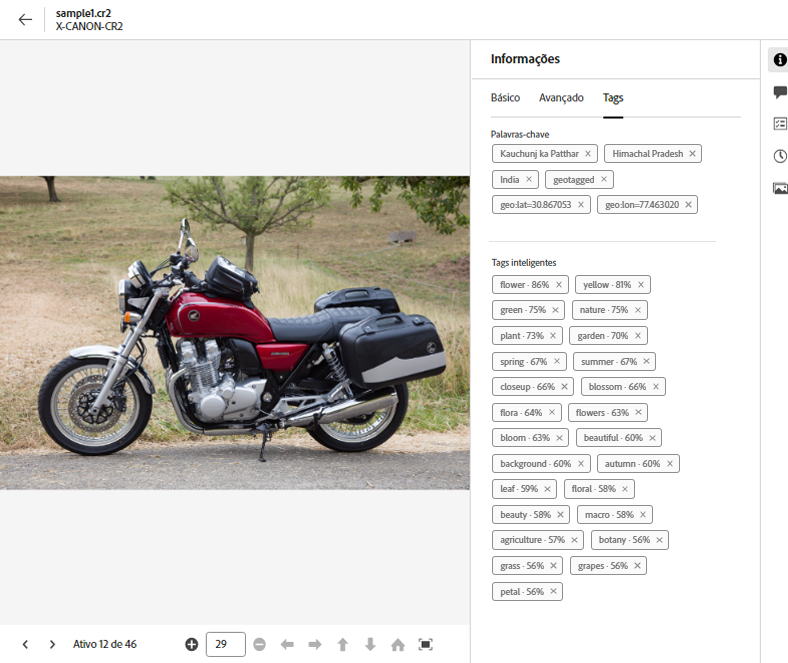
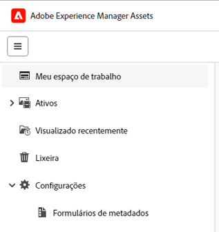
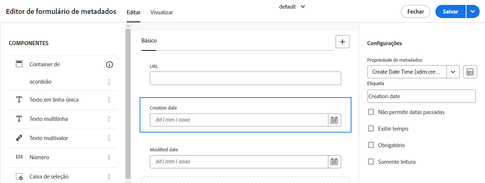

# Metadados no Assets Essentials {#metadata}

Os metadados são dados ou descrições sobre os dados. Por exemplo, suas imagens como um ativo podem conter informações sobre a câmera com a qual ela foi fotografada ou quaisquer informações de direitos autorais. Essas informações são os metadados da imagem. Os metadados são essenciais para um gerenciamento eficiente de ativos. Os metadados são a coleção de todos os dados disponíveis para um ativo, mas que podem não estar necessariamente contidos nesse ativo.

Os metadados ajudam a categorizar os ativos e são úteis à medida que a quantidade de informações digitais cresce. É possível gerenciar algumas centenas de arquivos com base apenas nos nomes de arquivo, miniaturas e memória. No entanto, essa abordagem não é escalável. Ela é limitada quando o número de pessoas envolvidas e o número de ativos gerenciados aumentam.

Com a adição de metadados, o valor de um ativo digital cresce, porque o ativo se torna,

* Mais acessível — os sistemas e usuários podem encontrá-lo facilmente.
* Mais fácil de gerenciar — é possível encontrar ativos com o mesmo conjunto de propriedades mais facilmente e realizar alterações neles.
* Completo — o ativo carrega mais informações e contexto com mais metadados.

Por esses motivos, o Assets fornece o meio certo de criar, gerenciar e trocar metadados para os seus ativos digitais.

## Visualizar os metadados {#view-metadata}

Para visualizar os metadados de um ativo, navegue até o ativo ou pesquise por ele, selecione-o e clique em **[!UICONTROL Detalhes]** na barra de ferramentas.

*Figura: para visualizar um ativo e seus metadados, clique em **[!UICONTROL Detalhes]** na barra de ferramentas ou clique duas vezes no ativo.*

Os metadados básicos, como título, descrição e data de upload estão disponíveis na guia [!UICONTROL Básico]. A guia [!UICONTROL Avançado] contém metadados mais avançados, como modelo de câmera, detalhes da lente e identificação geográfica. A guia [!UICONTROL Tags] contém tags aplicadas automaticamente com base no conteúdo da imagem.

## Atualizar metadados {#update-metadata}

Depois que admins configuram o formulário de metadados, outros campos podem ser atualizados manualmente. Talvez você deseje alterar isso, pois a leitura só é realizada com base em formulários de metadados prontos para uso.

## Tags inteligentes {#smart-tags}

O [!DNL Experience Manager Assets] usa a inteligência artificial fornecida pelo [Adobe Sensei](https://www.adobe.com/br/sensei.html) para aplicar automaticamente tags relevantes a todos os ativos carregados. Essas tags, devidamente chamadas de Tags inteligentes, aumentam a velocidade do conteúdo de seus projetos, ajudando você a encontrar ativos relevantes rapidamente. As tags inteligentes são um exemplo de metadados que não estão contidos na imagem.

As tags inteligentes são aplicadas em tempo quase real e geradas com base no conteúdo da imagem. Ao fazer upload de um ativo, a interface exibe [!UICONTROL Processando] na miniatura do ativo por algum tempo. Após concluir o processamento, é possível [visualizar os metadados](#view-metadata) e as tags inteligentes.

*Figura: para visualizar as tags inteligentes de um ativo, clique em **[!UICONTROL Detalhes]** na barra de ferramentas ou clique duas vezes no ativo.*

As Tags inteligentes também contêm uma pontuação de confiança como uma porcentagem. Ela indica a confiança associada à tag aplicada. Você pode moderar as tags inteligentes aplicadas automaticamente.

## Adicionar ou atualizar palavras-chave {#manually-tag}

É possível adicionar mais tags aos seus ativos, além das tags inteligentes que são adicionadas automaticamente usando o serviço inteligente do [!DNL Adobe Sensei]. Abra um ativo para pré-visualização, clique em [!UICONTROL Tags] e digite as palavras-chave desejadas no campo [!UICONTROL Palavras-chave]. Para adicionar a tag, pressione Return. O [!DNL Assets Essentials] indexa a palavra-chave em tempo quase real, e sua equipe poderá pesquisar os ativos atualizados em breve usando as novas palavras-chave.

Também é possível remover tags da seção [!UICONTROL Tags inteligentes] que são adicionadas automaticamente pelo [!DNL Assets Essentials] em todos os ativos carregados.

## Gerenciamento de taxonomia {#taxonomy-management}

As tags também podem ser aninhadas em uma hierarquia para permitir relacionamentos como o de categoria e subcategoria. Se você precisar inserir tags hierárquicas, elas podem ser gerenciadas facilmente por admins na seção [!UICONTROL Gerenciamento de taxonomia] das [!UICONTROL Configurações]. É possível criar um conjunto controlado de namespaces e tags que todos os usuários podem usar para descrever o conteúdo. Somente admins podem configurar hierarquias de tags no [!UICONTROL Gerenciador de taxonomia], garantindo que os valores sejam controlados e usados de forma consistente.

## Configurar formulários de metadados {#metadata-forms}

>[!CONTEXTUALHELP]
>id="assets_metadata_forms"
>title="Formulários de metadados"
>abstract="O [!DNL Experience Manager Assets] fornece vários campos padrão de metadados, por padrão. As organizações têm necessidades adicionais de metadados e precisam de mais campos para adicionar metadados específicos de negócios. Os formulários de metadados permitem que as empresas adicionem campos de metadados personalizados à página Detalhes de um ativo. Os metadados específicos de negócios melhoram a governança e a descoberta de ativos."

Por padrão, o Assets Essentials fornece vários campos de metadados padrão. As organizações têm necessidades adicionais de metadados e precisam de mais campos para adicionar metadados específicos de negócios. Os formulários de metadados permitem que as empresas adicionem campos de metadados personalizados à página [!UICONTROL Detalhes] de um ativo. Os metadados específicos de negócios melhoram a governança e a descoberta de ativos. É possível criar formulários do zero ou redefinir a finalidade de um formulário existente.

É possível configurar formulários de metadados para diferentes tipos de ativos (diferentes tipos de MIME). Use o mesmo nome de formulário como o tipo de MIME do arquivo. O Assets Essentials corresponde automaticamente os ativos carregados do tipo MIME ao nome do formulário e atualiza os metadados dos ativos carregados com base nos campos de formulário.

Por exemplo, se um formulário de metadados chamado `PDF` ou `pdf` existir, os documentos PDF carregados conterão campos de metadados conforme definidos no formulário.

O Assets Essentials usa a seguinte sequência ao pesquisar nomes de formulário de metadados existentes para aplicar os campos de metadados aos ativos carregados de um tipo específico:

Subtipo MIME > Tipo MIME > Formulário `default` > Formulário pronto para uso

Por exemplo, se um formulário de metadados chamado `PDF` ou `pdf` existir, os documentos PDF carregados contêm campos de metadados conforme definidos no formulário. Se não existir um formulário de metadados chamado `PDF` ou `pdf`, o Assets Essentials buscará um formulário de metadados chamado `application`. Se houver um formulário de metadados chamado `application`, os documentos PDF carregados conterão campos de metadados conforme definido no formulário. Se o Assets Essentials ainda não encontrar um formulário de metadados correspondente, ele pesquisará pelo formulário de metadados `default` para aplicar campos de metadados definidos no formulário aos documentos PDF carregados. Se nenhuma dessas etapas funcionar, o Assets Essentials aplicará os campos de metadados definidos no formulário pronto para uso a todos os documentos PDF carregados.

>[!IMPORTANT]
>
>O novo formulário de metadados para um tipo de arquivo específico substitui completamente o formulário de metadados padrão que o [!DNL Assets Essentials] fornece. Se você excluir ou renomear um formulário de metadados, os campos de metadados padrão estarão disponíveis novamente para novos ativos.

Para criar um formulário de metadados, siga estas etapas:

1. No painel à esquerda, clique em **[!UICONTROL Configurações]** > **[!UICONTROL Formulários de metadados]**.

   

1. Clique em **[!UICONTROL Criar]** na área superior direita da interface.
1. Forneça um nome para o formulário e clique em **[!UICONTROL Criar]**.
1. Forneça um nome para a guia em **[!UICONTROL Configurações]** no painel direito.
1. A partir do menu **[!UICONTROL Componentes]**, disponível no painel à esquerda, arraste os componentes necessários para uma guia do formulário. Arraste os componentes na sequência desejada.

   

   *Figura: a interface de criação do formulário de metadados com a opção de adicionar componentes e de pré-visualizar o formulário.*

1. Para cada componente, forneça um nome nas **[!UICONTROL Configurações]** do painel direito e um mapeamento com as propriedades compatíveis.
1. Opcionalmente, para um componente, selecione **[!UICONTROL Obrigatório]** para tornar o campo de metadados obrigatório e selecione **[!UICONTROL Somente leitura]** para transformá-lo em um campo não editável na página [!UICONTROL Detalhes] do ativo.
1. Opcionalmente, clique em **[!UICONTROL Pré-visualização]** para pré-visualizar o formulário que está sendo criado.
1. Como opção, adicione mais guias e os componentes necessários em cada guia.
1. Clique em **[!UICONTROL Salvar]** quando o formulário estiver finalizado.

Assista a este vídeo para ver a sequência de etapas:

>[!VIDEO](https://video.tv.adobe.com/v/341275)

Depois que um formulário é criado, ele é aplicado automaticamente quando os usuários carregam um ativo do tipo MIME correspondente.

Para reutilizar um formulário existente para criar um novo formulário, selecione um formulário de metadados, clique em **[!UICONTROL Copiar]** na barra de ferramentas, forneça um nome e clique em **[!UICONTROL Confirmar]**. É possível editar um formulário de metadados para alterá-lo. Quando você altera um formulário, ele é usado para ativos carregados após a alteração. Isso não altera os ativos existentes.

### Componentes de propriedade {#property-components}

Você pode personalizar o formulário de metadados usando qualquer um dos seguintes componentes de propriedade. Basta arrastar e soltar o tipo de componente no formulário no local desejado e modificar as configurações do componente.
Veja abaixo uma visão geral de cada tipo de propriedade e como eles são armazenados.

| Nome do componente | Descrição |
|---|---|
| Container de acordeão | Adiciona um cabeçalho recolhível que exibe uma lista de componentes e propriedades comuns. Ele pode ser expandido ou recolhido por padrão. |
| Texto em linha única | Adiciona uma propriedade de texto em linha única. |
| Texto multilinha | Adiciona várias linhas de texto ou um parágrafo. Ele é expandido à medida que o usuário digita para incluir todo o conteúdo. |
| Texto multivalor | Adiciona uma propriedade de texto multivalor. |
| Número | Adiciona um componente de número. |
| Caixa de seleção | Adiciona um valor booleano. Este é armazenado como TRUE ou FALSE depois que um valor é salvo. |
| Data | Adiciona um componente de data. |
| Suspenso | Adiciona uma lista suspensa. |
| Estado | Adiciona uma propriedade de estado do repositório (mapeada para repo:state) |
| Status do ativo | Adiciona a propriedade de status do ativo padrão (mapeada para dam:assetStatus) |
| Tags | Adiciona uma tag a partir de valores armazenados no Gerenciamento de taxonomia (mapeado para xcm:tags). |
| Palavras-chave | Adiciona palavras-chave de forma livre (mapeadas para dc:subject). |
| Tags inteligentes | Adicione para aumentar os recursos de pesquisa inserindo tags de metadados automaticamente. |
| Link | Adicione para habilitar URLs externos. Uma vez configurado no formulário de metadados, o componente de URL pode ser mapeado para uma propriedade de metadados específica na página “Editor de metadados”. Este [formulário de metadados pode ser atribuído a pastas](#assign-metadata-form-folder). |

### Atribuir formulário de metadados a pastas {#assign-metadata-form-folder}

Você também pode atribuir um formulário de metadados a uma pasta na implantação do Assets Essentials. O formulário de metadados atribuído a uma pasta de acordo com o tipo MIME é substituído quando você aplica manualmente um formulário de metadados a uma pasta. Em seguida, todos os ativos na pasta, incluindo os contidos nas subpastas, exibem as propriedades definidas no formulário de metadados.

Para atribuir um formulário de metadados a uma pasta:

1. Navegue até **[!UICONTROL Configurações]** > **[!UICONTROL Formulários de metadados]** e selecione um formulário de metadados.

2. Clique em **[!UICONTROL Atribuir a pastas]**.

3. Selecione as pastas e clique em **[!UICONTROL Atribuir]**. É possível selecionar as pastas clicando nos nomes delas.

   

   Você também pode navegar até a página de detalhes da pasta e selecionar um formulário de metadados nas propriedades da pasta disponíveis no painel direito para atribuir o formulário à pasta.

   

### Remover formulário de metadados das pastas {#remove-metadata-form-folder}

Depois de atribuir um formulário de metadados a uma ou várias pastas, o Experience Manager Assets também permite remover o formulário de metadados das pastas selecionadas.

Para remover um formulário de metadados de uma pasta:

1. Navegue até **[!UICONTROL Configurações]** > **[!UICONTROL Formulários de metadados]** e selecione um formulário de metadados.

1. Clique em **[!UICONTROL Remover das pastas]**. A lista de pastas atribuídas para a exibição do formulário de metadados.

1. Selecione a pasta e clique em **[!UICONTROL Remover]**. Você também pode selecionar várias pastas da lista.

Além disso, é possível navegar até a página de detalhes da pasta e selecionar **[!UICONTROL Formulário de metadados mapeados pelo sistema]** no campo **[!UICONTROL Formulários de metadados]** para remover o formulário de metadados atribuído de uma pasta.

### Trabalho com o componente de link no formulário de metadados {#link-component-metadata-form}

O componente de link é usado para habilitar URLs externos, incluindo links de armazenamento, informações de direitos autorais, formulários de contato e assim por diante. Para usar o componente de link em um formulário de metadados, é necessário [configurar o formulário de metadados](#metadata-forms). O componente de URL pode ser mapeado para uma propriedade de metadados específica na página “Editor de metadados”, que funciona da mesma forma que outros componentes de metadados. Este formulário de metadados pode ser atribuído a pastas. Assim, na página detalhada do ativo de pasta atribuído, é possível ver o valor dos metadados do link do ativo.

Siga as etapas abaixo para usar o componente de link na página de detalhes do ativo:

1. Acesse a página de detalhes do ativo e navegue até **[!UICONTROL URL do link]**.
1. Adicione o URL que deseja usar para redirecionar para o ativo selecionado.
1. Clique em **[!UICONTROL Adicionar link]**. Realize uma das ações a seguir:
   * Clique no  para copiar o URL. 
   * Clique no  para editar o URL.
1. Clique em **[!UICONTROL Salvar]** para salvar as alterações.

## Próximas etapas {#next-steps}

* [Assista a um vídeo sobre gerenciamento de formulários de metadados no Assets Essentials](https://experienceleague.adobe.com/docs/experience-manager-learn/assets-essentials/configuring/metadata-forms.html?lang=pt-BR)

* Forneça feedback sobre o produto usando a opção de [!UICONTROL Feedback] disponível na interface do Assets Essentials

* Forneça feedback sobre a documentação usando as opções [!UICONTROL Editar esta página]  ou [!UICONTROL Registrar um problema]  disponíveis na barra lateral direita

* Entre em contato com o [Atendimento ao cliente](https://experienceleague.adobe.com/?support-solution=General&amp;lang=pt-BR#support)

<!-- TBD: Cannot create a form using the second option. Documenting only the first option for now.
To reuse an existing form to create a new form, do one of these:

* Select a metadata form and click **[!UICONTROL Copy]** from the toolbar, provide a name, and click **[!UICONTROL Confirm]**.

* Click **[!UICONTROL Create]**, select **[!UICONTROL Use existing form structure as template]** option, and select an existing form. 
-->

<!-- TBD: Queries for PM and engg.

Can we edit the existing metadata in any form?

How to moderate smart tags?

Allow or deny list for smart tags?

What about Tags displayed just above Smart Tags in the UI?

Is there a detailed metadata tab. Where do the other details of an asset go?

How can one search based strictly on the metadata. Similar to AEM Assets GQL queries.
-->

<!-- TBD: Link to related articles if any.

>[!MORELIKETHIS]
>
>* [Search assets](search.md).
-->

