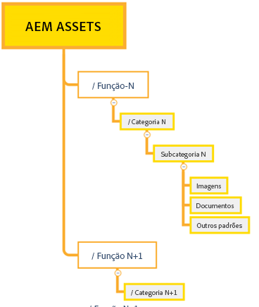
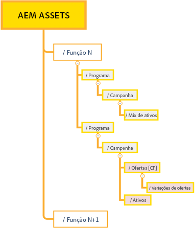
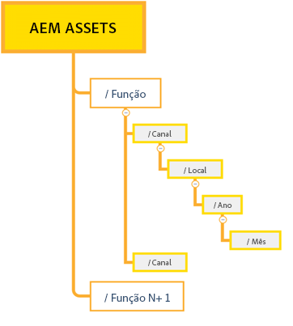

# Práticas recomendadas para o gerenciamento eficaz de permissões {#best-practices-permissions-management}

Como administrador, antes de começar a gerenciar as permissões de pasta para o repositório do Assets Essentials, há várias práticas recomendadas que você pode implementar para tornar a infraestrutura mais intuitiva para administradores e usuários finais durante o gerenciamento de operações.

Você pode incorporar essas práticas recomendadas ao:

* [Criar grupos de usuários no Admin Console](#admin-console-best-practices)

* [Criar uma estrutura de pastas no repositório do Assets Essentials](#folder-structure-assets-essentials)

* [Gerenciar permissões no repositório do Assets Essentials](#folder-permissions)

## Admin Console {#admin-console-best-practices}

Identifique as necessidades de acesso com base nos grupos de usuários em sua organização. Planeje e crie grupos de usuários para sua organização e adicione usuários a eles. É mais fácil gerenciar permissões de pastas com base em grupos de usuários do que em usuários individuais.

## Estrutura de pastas do repositório do Assets Essentials {#folder-structure-assets-essentials}

Considere os seguintes pontos quando começar a planejar a criação de uma estrutura de pastas no repositório do Assets Essentials:

* Governança futura: as pastas controladas pelos administradores e as pastas [delegadas por permissões a outros usuários como proprietários](manage-permissions.md##manage-permissions-folders).

* Escalável: a estrutura de pastas deve atender às necessidades futuras de sua organização e deve ser facilmente escalável.

* Tamanho: uma pasta não deve conter muitos ativos. Isso pode levar a problemas de usabilidade, tornando-a difícil de gerenciar.

* Intuitiva: a estrutura de pastas deve ser fácil de navegar e intuitiva para os usuários finais. Os usuários devem ser capazes de identificar facilmente onde fazer upload de um novo ativo na estrutura de pastas.

Há vários tipos possíveis de estruturas de pastas que podem ser usados na sua organização. Veja a seguir alguns exemplos de estruturas de pastas típicas:

* Com base em funções e categorizações

  

* Com base em campanha

  

* Com base no local da oferta (ou canal)

  

## Permissões de pasta {#folder-permissions}

Depois de criar grupos de usuários para sua organização, adicionar usuários a eles e selecionar e criar uma estrutura de pastas no repositório do Assets Essentials que atenda às necessidades de sua organização, você pode começar a gerenciar as permissões de pastas para sua organização. Considere os seguintes pontos ao iniciar o gerenciamento das permissões de pasta:

* Aplique permissões para grupos de usuários, não para usuários individuais. Isso resulta em uma estrutura de permissões mais simples e eficiente.

* Mantenha a estrutura de permissões o mais simples possível para oferecer eficiência operacional.

* Use as proibições de acesso com cuidado e prefira aplicar permissões positivas (Pode editar, Pode visualizar, Proprietário) à estrutura de pastas.

Para obter exemplos sobre como criar uma estrutura de pastas simples e eficiente, consulte [Gerenciar permissões em pastas](manage-permissions.md##manage-permissions-folders).

## Próximas etapas {#next-steps}

* Forneça feedback sobre o produto usando a opção de [!UICONTROL Feedback] disponível na interface do Assets Essentials

* Forneça feedback sobre a documentação usando as opções [!UICONTROL Editar esta página]  ou [!UICONTROL Registrar um problema]  disponíveis na barra lateral direita

* Entre em contato com o [Atendimento ao cliente](https://experienceleague.adobe.com/pt-br?support-solution=General&amp;lang=pt-BR#support)
