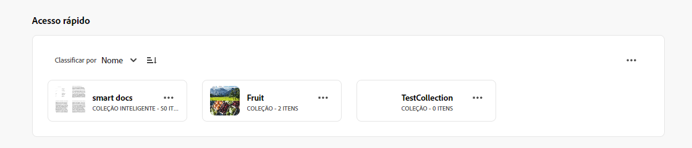
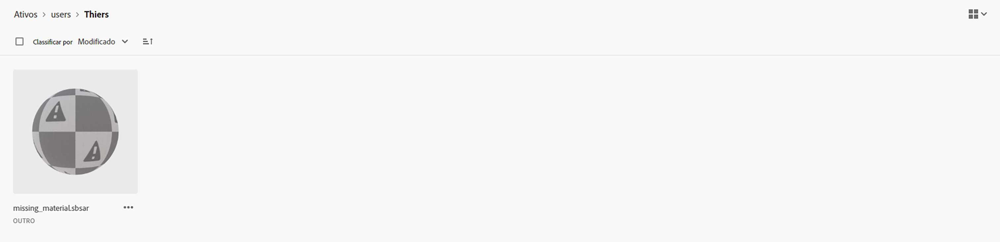
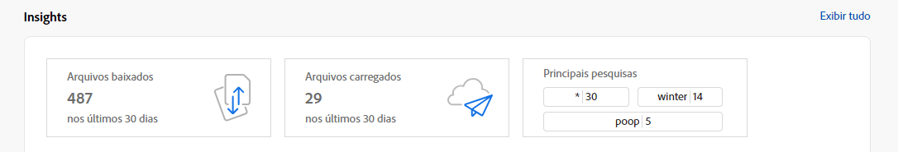
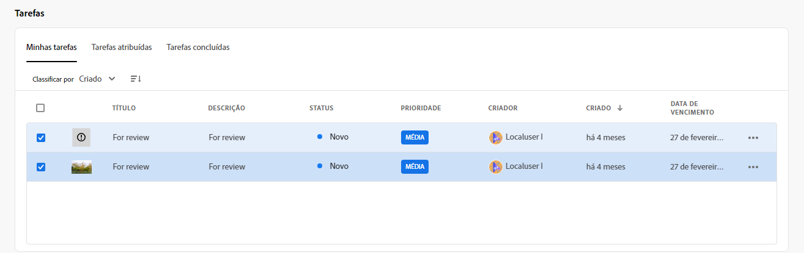
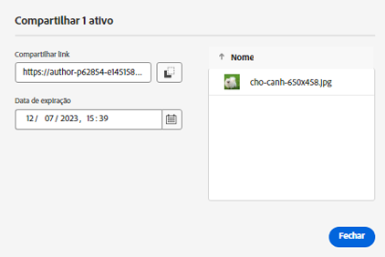

# Notas de versão do [!DNL Assets Essentials] {#release-notes}

A versão atual do Assets Essentials foi lançada em 8 de junho de 2023.

A lista de recursos inclui:

**Marcação hierárquica de ativos para obter uma experiência de pesquisa mais rápida**

Listas planas de vocabulários controlados tornam-se incontroláveis com o tempo. O Assets Essentials agora é compatível com a estrutura hierárquica de marcação, que facilita a aplicação de metadados relevantes, a categorização de ativos, o suporte a pesquisas, a reutilização de tags, a melhoria da descoberta e assim por diante.

**Fixar arquivos, pastas e coleções para acesso rápido**

Agora é possível fixar arquivos, pastas e coleções para agilizar o acesso a esses itens quando for necessário. Os itens fixados são exibidos na variável **Acesso rápido** seção do Meu espaço de trabalho. Você pode acessá-las usando Meu espaço de trabalho em vez de navegar até o local em que são salvas no repositório.

**Filtrar ativos na pasta Lixeira**

O Assets Essentials agora permite filtrar ativos disponíveis na pasta Lixeira. Você pode aplicar filtros padrão ou personalizados para pesquisar ativos apropriados na pasta Lixeira para restaurá-los ou excluí-los permanentemente.

**Visualizações de miniaturas para ativos 3D**

O Assets Essentials agora gera visualizações de miniaturas para formatos de arquivo 3D comuns, incluindo gLB, USDz, FBX, 3DS, OBJ e SBSAR. Quando esses arquivos são carregados para o Assets Essentials, as miniaturas são geradas automaticamente pelo sistema, por padrão.

**Exibir os principais termos pesquisados**

O Assets Essentials agora oferece suporte à exibição dos principais termos pesquisados na implantação do Assets Essentials usando o **Insights** seção do Meu espaço de trabalho. Você também pode navegar até os Insights detalhados para exibir as principais pesquisas durante os últimos 30 dias ou 12 meses.

**Aprimoramentos no formulário de metadados**

O Assets Essentials agora permite adicionar componentes de propriedade de texto de vários valores e listas suspensas aos formulários de metadados.

**Aprimoramentos com base no feedback dos clientes**

Aprimoramentos e correções de erros com base no feedback do cliente.

## Problemas conhecidos {#known-issues}

A lista de problemas conhecidos do [!DNL Assets Essentials] é revisada e atualizada continuamente:

<!--

* Assets Essentials does not support creating Private collections.

-->

* As coleções privadas estão disponíveis para o criador e usuários com privilégios de administrador. Como administrador, não é possível delegar a outros usuários as permissões para acessar a coleção.

* Como administrador, não é possível delegar a outros usuários as permissões para acessar a coleção.

Se você encontrar problemas ou quiser fazer solicitações de aprimoramento, [forneça feedback](#provide-feedback) à equipe.

## Versões anteriores {#past-releases}

### Várias versões em 2023 {#multiple-releases-2023}

A lista de recursos recentemente adicionados inclui:

**Principais ativos baixados**

O meu espaço de trabalho agora exibe os dez ativos mais baixados para o seu ambiente do Assets Essentials na seção [!UICONTROL Conteúdo]. Também é possível visualizar o tipo de formato e o número de downloads para cada ativo listado.

**Atualizações em massa para metadados de ativos**

As atualizações de metadados em massa permitem executar atualizações de metadados comuns em vários ativos simultaneamente. Não é necessário atualizar registros individualmente e é possível aplicar propriedades rapidamente a ativos ou pastas acessados por meio da pesquisa.

**Meu espaço de trabalho com widgets configuráveis**

O Assets agora fornece um espaço de trabalho personalizado para você, que serve como uma solução única para fornecer acesso conveniente às principais áreas da interface do Assets e às informações mais relevantes para você. O acesso mais rápido a essas opções aumenta a velocidade e a eficiência do conteúdo de seus projetos.

O meu espaço de trabalho inclui dispositivos para Insights, Tarefas e Conteúdo. É possível configurar como esses widgets são exibidos em seu espaço de trabalho, com base em suas preferências.

**Interface dedicada ao gerenciamento de tarefas**

O Assets Essentials agora permite gerenciar a lista de tarefas atribuídas a você, criadas por você e já concluídas por você em um local centralizado, usando a nova opção **[!UICONTROL Tarefas]** disponível no painel de navegação esquerdo. Você também pode tomar as ações apropriadas selecionando uma tarefa para aprová-la ou rejeitá-la, ou abrindo os detalhes da tarefa para aprová-la, rejeitá-la, editá-la ou excluí-la.

**Links gerados automaticamente para compartilhar ativos**

O Assets Essentials agora gera um link automaticamente assim que você opta por compartilhar um ativo usando a interface do Assets Essentials. O link gerado permanece válido mesmo que você alterar a data de expiração.

**Aprimoramentos com base no feedback dos clientes**

Aprimoramentos e correções de erros com base no feedback do cliente.

### 2022.11.0 {#november-2022}

A versão de novembro do [!DNL Assets Essentials] foi lançada em 17 de novembro de 2022.

Esta versão fornece:

**Visualização de documentos usando o visualizador da Document Cloud**

O Assets Essentials agora permite fazer upload de documentos em outros tipos de formato compatíveis e visualizá-los usando o visualizador da Document Cloud incluído. Os tipos de formato compatíveis incluem: TXT, RTF, DOC, DOCX, PPT, PPTX, XLS e XLSX.

<!--

**View Smart Tags moderation reports**

Asset reporting now provides administrators with visibility into the Smart Tags promoted or deleted for an asset. You can specify a folder path and the report lists the Smart Tags promoted or deleted for all assets available at the folder path.

-->

<!--
**Read-only access to large number of users**

Assets Essentials allows administrators to provide read-only access to a large number of users for selected assets or folders in the repository. 
You can easily synchronize the user groups available on the external identity management of an organization with Adobe Admin Console and then manage permissions in Admin Console and Assets Essentials to provide the users with read-only access for selected assets or folders.

-->

**Nova opção para Salvar metadados**

Uma nova opção para Salvar metadados já está disponível na interface do Assets Essentials para melhorar o controle de metadados.

**Aprimoramentos com base no feedback dos clientes**

Aprimoramentos e correções de erros com base no feedback do cliente.

**Adobe Asset Link, versão 3.3**

A versão 3.3 do [Adobe Asset Link](https://helpx.adobe.com/br/enterprise/using/adobe-asset-link.html) foi lançada em 13 de dezembro de 2022, com os seguintes recursos:

* Suporte à [Creative Cloud para equipes](https://www.adobe.com/br/creativecloud/business/teams.html), além do suporte à [Creative Cloud para corporações](https://www.adobe.com/br/creativecloud/business/enterprise.html) já existente.

* Suporte aos aplicativos mais recentes do Adobe InDesign, Photoshop e Illustrator 2023.

* Suporte ao uso do plug-in CEP do Adobe Asset Link em ambientes com servidores proxy.

### 2022.8.0 {#august-2022}

A versão de agosto do [!DNL Assets Essentials] foi lançada em 22 de agosto de 2022.

Esta versão fornece:

**Notificações para coleções**

As notificações do Assets Essentials agora permitem monitorar as operações realizadas nas coleções disponíveis no repositório. Você precisa selecionar e assinar as coleções sobre as quais deseja receber notificações. Você também pode configurar as operações para as quais as notificações são enviadas, como as operações excluir, compartilhar link, mover, renomear e atualizar realizadas nas coleções.

**Editar coleções inteligentes**

O Assets Essentials agora também oferece a capacidade de editar os critérios de pesquisa usados ao criar uma coleção inteligente.  Salve os novos critérios de pesquisa para atualizar dinamicamente o conteúdo da coleção.

**Exibir estatísticas em tempo real da conta de armazenamento**

O Assets Essentials agora permite visualizar os dados da conta de armazenamento em tempo real para o ambiente do Assets Essentials, por meio do painel Estatísticas em tempo real. Você pode visualizar métricas de evento em tempo real dos últimos 30 dias ou dos últimos 12 meses.

**Exibir relatórios de upload**

O relatório de ativos agora oferece aos administradores visibilidade sobre ativos carregados na implantação do Adobe Experience Manager Assets Essentials. Os administradores já têm a capacidade de gerar relatórios para os ativos baixados da implantação do Assets Essentials. Esses dados fornecem informações úteis sobre como os usuários interagem com o conteúdo e o produto.

**Aprimoramentos com base no feedback dos clientes**

Aprimoramentos e correções de erros com base no feedback do cliente.

### 2022.6.0 {#june-2022}

A versão de junho do [!DNL Assets Essentials] foi lançada em 14 de julho de 2022.

Esta versão fornece:

**Coleções inteligentes**

Salve os resultados da pesquisa como uma coleção inteligente para atualizar dinamicamente o conteúdo da coleção. Se houver ativos adicionados ao repositório do Assets Essentials que se encaixem nos critérios de pesquisa definidos na [criação da coleção inteligente](manage-collections.md#create-smart-collection), o conteúdo da coleção inteligente será atualizado automaticamente.

**Notificações**

As notificações do Assets Essentials permitem [monitorar as operações realizadas nos ativos ou pastas disponíveis no repositório](manage-notifications.md). Você precisa selecionar e assinar o conteúdo sobre o qual deseja receber notificações. Você também pode configurar as categorias para as quais receberá notificações.

**Relatório**

Os relatórios de ativos permitem que os administradores avaliem a atividade do usuário no Adobe Experience Manager Assets Essentials. Os relatórios e o painel Estatísticas em tempo real fornecem informações úteis sobre como os usuários interagem com os ativos disponíveis na implantação. [Use as informações nos relatórios](manage-reports.md) para obter as principais métricas de sucesso e medir a adoção de ativos na sua empresa e por clientes.

Visualize os relatórios de download de ativos e o módulo do painel Estatísticas em tempo real para ver quais ativos estão sendo baixados e a frequência dos downloads.

### 2022.5.0 {#may-2022}

A versão de maio do [!DNL Assets Essentials] foi lançada em 16 de junho de 2022.

Esta versão fornece:

**Aprimoramentos no status do ativo**

* O Assets Essentials agora permite [definir uma data de expiração para um ativo](manage-organize.md#set-asset-status). Além disso, você pode [filtrar ativos](search.md#refine-search-results) com base no status `Expired` do ativo e em um intervalo de datas de expiração.

* Agora é possível visualizar o indicador de status do ativo de todos os ativos disponíveis na Lixeira. Assim, você pode decidir se deve restaurar um ativo com base em seu status.

**Aprimoramentos nos filtros de pesquisa**

* O Assets Essentials agora permite [filtrar ativos](search.md#refine-search-results) usando o status `No Status` do ativo.

<!--

* Assets Essentials now supports [using a wildcard operator (*) while using custom filters](search.md#custom-filters) to enable Assets Essentials to display assets in the results that partially match the search criteria.

-->

**Aprimoramentos nas coleções**

<!--

* Assets Essentials now enables you to [create Private collections](manage-collections.md#create-collection).

-->

* O Assets Essentials agora permite fazer o [download de uma coleção](manage-collections.md).

* Agora é possível editar o campo de metadados Descrição de uma coleção.

**Aprimoramentos na documentação**

* Uma nova versão da [documentação de visão geral do Assets Essentials](introduction.md) agora está disponível.

**Aprimoramentos com base no feedback dos clientes**

* Aprimoramentos e correções de erros com base no feedback do cliente.

### 2022.4.0 {#april-2022}

A versão atual do [!DNL Assets Essentials] foi lançada em 12 de maio de 2022. Esta versão fornece:

* O [!DNL Assets Essentials] agora permite a [criação de coleções](manage-collections.md). Uma coleção é um conjunto de ativos no Experience Manager Assets Essentials. Use coleções para compartilhar ativos entre usuários. Diferente de pastas, uma coleção pode incluir ativos de locais diferentes.

* O Assets Essentials agora também permite [adicionar filtros personalizados](search.md#custom-filters) à interface. É possível aplicar esses filtros personalizados além dos filtros padrão para refinar os resultados da pesquisa.

* O Assets Essentials agora permite [definir status](manage-organize.md#set-asset-status) em ativos disponíveis no repositório. Defina um status de ativo para melhor administrar e gerenciar o consumo downstream de ativos digitais.

* Aprimoramentos e correções de erros com base no feedback do cliente.

#### Modo incógnito no Chrome {#incognito-mode}

Com esta versão, estamos otimizando o desempenho do delivery da interface. Recursos específicos no Assets Essentials - comentários em ativos e edição de imagens - dependem do armazenamento local do navegador e da ativação de cookies de terceiros. O modo incógnito no navegador Chrome bloqueia cookies de terceiros por padrão. Os usuários têm várias opções para continuar a acessar todos os recursos:

* Uso dos perfis do Chrome em vez do modo Incógnito, quando o usuário precisar separar as sessões do navegador

* Desativação de `Block third-party cookies` na tela do modo Incógnito no Chrome

### 2022.2.0 {#march-2022}

O [!DNL Assets Essentials] foi lançado em 9 de março de 2022 com as seguintes atualizações:

* O [!DNL Assets Essentials] agora permite [gerar um link e compartilhar ativos com os participantes externos](share-links-for-assets.md), que não têm acesso ao aplicativo do [!DNL Assets Essentials]. Você pode definir uma data de expiração para o link e, em seguida, compartilhá-la com outras pessoas usando o método de comunicação preferido, como email ou serviços de mensagens. Os recipients do link podem visualizar ativos e baixá-los.

* O [!DNL Assets Essentials] agora inclui [um perfil de administrador de produto](deploy-administer.md#add-users-to-essentials) no Admin Console, além dos perfis de produtos do usuário regular e do consumidor existentes. Agora, um administrador pode atribuir outros usuários ao perfil de administrador de produto.

* O Assets Essentials agora permite que os administradores [gerenciem os níveis de acesso para pastas disponíveis no repositório](manage-permissions.md). Como administrador, você pode criar grupos de usuários e atribuir permissões a esses grupos para gerenciar níveis de acesso. Você também pode delegar os privilégios de gerenciamento de permissões a grupos de usuários no nível da pasta.

* Aprimoramentos e correções de erros com base no feedback do cliente.

Além disso, a extensão [!DNL Adobe Asset Link] para Creative Cloud (Photoshop, Illustrator e InDesign), recebeu uma [nova versão (3.2)](https://exchange.adobe.com/creativecloud.details.106875.adobe-asset-link-cep.html), com melhorias de desempenho no tempo de inicialização do painel e na velocidade de download.

### Versão 2022.1.0 {#january-2022}

O [!DNL Assets Essentials] foi lançado em 03 de fevereiro de 2022 com as seguintes atualizações:

* Melhorias de desempenho para a operação [!UICONTROL Criar pasta]. <!-- CQ-4338818 -->

### Versão 2021.11.0 {#november-2021}

O [!DNL Assets Essentials] foi lançado em 16 de dezembro de 2021 com as seguintes atualizações:

* A Adobe implanta o Assets Essentials automaticamente após concluir o processo de provisionamento. Os administradores não precisam executar etapas adicionais para implantar o Assets Essentials usando a interface do usuário do [!DNL Cloud Manager]. Essa implantação automática estará disponível para ambientes provisionados após 6 de janeiro de 2022.
* Novas versões de plug-ins da Creative Cloud que funcionam com o Assets Essentials estão disponíveis no Adobe Exchange - [Adobe Asset Link para Adobe XD v 2.1.0](https://exchange.adobe.com/creativecloud/plugindetails.html/app/cc/61d229b9) e [Adobe Asset Link para Photoshop / InDesign / Illustrator v 3.1.65](https://exchange.adobe.com/creativecloud.details.106875.adobe-asset-link-cep.html).
* Várias correções de erros e aprimoramentos de produtos, incluindo problemas conhecidos anteriores (as pastas agora são exibidas corretamente na árvore de navegação esquerda após o upload<!-- CQ-4337638 -->, arrastar e soltar upload permite que o usuário selecione a pasta atual ou qualquer subpasta ao soltar para fazer upload<!-- CQ-4327753 -->).

### Versão 2021.8.0 {#august2021}

O [!DNL Assets Essentials] 2021.8.0 foi lançado em 30 de agosto de 2021, com as seguintes atualizações:

* Integrações com o [!DNL Adobe Workfront] que permite que usuários do [!DNL Workfront] gerenciam os ativos digitais no contexto do gerenciamento do próprio trabalho.

### Versão 2021.7.0 {#july2021}

O [!DNL Assets Essentials] 2021.7.0 foi lançado em 29 de julho de 2021, com as seguintes atualizações:

* Você pode criar e gerenciar formulários de metadados personalizados que serão usados para exibir propriedades de metadados aos usuários na tela de detalhes do ativo, por meio da opção [!UICONTROL Formulários de metadados] em [!DNL Settings]. Consulte [formulários de metadados](metadata.md#metadata-forms).
* Várias correções de erros e aprimoramentos de produtos, incluindo melhor desempenho ao fazer upload de uma pasta aninhada com muitas subpastas.

### Versão 2021.6.0 {#june2021}

A primeira versão do [!DNL Assets Essentials], disponibilizada em 21 de junho de 2021, oferece recursos leves de gerenciamento de ativos. Ela é compatível com os seguintes recursos principais e operações de CRUD (criar, ler, atualizar e excluir):

* Faça upload e adicione ativos, inclusive pastas aninhadas. Visualize os ativos e as versões.
* Pesquisa de texto completo, filtros de pesquisa aprimorados e pesquisas salvas para detecção rápida de ativos.
* Operações básicas de gerenciamento de ativos, como atualizar, excluir, baixar e gerenciar metadados.
* O [!DNL Assets Essentials] está disponível a usuários do [!DNL Adobe Journey Optimizer] para gerenciar os ativos ao criar mensagens. 
