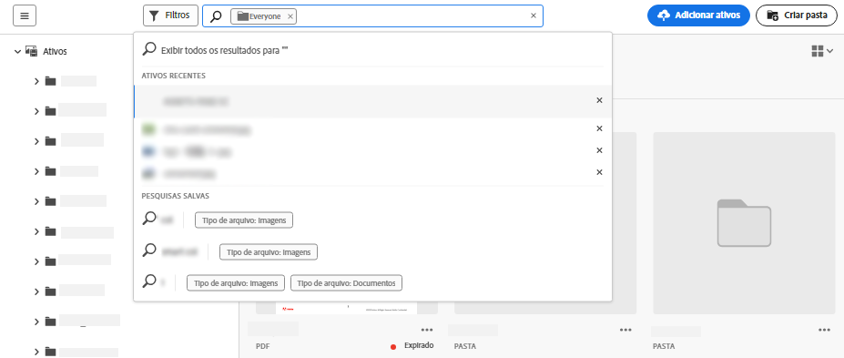
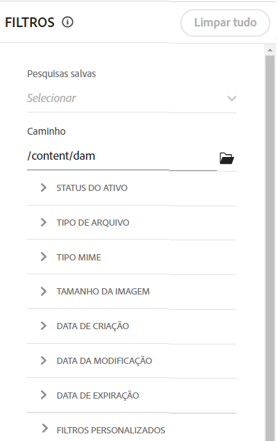
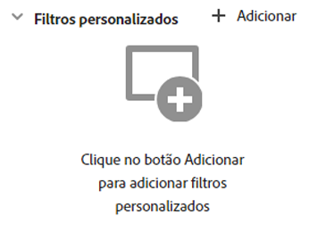
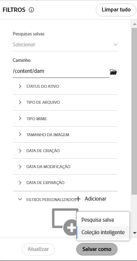

# Pesquisar ativos no [!DNL Assets Essentials] {#search-assets}

>[!CONTEXTUALHELP]
>id="assets_search"
>title="Pesquisar ativos"
>abstract="Pesquise por ativos especificando uma palavra-chave na barra de pesquisa ou filtrando ativos com base no status, tipo de arquivo, tipo MIME, tamanho, criação, modificação e datas de expiração. Também é possível aplicar filtros personalizados, além dos filtros padrão. Você pode salvar os resultados filtrados como uma Pesquisa salva ou uma Coleção inteligente."
>additional-url="https://experienceleague.adobe.com/docs/experience-manager-assets-essentials/help/manage-collections.html?lang=pt-BR#manage-smart-collection" text="Criar coleções inteligentes"

O [!DNL Assets Essentials] oferece uma pesquisa eficiente, que funciona por padrão. A pesquisa é abrangente, pois é uma pesquisa de texto completo. Essa eficiente funcionalidade de pesquisa permite descobrir rapidamente o ativo apropriado e ajuda a melhorar a velocidade do conteúdo. O [!DNL Assets Essentials] fornece pesquisa de texto completo e até mesmo pesquisas por meio de metadados, como tags inteligentes, título, data de criação e direito autoral.

Para pesquisar ativos,

* Clique na caixa de pesquisa na parte superior da página. Por padrão, a pesquisa é feita na pasta em que você está navegando no momento. Siga uma das seguintes opções:

  

   * Pesquisar usando uma palavra-chave e, opcionalmente, alterar a pasta. Pressione Return.

   * Comece a trabalhar com um ativo visualizado recentemente procurando diretamente por ele. Clique na caixa de pesquisa e selecione um ativo visualizado recentemente a partir das sugestões.

## Filtrar os resultados da pesquisa {#refine-search-results}

Você pode filtrar os resultados da pesquisa com base nos seguintes parâmetros.

*Figura: filtre ativos pesquisados com base em vários parâmetros.*

* Status do ativo: filtre os resultados da pesquisa usando um status de ativo `Approved`, `Rejected` ou `No Status`.

* Tipo de arquivo: filtre os resultados da pesquisa pelos tipos de arquivos compatíveis, ou seja, `Images`, `Documents` e `Videos`.
* Tipo MIME: filtrar um ou mais formatos de arquivo compatíveis. <!-- TBD:  [supported file formats](/help/using/supported-file-formats.md). -->
* Tamanho da imagem: forneça um ou mais valores máximos e mínimos de dimensão para filtrar imagens. O tamanho é fornecido em valores de dimensão de pixel e não é o tamanho do arquivo das imagens.
* Data de criação: a data de criação do ativo fornecida pelos metadados. O formato de data padrão usado é `yyyy-mm-dd`.
* Data de modificação: a data da última modificação dos ativos. O formato de data padrão usado é `yyyy-mm-dd`.

* Data de expiração: filtre os resultados da pesquisa com base no status `Expired` de um ativo. Além disso, é possível especificar um intervalo de datas para a expiração dos ativos, permitindo filtrar ainda mais os resultados da pesquisa.

* Filtros personalizados: [adicione filtros personalizados](#custom-filters) à interface do Assets Essentials. Aplique filtros personalizados além dos filtros padrão para refinar os resultados da pesquisa.

Você pode classificar os ativos pesquisados em ordem crescente ou decrescente de `Name`, `Relevance`, `Size`, `Modified` e `Created`. Os ativos pesquisados são classificados com base em `Relevance`, por padrão.

## Gerenciar filtros personalizados {#custom-filters}

**Permissões necessárias:** `Can Edit`, `Owner` ou Administrador.

O Assets Essentials também permite adicionar filtros personalizados à interface. É possível aplicar esses filtros personalizados além dos [filtros padrão](#refine-search-results) para refinar os resultados da pesquisa.

O Assets Essentials fornece os seguintes filtros personalizados:

<table>
    <tbody>
     <tr>
      <th><strong>Nome do filtro personalizado</strong></th>
      <th><strong>Descrição</strong></th>
     </tr>
     <tr>
      <td>Título</td>
      <td>Filtrar ativos usando o título do ativo. O título especificado nos critérios de pesquisa que diferenciam maiúsculas e minúsculas deve corresponder ao título exato do ativo a ser exibido nos resultados.</td>
     </tr>
     <tr>
      <td>Nome</td>
      <td>Filtre ativos usando o nome do arquivo de ativo. O nome especificado nos critérios de pesquisa que diferenciam maiúsculas e minúsculas deve corresponder ao nome exato do arquivo do ativo a ser exibido nos resultados.</td>
     </tr>
     <tr>
      <td>Tamanho do ativo</td>
      <td>Filtre ativos definindo um intervalo de tamanho, em bytes, nos critérios de pesquisa para um ativo ser exibido nos resultados.</td>
     </tr>
     <tr>
      <td>Tags previstas</td>
      <td>Filtrar ativos usando a tag inteligente de ativos. O nome da tag inteligente especificada nos critérios de pesquisa que diferenciam maiúsculas e minúsculas deve corresponder ao nome exato da tag inteligente do ativo a ser exibido nos resultados. Não é possível especificar várias tags inteligentes nos critérios de pesquisa.</td>
     </tr>    
    </tbody>
   </table>

<!--
   You can use a wildcard operator (*) to enable Assets Essentials to display assets in the results that partially match the search criteria. For example, if you define <b>ma*</b> as the search criteria, Assets Essentials displays assets with title, such as, market, marketing, man, manchester, and so on in the results.

   You can use a wildcard operator (*) to enable Assets Essentials to display assets in the results that partially match the search criteria.

   You can use a wildcard operator (*) to enable Assets Essentials to display assets in the results that partially match the search criteria. You can specify multiple smart tags separated by a comma in the search criteria.

   -->

### Adicionar filtros personalizados {#add-custom-filters}

Para adicionar filtros personalizados:

1. Clique em **[!UICONTROL Filtros]**.

1. Na seção **[!UICONTROL Filtros personalizados]**, clique em **[!UICONTROL Editar]** ou **[!UICONTROL Adicionar filtros]**.

   

1. Na caixa de diálogo **[!UICONTROL Gerenciamento de filtros personalizados]**, selecione os filtros que precisam ser adicionados à lista de filtros existente. Selecionar **[!UICONTROL Filtros personalizados]** para selecionar todos os filtros.

1. Clique em **[!UICONTROL Confirmar]** para adicionar os filtros à interface.

### Remover filtros personalizados {#remove-custom-filters}

Para remover filtros personalizados:

1. Clique em **[!UICONTROL Filtros]**.

1. Na seção **[!UICONTROL Filtros personalizados]**, clique em **[!UICONTROL Editar]**.

1. Na caixa de diálogo **[!UICONTROL Gerenciamento de filtros personalizados]**, desmarque os filtros que precisam ser removidos da lista de filtros existente.

1. Clique em **[!UICONTROL Confirmar]** para remover os filtros da interface.

## Pesquisas salvas {#saved-search}

A funcionalidade de pesquisa é bastante fácil de usar no [!DNL Assets Essentials]. Na caixa de pesquisa, você pode simplesmente digitar uma palavra-chave e pressionar Return para ver os resultados. Além disso, é possível pesquisar novamente por palavras-chave recentes de maneira rápida e com um único clique.

Também é possível filtrar os resultados da pesquisa com base em critérios específicos relacionados aos metadados e tipos de ativos. O [!DNL Assets Essentials] também permite salvar os parâmetros de uma pesquisa para melhorar a experiência de busca de filtros usados com frequência. Em seguida, você pode selecionar a pesquisa salva para pesquisar e aplicar o filtro com apenas um clique.

Para criar uma pesquisa salva, pesquise por algum ativo, aplique um ou mais filtros e clique em **[!UICONTROL Salvar como]** > **[!UICONTROL Pesquisa salva]** no painel [!UICONTROL Filtros]. Você também pode clicar em **[!UICONTROL Salvar como]** e selecionar **[!UICONTROL Coleção inteligente]** para salvar os resultados como uma coleção inteligente. Consulte [Criar uma coleção inteligente](manage-collections.md#create-a-smart-collection) para obter mais detalhes.

<!-- TBD: Search behavior. Full-text search. Ranking and rank boosts. Hidden assets.
Report poor UX that users can only save a filtered search and not a simple search.
.
Are other supported files fully indexed and support full-text search? Eg. audio/videos files can at best have metadata indexed.
Anything about ranking of assets displayed in search results?

What about temporarily hiding an asset (suspending search on it) from the search results? If an asset is undergoing review collaboration, should it be used by others? Should it be hidden in search?

When userA is searching and userB add an asset that matches search results, will the asset display in search as soon as userA refreshes the page? Assuming indexing is near real-time. May not be so for bulk uploads.
-->

## Trabalhar com os resultados da pesquisa {#work-with-search-results}

Você pode selecionar os ativos exibidos nos resultados da pesquisa e realizar as seguintes ações:

* **Detalhes**: visualizar e editar as propriedades do ativo.

* **Adicionar à coleção**: adicionar o ativo selecionado a uma coleção.

* **Baixar**: baixar um ativo.

* **Excluir**: excluir um ativo.

* **Copiar**: copiar um ativo para um local de pasta diferente.

* **Mover**: mover um ativo para um local de pasta diferente.

* **Renomear**: renomear um ativo.

* **Atribuir tarefas**: atribuir tarefas de um ativo a usuários.

* **Compartilhar link**: [compartilhar links](share-links-for-assets.md) para um ativo com outros usuários, para que possam acessá-lo e baixá-lo.

* **Observar**: [monitorar as operações](manage-notifications.md) executadas em um ativo.

* **Mostrar local do arquivo**: navegar até o local da pasta de ativos.

* **Fixar no Acesso rápido**: [fixar um ativo](my-workspace.md) para agilizar o acesso quando precisar. Todos os itens fixados são exibidos na seção **Acesso rápido** do Meu espaço de trabalho.

## Próximas etapas {#next-steps}

* [Assista a um vídeo sobre pesquisa de ativos no Assets Essentials](https://experienceleague.adobe.com/docs/experience-manager-learn/assets-essentials/basics/using.html?lang=pt-BR)

* Forneça feedback sobre o produto usando a opção de [!UICONTROL Feedback] disponível na interface do Assets Essentials

* Forneça feedback sobre a documentação usando as opções [!UICONTROL Editar esta página]  ou [!UICONTROL Registrar um problema]  disponíveis na barra lateral direita

* Entre em contato com o [Atendimento ao cliente](https://experienceleague.adobe.com/?support-solution=General&amp;lang=pt-BR#support)
