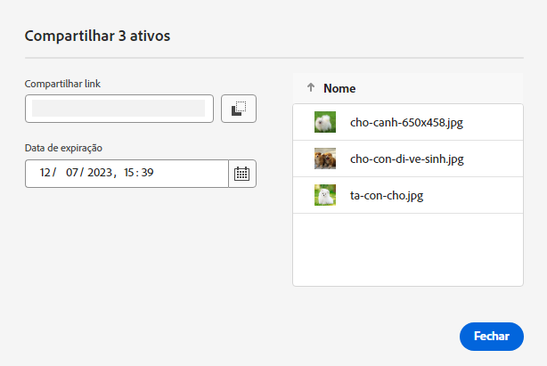

# Compartilhar links para ativos {#share-links-assets}

O [!DNL Assets Essentials] permite gerar um link e compartilhar ativos com participantes externos, que não têm acesso ao aplicativo [!DNL Assets Essentials]. Você pode definir uma data de expiração para o link e, em seguida, compartilhá-la com outras pessoas usando o método de comunicação preferido, como email ou serviços de mensagens. Os recipients do link podem visualizar ativos e baixá-los.

## Gerar um link para ativos {#generate-link-for-assets}

Para gerar um link para um ativo ou uma pasta contendo ativos:

1. Selecione o(s) ativo(s) e/ou a(s) pasta(s) contendo os ativos e clique em **[!UICONTROL Compartilhar link]**.

1. Se desejar ajustá-lo, clique no ícone Calendário para definir uma data de expiração para o link usando o campo **[!UICONTROL Data de vencimento]**. Também é possível especificar uma data diretamente no formato `yyyy-mm-dd`. Por padrão, a data de expiração de um link é definida como 2 semanas a partir da data de compartilhamento.

>[!NOTE]
> O formato da data muda com base na localidade escolhida.
> Por exemplo, `de-DE` utiliza `dd-mm-yyyy`, `ja-JA` utiliza `yyyy-mm-dd`, e `en-EN` utiliza `mm-dd-yyyy`.
>

1. Copie o link do campo **[!UICONTROL Compartilhar link]**.

   

1. Clique em **[!UICONTROL Fechar]** e compartilhe o link por email ou outras ferramentas de colaboração.

## Acessar os ativos compartilhados {#access-shared-assets}

Após compartilhar o link público para os ativos, os destinatários podem clicar nele para visualizar ou baixar os ativos compartilhados em um navegador da web sem precisar fazer logon no [!DNL Assets Essentials].

Clique no link, clique na pasta para navegar até o ativo e, em seguida, clique no ativo para visualizá-lo. Você pode optar por exibir os ativos compartilhados em uma Exibição de lista ou em uma Exibição de cartão.

Você pode passar o mouse sobre o ativo compartilhado ou a pasta de ativos compartilhados para selecionar o ativo ou baixá-lo.

Você também pode selecionar vários ativos e clicar em **[!UICONTROL Download]**. O [!DNL Assets Essentials] baixa os ativos selecionados como um arquivo ZIP. O [!DNL Assets Essentials] cria uma subpasta no arquivo ZIP pai, com o mesmo nome do ativo, para cada ativo que você seleciona para download.

Para baixar todos os ativos de uma só vez, alterne para a **[!UICONTROL Exibição de lista]**, clique em **[!UICONTROL Selecionar tudo]** e, em seguida, clique em **[!UICONTROL Download]**.

## Próximas etapas {#next-steps}

* [Assista a um vídeo sobre compartilhamento de links para ativos no Assets Essentials](https://experienceleague.adobe.com/docs/experience-manager-learn/assets-essentials/basics/link-sharing.html?lang=pt-BR).

* Forneça feedback sobre o produto por meio da opção de [!UICONTROL Feedback] disponível na interface do usuário do Assets Essentials.

* Forneça feedback sobre a documentação por meio das opções [!UICONTROL Editar esta página]  ou [!UICONTROL Registrar um problema]  disponíveis na barra lateral direita.

* Entre em contato com o [Atendimento ao cliente](https://experienceleague.adobe.com/?support-solution=General&amp;lang=pt-BR#support).
